```mermaid
graph TD
    A[User Views Approved Document] --> B[User: 'I need to update the PRD']
    B --> C[Agent: 'What would you like to change?']
    C --> D[User Describes Changes]
    D --> E[Agent Loads Current Document]

    E --> F[Agent Analyzes Change Scope]
    F --> G{Change Type}

    G -->|Minor Edit| H[Track as Minor: No Credit Deduction]
    G -->|Major Revision| I[Track as Major: Deduct 1 Credit Silently]

    H --> J[Agent Generates New Version]
    I --> J

    J --> K[Document Version Incremented: v2 → v3]
    K --> L[Preview Shows New Version]
    L --> M{User Reviews Changes}

    M -->|Approve| N[Mark Version as Approved]
    M -->|Need More Changes| O[User Provides Additional Feedback]

    O --> C

    N --> P[Agent: 'Document updated! Anything else?']

    I -.Background Check.-> Q{Approaching Credit Limit?}
    Q -->|< 5 Credits Left| R[Show Notification: 'You have X credits remaining']
    Q -->|0 Credits| S[Block Action: Show Upgrade/Top-Off Modal]
```

# OutcomeSignal UI/UX Specification

This document defines the user experience goals, information architecture, user flows, and visual design specifications for OutcomeSignal's user interface. It serves as the foundation for visual design and frontend development, ensuring a cohesive and user-centered experience.

## Overall UX Goals & Principles

### Target User Personas

**Solo Developer / Indie Hacker:**
Technical professionals building products independently who need comprehensive planning documentation without hiring a PM or architect. They value efficiency, clarity, and learning best practices through doing. Comfortable with technical concepts but may lack formal SDLC experience.

**Small Team Lead (2-5 developers):**
Engineering leads or technical founders managing small development teams who need to create professional planning artifacts quickly. They balance hands-on coding with planning responsibilities and need to communicate clearly with both technical and non-technical stakeholders.

**Product Manager (Small Company):**
PMs at startups or small companies who need to produce high-quality PRDs, architecture specs, and planning documents but lack dedicated specialists. They understand product development but need AI assistance to maintain documentation standards and completeness.

### Usability Goals

- **Speed to Value:** New users complete their first document approval within 30 minutes of signup
- **High Approval Rate:** 80%+ of AI-generated documents require only minor edits before approval
- **Clarity Over Complexity:** Every interaction should be immediately understandable without requiring documentation or training
- **Minimal Context Switching:** Three-column workspace keeps users oriented with hierarchy, document, and conversation visible simultaneously
- **Conversation Fluency:** Users should feel like they're working with a capable PM, not wrestling with software

### Design Principles

1. **Executive Delegation** - Users act as executives directing capable AI specialists, not as operators managing complex tools
2. **Transparency Builds Trust** - All AI actions are visible via status indicators; no "magic" happens behind the scenes
3. **Progressive Disclosure** - Complexity is revealed gradually; trial users see simplified experience, advanced features appear contextually when unlocked
4. **Explicit Over Implicit** - Phase transitions, approvals, and state changes require explicit user action; no surprising automatic behavior
5. **Spatial Awareness** - Three-column layout provides consistent spatial orientation: where you are (left), what you're working on (middle), who you're working with (right)

### Change Log

| Date | Version | Description | Author |
|------|---------|-------------|--------|
| 2025-10-16 | 1.0 | Initial UI/UX Specification creation | Sally (UX Expert) |

## Information Architecture (IA)

### Site Map / Screen Inventory


### Navigation Structure

**Primary Navigation:** Top navigation bar with user profile menu (right), account settings access, and logout. The primary interaction model is workspace-centric rather than traditional multi-page navigation—users stay within the Initiative workspace for the majority of their session.

**Secondary Navigation:** Left column hierarchy tree provides Initiative → Epic drill-down navigation. Clicking nodes navigates context without leaving the three-column workspace. Initiative switcher dropdown in header allows quick switching between projects.

**Breadcrumb Strategy:** Minimal breadcrumbs in mobile view only. Desktop relies on persistent left column for "you are here" orientation. Mobile breadcrumb format: `Dashboard > [Initiative Name] > [Epic Name]` displayed above the active tab.

## User Flows

### Flow: New User Onboarding & First Document Creation

**User Goal:** Sign up and create first Project Brief within 30 minutes

**Entry Points:** Landing page "Start Free Trial" CTA, direct signup URL

**Success Criteria:** User approves their first Brief document and understands how to proceed

#### Flow Diagram


#### Edge Cases & Error Handling:
- **OAuth Failure:** Show error message with fallback to email/password signup
- **Initiative Creation Limit:** Trial users blocked at 2nd Initiative with upgrade prompt
- **Session Timeout During Brief Creation:** Auto-save conversation state, restore on return
- **Brief Generation Failure:** Agent apologizes, offers to retry with different approach
- **User Provides Insufficient Info:** Agent asks clarifying questions before drafting

**Notes:** This flow emphasizes the "time to first value" metric (30 minutes). The agent-led conversation reduces friction compared to traditional form-based onboarding.

---

### Flow: Trial-to-Paid Conversion

**User Goal:** Upgrade to paid plan to unlock full document generation

**Entry Points:** Paywall modal (triggered at trial limits), Dashboard upgrade banner, Settings page

**Success Criteria:** User completes Stripe checkout and gains access to paid features

#### Flow Diagram

```mermaid
graph TD
    A[Paywall Trigger Event] --> B{Trigger Type}

    B -->|2nd Document Attempt| C[User Tries to Generate PRD]
    B -->|2nd Initiative| D[User Clicks 'Create Initiative']
    B -->|Export Attempt| E[User Clicks 'Export']
    B -->|7-Day Expiration| F[User Logs In After Trial End]

    C --> G[Paywall Modal Appears]
    D --> G
    E --> G
    F --> G

    G --> H[Show Tier Comparison Table]
    H --> I[Starter $49/mo, Pro $149/mo, Enterprise $499/mo]
    I --> J{User Action}

    J -->|Select Plan| K[Click 'Upgrade to [Tier]']
    J -->|Dismiss Modal| L{Trial Still Valid?}

    L -->|Yes| M[Return to Workspace]
    L -->|No| N[Cannot Dismiss: Must Upgrade or Logout]

    K --> O[Redirect to Stripe Checkout]
    O --> P[User Enters Payment Info]
    P --> Q{Payment Success?}

    Q -->|Success| R[Stripe Webhook Fires]
    Q -->|Failure| S[Show Error, Return to Modal]

    R --> T[Update Subscription in DB]
    T --> U[Redirect to Dashboard with Success Message]
    U --> V[User Sees Updated Tier Badge]
    V --> W[Previously Blocked Features Unlocked]

    W --> X[User Resumes Work: Generate PRD]
```

#### Edge Cases & Error Handling:
- **Payment Declined:** Show user-friendly error, offer alternative payment method
- **Stripe Webhook Delay:** Show "Processing..." state, poll for subscription status
- **User Closes Checkout Mid-Flow:** Save cart, allow return via "Complete Upgrade" link
- **Downgrade Scenario (Post-MVP):** Not supported in MVP; users contact support
- **Trial Expired But User Has Valuable Data:** Allow read-only access, show upgrade CTA

**Notes:** The conversion flow is designed to minimize drop-off. Pre-filling email from Clerk reduces friction, and Stripe handles payment security.

---

### Flow: Document Revision & Approval Cycle

**User Goal:** Request changes to an approved document and re-approve

**Entry Points:** Chat with agent in workspace, clicking "Edit" on document (Phase 2+)

**Success Criteria:** User receives revised document that meets their needs

#### Flow Diagram



#### Edge Cases & Error Handling:
- **Out of Credits:** Show "Out of Credits" modal with upgrade or credit top-off option via Stripe
- **Conflicting Changes:** Agent clarifies which parts to keep, which to change
- **User Changes Mind Mid-Revision:** Agent offers to revert to previous approved version
- **Version History Overflow:** Store last 10 versions per document (configurable)
- **Credit Limit During Generation:** If credits run out mid-generation, complete current request but show upgrade prompt before next action

**Notes:** Credits are tracked silently in the background. Users only see credit notifications when approaching their limit (< 5 remaining) or when they've run out. The distinction between minor and major revisions is determined by edit distance (>20% content change = major).

## Wireframes & Mockups

**Primary Design Tool:** AI-powered UI generation using Claude Sonnet 4.5 Desktop, Lovable, or v0. This specification document serves as the source of truth for generating UI components and layouts via AI tools.

**Design Approach:** Each screen layout description below is structured to serve as input for AI UI generation tools. Key elements, interaction patterns, and responsive behaviors are detailed to enable accurate component generation. When using these tools, reference the specific screen section along with the Component Library and Branding sections for complete context.

### Key Screen Layouts

#### Dashboard / Initiative List

**Purpose:** Primary landing page after login. Provides overview of all user Initiatives and quick access to create new ones.

**Key Elements:**
- Top navigation bar with OutcomeSignal logo (left), tier badge (e.g., "Starter Plan"), usage indicator ("15/25 credits"), user profile menu (right)
- Page header: "Your Initiatives" with "Create New Initiative" primary action button (disabled if at tier limit)
- Card grid layout (3 columns on desktop, 2 on tablet, 1 on mobile) displaying Initiative cards
- Each card shows: Initiative title, status badge (Active/Archived), phase progress ("Planning 45%"), last updated timestamp, action menu (three-dot icon)
- Empty state for new users: Centered illustration with "Create your first Initiative to get started" and prominent CTA button
- Trial users see banner: "Trial: X days remaining | 1 of 1 Initiative used" with "Upgrade" link

**Interaction Notes:**
- Clicking card navigates to Initiative workspace
- Hover on card shows subtle elevation shadow
- Action menu provides: Open, Settings, Archive, Share
- Trial limit banner is dismissible but reappears on next session

**AI Generation Prompt Context:** "Create a dashboard with a card grid layout for project initiatives. Use shadcn/ui Card component with hover effects. Include a top navigation bar with logo, usage stats, and user menu. Show empty state with illustration when no initiatives exist. Make responsive: 3-col desktop, 2-col tablet, 1-col mobile."

---

#### Three-Column Workspace (Main View)

**Purpose:** Core application interface where users navigate hierarchy, view documents, and chat with AI agents.

**Key Elements:**
- **Left Column (240px default, collapsible to 48px icon bar):**
  - Initiative title header with switcher dropdown
  - Collapsible hierarchy tree: Initiative → Epics → Documents
  - Icons indicate document type (📋 Brief, 📄 PRD, 🏗️ Architecture, etc.)
  - Active node highlighted with blue background
  - Collapse button (chevron icon) at top-right of column

- **Middle Column (flex-grow, min 400px):**
  - Document title header with version dropdown ("v3") and export button
  - TipTap rich text preview area (read-only, scrollable)
  - Document renders with typography hierarchy, syntax highlighting for code blocks
  - Loading skeleton shown during generation
  - Empty state when no document selected: "Select a document to preview"

- **Right Column (360px default, collapsible to 0px):**
  - Phase indicator header: "📋 Planning Phase [45%]" with progress bar
  - Sub-agent status: "Working with Architecture Agent..." (animated dots during processing)
  - Chat message area (scrollable, auto-scroll to bottom on new message)
  - User messages: right-aligned, blue background, rounded corners
  - Agent messages: left-aligned, gray background, agent icon
  - Approval UI (shown after document generation): "Approve" (green button), "Need Changes" (outlined button)
  - Input area: text field with "Send" button, supports multiline (Shift+Enter)
  - Typing indicator when agent is responding

- **Responsive Behavior:**
  - **Desktop (1280px+):** All three columns visible
  - **Tablet (768-1279px):** Left column becomes slide-out drawer (hamburger menu to open)
  - **Mobile (<768px):** Single column with bottom tab bar: "Hierarchy" | "Document" | "Chat"

**Interaction Notes:**
- Resize handles between columns (drag to adjust width) using react-resizable-panels
- Column widths persist to localStorage
- Double-click column border to reset to default width
- Keyboard shortcut: `Cmd/Ctrl + B` to toggle left column, `Cmd/Ctrl + /` to toggle right column

**AI Generation Prompt Context:** "Create a three-column workspace layout using react-resizable-panels. Left: collapsible tree navigation with folder icons. Middle: document preview with TipTap editor (read-only mode) with markdown rendering. Right: chat interface with message bubbles, input field, and approval buttons. Make fully responsive with drawer/tab patterns for mobile. Use shadcn/ui components throughout."

---

#### Paywall / Upgrade Modal

**Purpose:** Convert trial users to paid plans by showcasing tier benefits and enabling Stripe checkout.

**Key Elements:**
- Modal overlay (80% opacity dark background, dismissible only if trial valid)
- Modal content (max-width 900px, centered):
  - Header: "Upgrade to Continue" with close button (X) if dismissible
  - Subheader: Contextual message based on trigger ("You've used your trial document. Upgrade to create PRDs, Architecture, and more.")
  - Tier comparison table (3 columns: Starter, Professional, Enterprise):
    - Price row: "$49/mo", "$149/mo", "$499/mo"
    - Features rows: Initiatives limit, Credits/month, Document types, Export, Support
    - Current tier highlighted if user has active subscription
  - Primary CTA buttons per tier: "Upgrade to [Tier]" (blue, prominent)
  - Footer: "Questions? Contact sales" link

**Interaction Notes:**
- Clicking "Upgrade" redirects to Stripe Checkout with tier pre-selected
- Close button (X) only appears if trial is still valid
- If trial expired, modal is non-dismissible (must upgrade or log out)
- Tier feature cells use checkmarks (✓) or limits ("3/month", "25 credits")

**AI Generation Prompt Context:** "Create a pricing modal with three-tier comparison table (Starter $49, Pro $149, Enterprise $499). Use shadcn/ui Dialog component with feature comparison rows. Include checkmarks and feature limits. Add CTA buttons for each tier. Modal should be dismissible or non-dismissible based on prop. Center modal at max-width 900px with dark overlay."

---

#### Account Settings Page

**Purpose:** Manage subscription, view usage, and configure integrations (Phase 2+).

**Key Elements:**
- Side navigation tabs: "Subscription" | "Usage" | "Integrations" (Phase 2+) | "Account"
- **Subscription Tab:**
  - Current plan card: Tier name, price, renewal date
  - "Manage Subscription" button → opens Stripe Customer Portal
  - Usage summary: Credits used/remaining this month, Initiatives count
- **Usage Tab:**
  - Monthly usage chart (credits over time)
  - Document generation history table: Date, Document Type, Credits Used, Status
  - Export history (Phase 2+)
- **Account Tab:**
  - Email (read-only, managed by Clerk)
  - Profile name (editable)
  - Danger zone: "Delete Account" button (confirmation modal)

**Interaction Notes:**
- Stripe Customer Portal handles payment method updates, invoice downloads, cancellation
- Usage chart uses simple bar chart (no complex visualizations needed for MVP)

**AI Generation Prompt Context:** "Create a settings page with side tab navigation (Subscription, Usage, Account). Use shadcn/ui Tabs component. Subscription tab shows current plan card with CTA to Stripe portal. Usage tab has simple bar chart (Recharts) and table of document history. Account tab has editable profile fields and danger zone for account deletion with confirmation dialog."

## Component Library / Design System

**Design System Approach:** OutcomeSignal leverages **shadcn/ui** with the **"Scaled" theme** as the foundation, which provides accessible, customizable components built on Radix UI primitives. The Scaled theme offers a more compact, information-dense layout that's ideal for professional productivity tools.

**Theme Configuration:**
- Use shadcn/ui "Scaled" theme (reduced spacing, smaller font sizes, tighter component padding)
- Initialize with: `npx shadcn-ui@latest init` and select "Scaled" when prompted for style
- Tailwind CSS configured with Scaled theme's custom spacing scale and typography
- Reference: https://ui.shadcn.com/themes → Examples → "Scaled"

**Component Philosophy:**
- Start with shadcn/ui Scaled defaults for speed and accessibility
- Customize only where brand identity requires (colors, typography)
- Maintain consistency across all screens with compact, professional feel
- Prioritize keyboard navigation and screen reader support
- Components are server-compatible (work with Next.js App Router)
- Embrace information density—users are technical professionals who value efficiency over whitespace

### Core Components

#### Button

**Purpose:** Primary interactive element for actions throughout the application.

**Variants:**
- `default`: Primary actions (blue background, white text)
- `secondary`: Secondary actions (gray background)
- `outline`: Tertiary actions (transparent with border)
- `ghost`: Low-emphasis actions (no background, hover shows gray)
- `destructive`: Dangerous actions (red background, e.g., Delete)
- `link`: Text-only link style

**States:**
- Default, Hover, Focus, Active, Disabled, Loading (with spinner)

**Usage Guidelines:**
- Use `default` for primary CTAs (max 1 per screen section)
- Use `outline` or `ghost` for secondary actions
- Use `destructive` only for irreversible actions with confirmation
- Always include loading state for async actions
- Disabled buttons should have tooltip explaining why
- Scaled theme: Buttons are more compact with tighter padding

**AI Generation Prompt:** "Use shadcn/ui Button component with Scaled theme. Variants: default (primary blue), secondary, outline, ghost, destructive. Include loading state with spinner. Ensure focus states are visible for accessibility. Use compact sizing from Scaled theme."

---

#### Card

**Purpose:** Container for grouping related content, used extensively in Dashboard and Settings.

**Variants:**
- `elevated`: Default card with subtle shadow
- `flat`: No shadow, border only
- `interactive`: Hover elevation effect (for clickable cards)

**States:**
- Default, Hover (if interactive), Focus (keyboard nav)

**Usage Guidelines:**
- Use for Initiative cards on Dashboard
- Use for content sections in Settings
- Interactive cards should have visible hover state
- Scaled theme: Cards have tighter internal padding (1rem / 16px instead of 1.5rem)
- Reduced shadow for subtle depth

**AI Generation Prompt:** "Use shadcn/ui Card component with Scaled theme. Include CardHeader, CardContent, CardFooter subcomponents. Add hover elevation for interactive cards. Use compact padding from Scaled theme. Include focus ring for keyboard navigation."

---

#### Dialog (Modal)

**Purpose:** Overlay for focused tasks, confirmations, and paywalls.

**Variants:**
- `default`: Standard modal (dismissible)
- `alert`: Important modal (non-dismissible until action taken)
- `drawer`: Mobile-friendly slide-in variant

**States:**
- Open, Closing (with fade-out animation), Closed

**Usage Guidelines:**
- Use `alert` variant for paywall and destructive confirmations
- Modals should trap focus (Tab cycles within modal)
- Escape key closes dismissible modals
- Use for: Paywall, Create Initiative, Confirm Delete, etc.
- Scaled theme: Tighter spacing in dialog header and content areas

**AI Generation Prompt:** "Use shadcn/ui Dialog component with Scaled theme. Include DialogContent, DialogHeader, DialogTitle, DialogDescription. Support dismissible and non-dismissible modes. Include Escape key handling and focus trap. Responsive: full-screen on mobile, centered on desktop. Use compact spacing."

---

#### Input & Textarea

**Purpose:** Text input fields for forms and chat interface.

**Variants:**
- `default`: Standard input with border
- `error`: Red border with error message
- `disabled`: Grayed out, non-interactive

**States:**
- Default, Focus, Error, Disabled

**Usage Guidelines:**
- Always pair with Label component
- Show error messages below input (not as placeholder)
- Chat input uses Textarea with auto-resize
- Support keyboard shortcuts (Cmd+Enter to send in chat)
- Scaled theme: Reduced height and padding for compact feel

**AI Generation Prompt:** "Use shadcn/ui Input and Textarea components with Scaled theme. Include Label. Error state with red border and error message text. Focus state should have blue ring. Textarea should support multiline with auto-resize. Use compact sizing."

---

#### Dropdown Menu

**Purpose:** Contextual actions menu (three-dot menus, user profile menu).

**Variants:**
- `default`: Standard dropdown
- `with-icons`: Menu items include leading icons

**States:**
- Open, Closed

**Usage Guidelines:**
- Triggered by Button or IconButton (e.g., three dots)
- Menu appears below trigger by default, flips above if space constrained
- Use for: Initiative card actions, user profile menu, document version selector
- Scaled theme: Menu items have reduced vertical padding

**AI Generation Prompt:** "Use shadcn/ui DropdownMenu component with Scaled theme. Include DropdownMenuTrigger, DropdownMenuContent, DropdownMenuItem. Include icons with menu items. Support keyboard navigation (Arrow keys, Enter to select). Use compact item spacing."

---

#### Progress Bar

**Purpose:** Visual indicator for phase completion and upload progress.

**Variants:**
- `determinate`: Shows specific percentage (0-100%)
- `indeterminate`: Loading animation (no specific progress)

**States:**
- Progressing, Complete

**Usage Guidelines:**
- Use determinate for Planning phase progress (e.g., "45%")
- Use indeterminate for document generation loading states
- Color: Blue for normal progress, green when complete (100%)
- Scaled theme: Slightly smaller height for compactness

**AI Generation Prompt:** "Use shadcn/ui Progress component with Scaled theme. Support determinate (percentage-based) and indeterminate (animated) modes. Blue fill for progress, green for complete. Include percentage text label. Use compact height."

---

#### Badge

**Purpose:** Status indicators and tier labels.

**Variants:**
- `default`: Neutral gray
- `success`: Green (for Active, Approved)
- `warning`: Yellow (for Trial Expiring)
- `destructive`: Red (for Expired, Error)
- `info`: Blue (for tier labels like "Starter Plan")

**States:**
- Static (no interaction)

**Usage Guidelines:**
- Use for Initiative status, document approval status, tier labels
- Keep text concise (1-2 words max)
- Use appropriate semantic color (success = green, destructive = red)
- Scaled theme: Smaller badge with tighter padding

**AI Generation Prompt:** "Use shadcn/ui Badge component with Scaled theme. Variants: default, success (green), warning (yellow), destructive (red), info (blue). Rounded corners, small compact size, uppercase text."

---

#### Tree View (Custom Component)

**Purpose:** Hierarchical navigation in left column.

**Variants:**
- `collapsible`: Default tree with expand/collapse
- `with-icons`: Nodes include document type icons

**States:**
- Node: Collapsed, Expanded, Active (selected), Hover, Focus

**Usage Guidelines:**
- Use for Initiative → Epic → Document hierarchy
- Active node highlighted with blue background
- Support keyboard navigation (Arrow keys to navigate, Enter to select, Space to expand/collapse)
- Icons indicate document type (📋, 📄, 🏗️, etc.)
- Scaled theme: Reduced vertical spacing between nodes for density

**AI Generation Prompt:** "Create a custom tree navigation component using shadcn/ui Collapsible and Button with Scaled theme. Each node should support expand/collapse, active state (blue background), hover, and keyboard navigation. Include icons for different node types. Make scrollable with fixed height. Use compact vertical spacing between nodes."

## Branding & Style Guide

### Visual Identity

**Brand Guidelines:** OutcomeSignal IS the brand (not white-label/multi-tenant in MVP). No external brand guidelines—this document defines the visual identity.

**Design Aesthetic:**
- Clean, professional, developer-focused
- Information-dense without feeling cluttered (Scaled theme achieves this)
- Trustworthy and transparent (no unnecessary "magic" or playfulness)
- Modern SaaS tool that respects user's time and intelligence

### Color Palette

OutcomeSignal leverages the **shadcn/ui Scaled theme** default color palette with semantic usage for consistency.

| Color Type | Hex Code | Usage | Scaled Theme Variable |
|------------|----------|-------|----------------------|
| Primary | `hsl(221.2, 83.2%, 53.3%)` | Primary CTAs, active states, progress bars | `--primary` |
| Secondary | `hsl(210, 40%, 96.1%)` | Secondary buttons, subtle backgrounds | `--secondary` |
| Accent | `hsl(221.2, 83.2%, 53.3%)` | Links, interactive elements | `--accent` |
| Success | `hsl(142.1, 76.2%, 36.3%)` | Approved status, success messages | `--success` / green |
| Warning | `hsl(38, 92%, 50%)` | Trial expiring, caution notices | `--warning` / yellow |
| Error | `hsl(0, 84.2%, 60.2%)` | Errors, destructive actions, failed states | `--destructive` |
| Neutral | `hsl(210, 40%, 98%)` to `hsl(222.2, 84%, 4.9%)` | Text, borders, backgrounds (full scale) | `--muted`, `--foreground`, etc. |

**Usage Notes:**
- Scaled theme provides a complete HSL color system with dark mode support built-in
- Use semantic variables (e.g., `bg-primary`, `text-destructive`) rather than hardcoded hex values
- Dark mode automatically inverts the palette using CSS variables

### Typography

#### Font Families

- **Primary:** System font stack for native feel and performance
  - macOS: `-apple-system, BlinkMacSystemFont, "SF Pro Text"`
  - Windows: `"Segoe UI"`
  - Linux: `"Roboto", "Ubuntu"`
  - Fallback: `"Helvetica Neue", Arial, sans-serif`
- **Secondary:** Same as primary (no separate display font needed for compact UI)
- **Monospace:** `"SF Mono", "Monaco", "Cascadia Code", "Consolas", monospace`
  - Used for: Code blocks in documents, technical content

#### Type Scale (Scaled Theme)

The Scaled theme uses a tighter type scale optimized for information density:

| Element | Size | Weight | Line Height | Tailwind Class |
|---------|------|--------|-------------|----------------|
| H1 | 2rem (32px) | 800 (Extrabold) | 1.2 | `text-3xl font-extrabold` |
| H2 | 1.5rem (24px) | 700 (Bold) | 1.3 | `text-2xl font-bold` |
| H3 | 1.25rem (20px) | 600 (Semibold) | 1.4 | `text-xl font-semibold` |
| H4 | 1rem (16px) | 600 (Semibold) | 1.5 | `text-base font-semibold` |
| Body | 0.875rem (14px) | 400 (Normal) | 1.5 | `text-sm` (Scaled default) |
| Small | 0.75rem (12px) | 400 (Normal) | 1.4 | `text-xs` |
| Tiny | 0.625rem (10px) | 500 (Medium) | 1.3 | `text-[10px] font-medium` |

**Key Typography Decisions:**
- **Base font size: 14px** (not 16px) for Scaled theme—enables more content density
- **Line height: 1.5** for body text (optimal readability at smaller sizes)
- **Limited heading hierarchy:** H1-H4 only (deeper nesting unnecessary)
- **Font weight contrast:** Use weight (not size) to create hierarchy within compact space

### Iconography

**Icon Library:** [Lucide React](https://lucide.dev/) (consistent with shadcn/ui ecosystem)

**Icon Sizes:**
- Small: 14px (for inline text, badges)
- Default: 16px (for buttons, menu items)
- Medium: 20px (for headers, primary actions)
- Large: 24px (for empty states, illustrations)

**Usage Guidelines:**
- Use stroke-based icons (not filled) for consistency with Scaled theme
- Icon color inherits from text color (use `currentColor`)
- Maintain 2px stroke width for clarity at small sizes
- Key icons:
  - Document types: 📋 `FileText`, 📄 `File`, 🏗️ `Building2`, 🎨 `Palette`, 🔒 `Lock`, 🧪 `Flask`
  - Actions: `Plus`, `Trash2`, `Edit`, `Download`, `Upload`, `Share2`
  - Navigation: `ChevronRight`, `ChevronDown`, `Menu`, `X`
  - Status: `Check`, `AlertCircle`, `XCircle`, `Clock`

### Spacing & Layout

**Grid System:** Tailwind's default 12-column grid with Scaled theme's compact spacing

**Spacing Scale (Scaled Theme):**
The Scaled theme modifies Tailwind's default spacing scale for compactness:

- `space-1` = 0.25rem (4px) - Tight internal spacing
- `space-2` = 0.5rem (8px) - Default gap between related elements
- `space-3` = 0.75rem (12px) - Small section spacing
- `space-4` = 1rem (16px) - Standard padding (cards, modals)
- `space-6` = 1.5rem (24px) - Section headers
- `space-8` = 2rem (32px) - Page-level spacing

**Layout Principles:**
- Prefer **4px and 8px increments** for spacing (aligns with Scaled theme)
- Card padding: `p-4` (16px) instead of default 24px
- Section gaps: `gap-4` or `gap-6` (16-24px)
- Use `space-y-2` for stacked form elements (8px vertical gap)
- Three-column workspace uses CSS Grid with fixed/flex columns (not spacing scale)

## Accessibility Requirements

### Compliance Target

**Standard:** WCAG 2.1 Level AA

OutcomeSignal targets WCAG 2.1 Level AA compliance to ensure usability for developers with visual, motor, or cognitive disabilities. The shadcn/ui Scaled theme provides accessible defaults (Radix UI primitives), and we build upon that foundation.

### Key Requirements

**Visual:**
- **Color contrast ratios:** 4.5:1 minimum for normal text, 3:1 for large text and UI components (Scaled theme meets this by default)
- **Focus indicators:** Visible focus rings on all interactive elements (2px blue outline, provided by shadcn/ui)
- **Text sizing:** UI remains functional at 200% zoom without horizontal scroll (Scaled theme's rem-based sizing ensures this)
- **Color not sole indicator:** Status conveyed through icons + color (e.g., checkmark + green for success)

**Interaction:**
- **Keyboard navigation:** Full application navigable via keyboard (Tab, Arrow keys, Enter, Space, Escape)
  - Three-column workspace: Tab cycles through columns, keyboard shortcuts toggle panels
  - Tree navigation: Arrow keys navigate nodes, Enter selects, Space expands/collapses
  - Modals: Focus trap within modal, Escape closes dismissible modals
- **Screen reader support:** Semantic HTML, ARIA labels for dynamic content (agent messages, document updates, progress indicators)
  - Use `aria-label` for icon-only buttons
  - Use `aria-live="polite"` for agent status updates
  - Use `role="status"` for progress indicators
- **Touch targets:** 44×44px minimum for all interactive elements (WCAG AA compliant, important for responsive/mobile)

**Content:**
- **Alternative text:** All images and icons have descriptive `alt` text or `aria-label`
- **Heading structure:** Logical heading hierarchy (H1 → H2 → H3, no skipping levels)
- **Form labels:** All form inputs paired with visible `<Label>` elements

### Testing Strategy

- **Automated testing:** Run `axe-core` or Lighthouse accessibility audits in CI/CD
- **Manual keyboard testing:** Verify full keyboard navigation before each release
- **Screen reader testing:** Test with VoiceOver (macOS) and NVDA (Windows) for critical flows
- **Color contrast validation:** Use browser DevTools or Contrast Checker to verify ratios
- **Focus visibility:** Test focus states across all interactive elements
- **Responsive touch targets:** Test on real mobile devices (iPhone, Android)

## Responsiveness Strategy

### Breakpoints

OutcomeSignal uses Tailwind CSS's default breakpoints aligned with the Scaled theme:

| Breakpoint | Min Width | Max Width | Target Devices | Tailwind Prefix |
|------------|-----------|-----------|----------------|-----------------|
| Mobile | 320px | 767px | iPhone SE, modern smartphones | (default) |
| Tablet | 768px | 1023px | iPad, Android tablets | `md:` |
| Laptop | 1024px | 1279px | MacBook Air, small laptops | `lg:` |
| Desktop | 1280px | 1919px | Standard desktop displays | `xl:` |
| Wide | 1920px+ | - | Large monitors, 4K displays | `2xl:` |

### Adaptation Patterns

**Layout Changes:**
- **Mobile (<768px):** Single-column layout with bottom tab bar for "Hierarchy" | "Document" | "Chat" navigation
  - Three-column workspace collapses to tabbed view
  - Dashboard cards stack vertically (1 column)
- **Tablet (768-1023px):** Left column becomes slide-out drawer (hamburger menu), middle + right columns side-by-side
  - Dashboard cards display in 2-column grid
- **Laptop/Desktop (1024px+):** Full three-column layout with resizable panels
  - Dashboard cards display in 3-column grid

**Navigation Changes:**
- **Mobile:** Bottom tab bar replaces column panels, top nav condenses (hamburger menu for user profile)
- **Tablet:** Hamburger menu for left column (hierarchy tree), persistent top nav
- **Desktop:** All navigation visible, no hidden menus

**Content Priority:**
- **Mobile:** Agent chat takes priority (most important for conversation flow), document preview secondary
- **Tablet:** Equal priority for document preview and chat, hierarchy accessed via drawer
- **Desktop:** All content visible simultaneously for maximum productivity

**Interaction Changes:**
- **Mobile:** Touch-first interactions, larger tap targets (48×48px), swipe gestures for column switching
- **Tablet:** Hybrid touch + cursor interactions, 44×44px tap targets
- **Desktop:** Cursor + keyboard interactions, resize handles for column widths

## Animation & Micro-interactions

### Motion Principles

OutcomeSignal uses **subtle, purposeful animations** that enhance usability without distracting:

1. **Reinforce user actions** - Visual feedback confirms clicks, submissions, and state changes
2. **Indicate system status** - Loading states, progress, and transitions are communicated through motion
3. **Guide attention** - Animations direct user focus to important changes (new agent message, approval buttons)
4. **Respect user preferences** - Honor `prefers-reduced-motion` for accessibility

### Key Animations

- **Modal open/close:** 200ms fade + scale animation (modal fades in from 95% scale to 100%)
  - Duration: 200ms, Easing: `ease-out`
- **Drawer slide-in (mobile/tablet):** 250ms slide from left for hierarchy tree drawer
  - Duration: 250ms, Easing: `ease-in-out`
- **Button click feedback:** 100ms scale down to 98% on active state
  - Duration: 100ms, Easing: `ease-in-out`
- **Progress bar fill:** 300ms smooth fill animation as document generation progresses
  - Duration: 300ms, Easing: `linear`
- **Toast notifications:** 200ms slide-in from top-right corner
  - Duration: 200ms in, 150ms out, Easing: `ease-out`
- **Skeleton loading:** Subtle shimmer effect for document preview loading (800ms loop)
  - Duration: 800ms, Easing: `ease-in-out`, infinite loop
- **Agent typing indicator:** Animated dots (three dots fading in sequence, 600ms cycle)
  - Duration: 600ms per cycle, Easing: `ease-in-out`, infinite loop
- **Card hover elevation:** 150ms shadow transition on hover (for interactive cards)
  - Duration: 150ms, Easing: `ease-out`

**Implementation Notes:**
- Use Tailwind CSS transition utilities (`transition`, `duration-200`, `ease-out`)
- For complex animations, use Framer Motion (already in Next.js ecosystem)
- All animations respect `@media (prefers-reduced-motion: reduce)` - replace with instant transitions

## Performance Considerations

### Performance Goals

- **Page Load:** Initial load <2s on 3G, <1s on 4G (target: Fast 3G baseline)
- **Interaction Response:** Button clicks, navigation <100ms feedback
- **Document Preview Rendering:** Markdown rendering <500ms for documents up to 100 pages
- **Animation FPS:** Maintain 60fps for all animations (no jank or stuttering)

### Design Strategies

**Code Splitting & Lazy Loading:**
- Use Next.js dynamic imports for heavy components (TipTap editor, chart libraries)
- Lazy load modals (Paywall, Settings) only when opened
- Implement route-based code splitting (Dashboard, Workspace, Settings as separate chunks)

**Asset Optimization:**
- SVG icons only (Lucide React provides optimized SVGs, no image sprites needed)
- System fonts eliminate web font loading time
- No hero images or illustrations in MVP (use empty state text + icons)
- Optimize any user-uploaded images via Next.js Image component (if added in future phases)

**Rendering Performance:**
- Use Next.js Server Components for static content (headers, sidebars, initial page structure)
- Client Components only for interactive UI (chat, tree navigation, document preview)
- Virtualize long lists if needed (e.g., 100+ Initiatives on Dashboard, use `react-window`)
- TipTap editor in read-only mode (faster than editable mode)

**State Management:**
- Use Zustand for lightweight client state (column widths, UI preferences)
- React Query for server state (caching, background refetching)
- Avoid unnecessary re-renders (React.memo for heavy components)

**Monitoring:**
- Lighthouse CI in GitHub Actions (block PR if performance score <80)
- Vercel Analytics for Core Web Vitals tracking (LCP, FID, CLS)
- Sentry performance monitoring for slow transactions (>1s API calls, >500ms renders)

## Next Steps

### Immediate Actions

1. **Initialize shadcn/ui with Scaled theme** in Next.js project (`npx shadcn-ui@latest init`, select Scaled)
2. **Install core components** needed for MVP: Button, Card, Dialog, Input, Dropdown Menu, Progress, Badge, Tabs
3. **Set up Tailwind CSS configuration** with Scaled theme's custom spacing and typography
4. **Create AI generation prompts** for each screen layout using sections from this spec + v0/Lovable/Claude
5. **Build component library** starting with Button, Card, Dialog (highest priority)
6. **Implement responsive breakpoints** and test three-column workspace on mobile/tablet/desktop

### Design Handoff Checklist

- [x] All user flows documented
- [x] Component inventory complete
- [x] Accessibility requirements defined (WCAG AA)
- [x] Responsive strategy clear (mobile/tablet/desktop breakpoints)
- [x] Brand guidelines incorporated (Scaled theme)
- [x] Performance goals established (<2s load, <100ms interaction)
- [ ] AI generation prompts tested with v0/Lovable/Claude (to be validated by developer)
- [ ] TipTap editor integration researched (read-only markdown rendering)
- [ ] Tree navigation component prototyped (custom component, highest risk)

### Recommended Next Documents

After completing the UI/UX specification, the following documents should be created or updated:

1. **Frontend Architecture Document** - Technical implementation details (Next.js App Router, state management, API integration)
2. **Component Development Plan** - Story-by-story breakdown of component implementation (aligns with PRD Epic 2)
3. **AI UI Generation Guide** - Consolidated prompts and best practices for using Claude/v0/Lovable with this spec
4. **Design QA Checklist** - Validation checklist for ensuring implemented UI matches this specification

### Open Questions

- **Tree Navigation Implementation:** Should we build custom or evaluate third-party libraries (react-arborist, react-complex-tree)?
- **Dark Mode Support:** Scaled theme supports dark mode—should we enable it in MVP or defer to Phase 2?
- **Mobile App Priority:** PRD mentions mobile apps in Phase 4+, but should we optimize web mobile experience more aggressively in MVP?
- **Empty States:** Should we use illustrations/graphics for empty states, or stick with text + icons for MVP?

