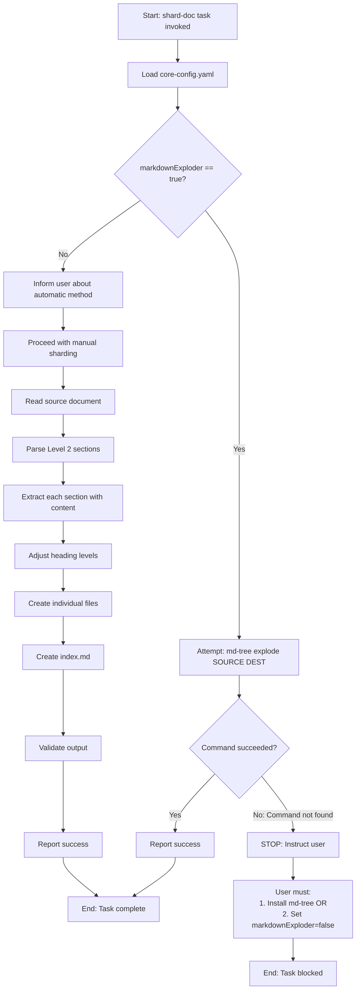
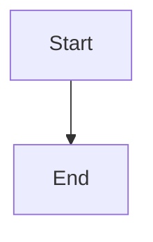
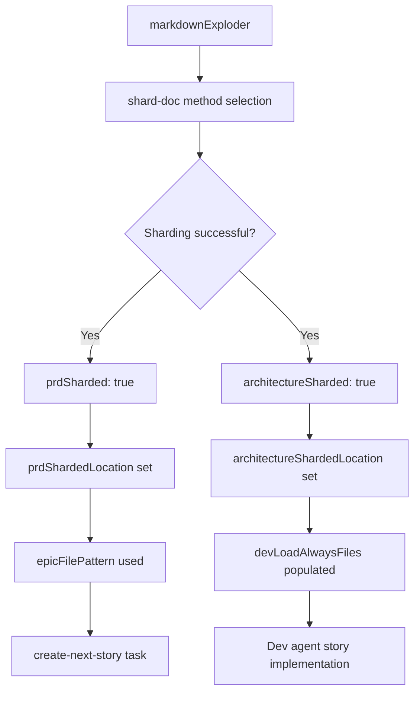

# Task Analysis: shard-doc

**Task ID**: `shard-doc`
**Task File**: `.bmad-core/tasks/shard-doc.md`
**Primary Agents**: PM (John), Architect (Winston), PO (Sarah)
**Task Type**: Document Transformation (Two-Path Workflow)
**Version Analyzed**: BMad Core v4

---

## 1. Purpose & Scope

### Overview
The `shard-doc` task is the **critical Planning→Development transition tool** in the BMad framework. It transforms large, monolithic planning documents (PRDs, Architecture specs) into structured folder hierarchies with individual files for each major section. This transformation is essential for the v4 architecture approach where epics and stories reference specific, manageable document fragments rather than navigating massive single files.

### Key Characteristics
- **Dual-path execution** - Automatic (preferred) via CLI tool or Manual (LLM-driven)
- **Configuration-driven behavior** - Sharding strategy controlled by `markdownExploder` setting
- **Content-preserving transformation** - Zero data loss, perfect markdown fidelity
- **Level 2 section extraction** - Splits on `## ` headings only
- **Heading level adjustment** - Promotes sections to become standalone documents
- **Index file generation** - Creates navigation hub for sharded content
- **Context-aware parsing** - Distinguishes real headers from code block content

### Design Philosophy
**"Enable agile access to planning artifacts by breaking monoliths into navigable components"**

The task embodies the principle that large documents become unwieldy for:
1. **AI Context Windows** - Loading entire PRD/architecture docs exceeds token limits
2. **Developer Focus** - Engineers need specific sections, not entire documents
3. **Story Context** - Stories should reference precise sections (e.g., `epic-1-user-auth.md`)
4. **Version Control** - Smaller files = better diff clarity and merge conflict reduction
5. **Team Collaboration** - Multiple agents can work on different sections simultaneously

### Scope
This task encompasses:
- Configuration detection (`markdownExploder` setting check)
- Automatic sharding via `md-tree explode` CLI (preferred path)
- Manual LLM-driven sharding with markdown parsing (fallback path)
- Level 2 section identification and extraction
- Heading level adjustment (L2→L1, L3→L2, etc.)
- Index file generation with navigation links
- Content integrity validation (code blocks, diagrams, tables)
- Success reporting with file manifest

### Critical Transition Role
**Sharding is the gateway between Planning Phase and Development Phase:**

```
Planning Phase              Sharding              Development Phase
──────────────              ────────              ─────────────────
PRD (monolithic)     →  shard-doc  →  docs/prd/epic-*.md
Architecture (mono)  →  shard-doc  →  docs/architecture/*.md

PM creates PRD              PO validates         SM creates stories
Architect designs           sharding success     Dev implements
```

Without sharding, the SM agent cannot identify epics, and the development cycle cannot begin.

---

## 2. Input Requirements

### Required Inputs

```yaml
required:
  - source_document: 'absolute/path/to/document.md'  # Document to shard
  - destination_folder: 'absolute/path/to/output/'   # Where shards are created

implicit:
  - core_config: '.bmad-core/core-config.yaml'  # Configuration settings
```

### Input Sources
- **source_document**: User-provided path (typically `docs/prd.md` or `docs/architecture.md`)
- **destination_folder**: User-provided path (typically `docs/prd/` or `docs/architecture/`)
- **core_config**: Loaded to check `markdownExploder` setting

### Configuration Dependencies

The task reads `core-config.yaml` to determine sharding strategy:

```yaml
markdownExploder: true/false  # If true, attempt automatic sharding

prd:
  prdFile: 'docs/prd.md'
  prdSharded: true              # Indicates PRD has been sharded
  prdShardedLocation: 'docs/prd'

architecture:
  architectureFile: 'docs/architecture.md'
  architectureSharded: true     # Indicates architecture has been sharded
  architectureShardedLocation: 'docs/architecture'
```

**Decision Logic**:
```
IF markdownExploder == true:
  → Attempt automatic sharding with md-tree explode
  → If command not found: STOP, instruct user on installation
  → If command succeeds: DONE
ELSE IF markdownExploder == false:
  → Inform user about preferred automatic method
  → Proceed with manual LLM-driven sharding
```

### Document Dependencies

**Source Document Requirements**:
- Must be valid markdown file
- Must contain at least one Level 2 heading (`## `)
- May contain any valid markdown: code blocks, diagrams, tables, lists
- Typical size: 5,000-50,000 lines (PRD or Architecture spec)

**Destination Folder**:
- Will be created if it doesn't exist
- Any existing files with conflicting names will be overwritten

### Validation Requirements

**Pre-execution checks**:
```python
# Check 1: Source document exists and is readable
if not os.path.exists(source_document):
    raise FileNotFoundError(f"Source document not found: {source_document}")

# Check 2: Source document contains Level 2 headings
content = read_file(source_document)
if not re.search(r'^## ', content, re.MULTILINE):
    raise ValueError("Document must contain at least one Level 2 heading (##)")

# Check 3: Configuration file exists
if not os.path.exists('.bmad-core/core-config.yaml'):
    # Warning, not blocking - task can still proceed
    warn("core-config.yaml not found, assuming manual mode")
```

---

## 3. Execution Flow

### High-Level Flow



### Detailed Step-by-Step Flow

#### AUTOMATIC PATH (Preferred)

**Step 0: Configuration Check**
```yaml
Action: Read .bmad-core/core-config.yaml
Check: markdownExploder setting
Decision:
  - IF true: Proceed to Step 1
  - IF false: Skip to Manual Path
  - IF config missing: Assume false, skip to Manual Path
```

**Step 1: Attempt Automatic Sharding**
```bash
# Execute CLI command
md-tree explode [source-document] [destination-folder]

# Example for PRD:
md-tree explode docs/prd.md docs/prd

# Example for Architecture:
md-tree explode docs/architecture.md docs/architecture
```

**Step 2: Check Command Result**
```yaml
IF command succeeds:
  - Report: "Document sharded successfully using md-tree"
  - List files created
  - END (do not proceed to manual method)

IF command fails with "command not found":
  - STOP immediately
  - Display message:
    "The markdownExploder setting is enabled but md-tree is not available.
    Please either:
    1. Install: npm install -g @kayvan/markdown-tree-parser
    2. Or set markdownExploder to false in core-config.yaml

    IMPORTANT: STOP HERE - do not proceed with manual sharding."
  - END (task blocked until user action)

IF command fails for other reasons:
  - Report error
  - Fall back to manual method (or STOP based on implementation)
```

#### MANUAL PATH (Fallback)

**Step 0: User Notification**
```yaml
Action: Inform user
Message: |
  The markdownExploder setting is currently false. For better performance
  and reliability, you should:
  1. Set markdownExploder to true in core-config.yaml
  2. Install: npm install -g @kayvan/markdown-tree-parser

  I will now proceed with the manual sharding process.
```

**Step 1: Identify Document and Target Location**
```yaml
Action: Parse inputs
source: [user-provided document path]
destination: [user-provided folder path]

Create destination folder if not exists:
  mkdir -p {destination}
```

**Step 2: Parse and Extract Sections**
```python
# CRITICAL PARSING RULES
# 1. Read entire document
content = read_file(source_document)

# 2. Identify all Level 2 sections
# Must be context-aware: ## inside code blocks are NOT headers
sections = []
in_code_block = False
current_section = None

for line_num, line in enumerate(content.split('\n')):
    # Track code block state
    if line.strip().startswith('```'):
        in_code_block = not in_code_block
        if current_section:
            current_section['lines'].append(line)
        continue

    # Only process ## as headers if NOT in code block
    if not in_code_block and line.startswith('## '):
        # Save previous section if exists
        if current_section:
            sections.append(current_section)

        # Start new section
        current_section = {
            'heading': line.strip(),
            'title': line[3:].strip(),  # Remove "## "
            'lines': [line],
            'start_line': line_num
        }
    else:
        # Add line to current section
        if current_section:
            current_section['lines'].append(line)

# Add final section
if current_section:
    sections.append(current_section)
```

**Step 3: Create Individual Files**
```python
for section in sections:
    # Generate filename from section title
    filename = generate_filename(section['title'])
    # Example: "## Tech Stack" → "tech-stack.md"

    # Adjust heading levels
    adjusted_content = adjust_heading_levels(section['lines'])
    # L2 (##) → L1 (#)
    # L3 (###) → L2 (##)
    # L4 (####) → L3 (###)
    # etc.

    # Write file
    write_file(f"{destination}/{filename}", adjusted_content)
```

**Filename Generation Rules**:
```python
def generate_filename(title: str) -> str:
    """Convert section title to lowercase-dash-case filename."""
    # Remove special characters (keep alphanumeric and spaces)
    clean = re.sub(r'[^a-zA-Z0-9\s-]', '', title)

    # Replace spaces with dashes
    dashed = clean.replace(' ', '-')

    # Convert to lowercase
    lower = dashed.lower()

    # Remove consecutive dashes
    normalized = re.sub(r'-+', '-', lower)

    # Remove leading/trailing dashes
    trimmed = normalized.strip('-')

    return f"{trimmed}.md"

# Examples:
# "Tech Stack" → "tech-stack.md"
# "Epic 1: User Authentication" → "epic-1-user-authentication.md"
# "API & Database Design" → "api-database-design.md"
```

**Heading Level Adjustment Rules**:
```python
def adjust_heading_levels(lines: list[str]) -> str:
    """Decrease all heading levels by 1."""
    adjusted = []
    in_code_block = False

    for line in lines:
        # Track code block boundaries
        if line.strip().startswith('```'):
            in_code_block = not in_code_block
            adjusted.append(line)
            continue

        # Only adjust headings outside code blocks
        if not in_code_block and line.startswith('#'):
            # Count leading # symbols
            level = len(line) - len(line.lstrip('#'))

            # Decrease level by 1 (minimum level 1)
            new_level = max(1, level - 1)

            # Rebuild heading
            heading_text = line.lstrip('#').lstrip()
            new_line = '#' * new_level + ' ' + heading_text
            adjusted.append(new_line)
        else:
            # Non-heading line, keep as-is
            adjusted.append(line)

    return '\n'.join(adjusted)
```

**Step 4: Create Index File**
```python
# Extract document title and preamble
# (Content before first Level 2 heading)
preamble = extract_preamble(content)
original_title = extract_h1_title(content)  # First # heading

# Build index content
index_content = f"""# {original_title}

{preamble if preamble else ''}

## Sections

"""

# Add links to all sharded files
for section in sections:
    filename = generate_filename(section['title'])
    title = section['title']
    index_content += f"- [{title}](./{filename})\n"

# Write index.md
write_file(f"{destination}/index.md", index_content)
```

**Step 5: Preserve Special Content**

Critical content types that must be preserved exactly:

1. **Fenced Code Blocks**:
```python
# Must capture complete blocks including language identifier
# CORRECT:
"""
```python
def foo():
    return 42
```
"""

# INCORRECT (missing closing fence):
"""
```python
def foo():
    return 42
"""
```

2. **Mermaid Diagrams**:
```python
# Must preserve complete diagram syntax
# CORRECT:
"""

"""
```

3. **Tables**:
```markdown
# Must maintain alignment and structure
| Column 1 | Column 2 | Column 3 |
|----------|----------|----------|
| Data     | Data     | Data     |
```

4. **Template Placeholders**:
```markdown
# Preserve exactly as-is
{{project_name}}
{{tech_stack}}
```

5. **Nested Lists**:
```markdown
# Preserve indentation levels
- Level 1
  - Level 2
    - Level 3
  - Level 2
```

**Step 6: Validation**
```python
# Verify sharding completeness
validation_checks = [
    "All Level 2 sections extracted",
    "No content lost (line count verification)",
    "All files created successfully",
    "Index.md contains all section links",
    "Heading levels properly adjusted",
    "Code blocks remain intact",
    "No ## symbols inside code blocks treated as headers"
]

for check in validation_checks:
    if not validate(check):
        raise ValidationError(f"Validation failed: {check}")
```

**Step 7: Report Results**
```yaml
Report Format:
  success: true
  source: docs/prd.md
  destination: docs/prd/
  files_created: 12
  sections:
    - filename: epic-1-user-authentication.md
      title: "Epic 1: User Authentication"
      lines: 250
    - filename: epic-2-data-management.md
      title: "Epic 2: Data Management"
      lines: 180
    # ... etc.
  index_file: docs/prd/index.md
  message: "Document sharded successfully"
```

---

## 4. Decision Points & Branching Logic

### Decision Point 1: Sharding Method Selection

**Trigger**: Task invocation
**Condition**: `markdownExploder` setting in `core-config.yaml`

```python
if config_exists and config.markdownExploder == True:
    return "AUTOMATIC_PATH"
else:
    return "MANUAL_PATH"
```

**Rationale**: The automatic method via `md-tree` is:
- **Faster**: Native CLI tool vs LLM parsing
- **More reliable**: Edge cases handled by dedicated parser
- **More accurate**: Heading level adjustments are deterministic
- **Less token-intensive**: No LLM context required

### Decision Point 2: Automatic Command Availability

**Trigger**: Attempting to execute `md-tree explode`
**Condition**: Command exists in system PATH

```python
result = subprocess.run(['md-tree', 'explode', source, dest])

if result.returncode == 127:  # Command not found
    return "BLOCK_AND_INSTRUCT"
elif result.returncode == 0:
    return "SUCCESS"
else:
    return "ERROR_FALLBACK"
```

**Actions**:
- **BLOCK_AND_INSTRUCT**: STOP task, display installation instructions, do NOT proceed to manual
- **SUCCESS**: Report success, END task
- **ERROR_FALLBACK**: Log error, optionally fall back to manual (implementation-specific)

### Decision Point 3: Header vs Code Block Detection

**Trigger**: Parsing each line in manual mode
**Condition**: Current code block state

```python
if line.startswith('```'):
    in_code_block = not in_code_block
    return "TOGGLE_CODE_BLOCK_STATE"

if line.startswith('## ') and not in_code_block:
    return "NEW_SECTION_HEADER"
else:
    return "CONTENT_LINE"
```

**Rationale**: Prevents false positives where documentation examples contain `## ` within code blocks.

### Decision Point 4: Filename Collision Handling

**Trigger**: Generated filename already exists in destination folder
**Condition**: File exists at target path

```python
target_path = f"{destination}/{filename}"

if os.path.exists(target_path):
    return "OVERWRITE"  # BMad approach: overwrite without prompting
else:
    return "CREATE_NEW"
```

**Rationale**: Sharding is typically a one-time operation during Planning→Development transition. Re-running sharding implies the user wants to regenerate the sharded structure.

### Decision Point 5: Empty or Invalid Sections

**Trigger**: Section extraction yields no content or only whitespace
**Condition**: Section content validation

```python
if len(section['lines']) <= 1:  # Only the heading, no content
    return "SKIP_SECTION"  # Don't create file for empty section
else:
    return "INCLUDE_SECTION"
```

**Rationale**: Prevents creation of empty files that would clutter the sharded structure.

---

## 5. User Interaction Points

### Interaction Point 1: Task Invocation

**When**: User initiates sharding (typically via PM agent command `*shard-prd` or Architect command `*shard-architecture`)
**Type**: Command parameters
**Required**:
- Source document path
- Destination folder path

**Example Dialogs**:
```
User: "Shard the PRD"
Agent: Resolves to: md-tree explode docs/prd.md docs/prd

User: "Split the architecture document into sections"
Agent: Resolves to: md-tree explode docs/architecture.md docs/architecture
```

### Interaction Point 2: Missing Configuration Warning

**When**: `markdownExploder` is set to `false`
**Type**: Informational notification
**Required**: None (task proceeds automatically)

**Display Message**:
```
The markdownExploder setting is currently false. For better performance
and reliability, you should:
1. Set markdownExploder to true in .bmad-core/core-config.yaml
2. Install @kayvan/markdown-tree-parser globally with:
   npm install -g @kayvan/markdown-tree-parser

I will now proceed with the manual sharding process.
```

### Interaction Point 3: Tool Not Available Block

**When**: `markdownExploder` is `true` but `md-tree` command not found
**Type**: Blocking error with user action required
**Required**: User must take action before task can succeed

**Display Message**:
```
The markdownExploder setting is enabled but the md-tree command is not available.

Please either:
1. Install @kayvan/markdown-tree-parser globally with:
   npm install -g @kayvan/markdown-tree-parser

2. Or set markdownExploder to false in .bmad-core/core-config.yaml

IMPORTANT: STOP HERE - do not proceed with manual sharding until one
of the above actions is taken.
```

**User Actions**:
- **Option 1**: Install the tool and re-run the task
- **Option 2**: Disable automatic sharding and re-run (task will use manual method)

### Interaction Point 4: Success Confirmation

**When**: Sharding completes successfully (automatic or manual)
**Type**: Success report
**Required**: None (informational)

**Display Format**:
```
✓ Document sharded successfully

Source: docs/prd.md
Destination: docs/prd/
Files created: 12

Sections:
- epic-1-user-authentication.md: "Epic 1: User Authentication"
- epic-2-data-management.md: "Epic 2: Data Management"
- epic-3-notifications.md: "Epic 3: Notifications"
... (full list)

Index file created: docs/prd/index.md
```

### Interaction Point 5: Validation Errors

**When**: Manual sharding encounters parsing errors or validation failures
**Type**: Error report with diagnostic information
**Required**: User must fix source document or report issue

**Example Error**:
```
✗ Sharding failed: Validation error

Issue: Code block starting at line 234 is not properly closed
Context:
  ```python
  def foo():
      return 42
  # Missing closing ```

Please fix the source document and try again.
```

---

## 6. Output Specifications

### Primary Outputs

**1. Sharded Document Files**
- **Location**: `{destination_folder}/{section-title-slug}.md`
- **Naming**: Lowercase-dash-case from Level 2 heading
- **Content**: Adjusted heading levels, complete section content
- **Format**: Markdown (.md)

**2. Index Navigation File**
- **Location**: `{destination_folder}/index.md`
- **Purpose**: Navigation hub with links to all shards
- **Content**: Original title, preamble, section links

**3. Configuration Updates** (Implicit)
- **PRD Sharding**: `prdSharded: true` in core-config.yaml
- **Architecture Sharding**: `architectureSharded: true` in core-config.yaml

### Output Structure Example

**For PRD Sharding** (`docs/prd.md` → `docs/prd/`):
```
docs/prd/
├── index.md                           # Navigation hub
├── epic-1-user-authentication.md      # Level 2 section 1
├── epic-2-data-management.md          # Level 2 section 2
├── epic-3-notifications.md            # Level 2 section 3
├── epic-4-admin-dashboard.md          # Level 2 section 4
├── non-functional-requirements.md     # Level 2 section 5
├── glossary.md                        # Level 2 section 6
└── appendix.md                        # Level 2 section 7
```

**For Architecture Sharding** (`docs/architecture.md` → `docs/architecture/`):
```
docs/architecture/
├── index.md                   # Navigation hub
├── tech-stack.md              # Level 2 section 1
├── coding-standards.md        # Level 2 section 2
├── source-tree.md             # Level 2 section 3
├── database-design.md         # Level 2 section 4
├── api-design.md              # Level 2 section 5
├── frontend-architecture.md   # Level 2 section 6
└── deployment-strategy.md     # Level 2 section 7
```

### Output Format Standards

#### Sharded File Format
```markdown
# Section Title

[Complete section content with adjusted heading levels]

## Subsection (was ### in original)

Content...

### Sub-subsection (was #### in original)

Content...
```

#### Index File Format
```markdown
# [Original Document Title]

[Preamble content if any existed before first ## heading]

## Sections

- [Section Title 1](./section-title-1.md)
- [Section Title 2](./section-title-2.md)
- [Section Title 3](./section-title-3.md)
...
```

### Content Integrity Guarantees

The sharding process guarantees:

1. **Zero Data Loss**: Every line from the source document appears in exactly one output file
2. **Perfect Markdown Fidelity**: All markdown syntax preserved exactly
3. **Code Block Preservation**: Fenced code blocks remain intact with language identifiers
4. **Diagram Preservation**: Mermaid diagrams, PlantUML, etc. preserved completely
5. **Table Preservation**: Markdown tables maintain alignment and structure
6. **Link Preservation**: Internal and external links remain functional
7. **Template Preservation**: Template placeholders like `{{variable}}` preserved
8. **Whitespace Significance**: Significant whitespace (indentation, blank lines) preserved

### Metadata Preservation

Special content preserved:
- YAML front matter (if present in original)
- HTML comments
- Markdown comments
- Inline HTML
- Embedded images with paths
- Custom markdown extensions

---

## 7. Error Handling & Validation

### Error Categories

#### E1: Pre-execution Errors

**E1.1: Source Document Not Found**
```yaml
Condition: source_document path does not exist
Error: FileNotFoundError
Message: "Source document not found: {path}"
Recovery: User must provide valid document path
```

**E1.2: Source Document Not Readable**
```yaml
Condition: Permissions issue or encoding problem
Error: PermissionError | UnicodeDecodeError
Message: "Cannot read source document: {path}"
Recovery: Check file permissions or encoding
```

**E1.3: No Level 2 Headings Found**
```yaml
Condition: Document contains no ## headings
Error: ValidationError
Message: "Document must contain at least one Level 2 heading (##)"
Recovery: User must add structure or use different sharding strategy
```

#### E2: Execution Errors

**E2.1: md-tree Command Not Found**
```yaml
Condition: markdownExploder=true but md-tree not installed
Error: CommandNotFoundError
Message: "md-tree command not available. Install or disable markdownExploder."
Recovery: Install tool OR set markdownExploder=false
Blocking: YES - task cannot proceed
```

**E2.2: md-tree Execution Failure**
```yaml
Condition: md-tree command fails with non-zero exit code
Error: CommandExecutionError
Message: "md-tree explode failed: {stderr}"
Recovery: Check document format, check disk space
Fallback: Optionally fall back to manual method
```

**E2.3: Destination Folder Creation Failure**
```yaml
Condition: Cannot create destination folder (permissions, disk space)
Error: OSError
Message: "Cannot create destination folder: {path}"
Recovery: Check permissions, check disk space
```

**E2.4: Parsing Errors (Manual Mode)**
```yaml
Condition: Malformed markdown that breaks parser
Error: ParseError
Examples:
  - Unclosed code blocks
  - Invalid heading syntax
  - Encoding issues mid-document
Message: "Document parsing failed at line {n}: {context}"
Recovery: User must fix source document
```

**E2.5: File Write Errors**
```yaml
Condition: Cannot write output files (permissions, disk space, name conflicts)
Error: IOError | OSError
Message: "Cannot write file: {path}"
Recovery: Check permissions, check disk space, check filename validity
```

#### E3: Post-execution Validation Errors

**E3.1: Content Loss Detected**
```yaml
Condition: Output line count != input line count (accounting for heading adjustments)
Error: ValidationError
Message: "Content validation failed: {input_lines} != {output_lines}"
Recovery: Re-run sharding, report bug if persistent
```

**E3.2: Section Extraction Failure**
```yaml
Condition: Expected sections not extracted (e.g., only 2 sections but document clearly has 5)
Error: ValidationError
Message: "Section extraction incomplete: expected {n}, got {m}"
Recovery: Manual inspection required
```

**E3.3: Index Generation Failure**
```yaml
Condition: index.md not created or malformed
Error: ValidationError
Message: "Index file validation failed"
Recovery: Re-run sharding
```

### Validation Strategy

**Pre-execution Validation**:
```python
def validate_preconditions(source: str, dest: str) -> bool:
    checks = [
        ("Source exists", os.path.exists(source)),
        ("Source is file", os.path.isfile(source)),
        ("Source readable", os.access(source, os.R_OK)),
        ("Dest parent exists", os.path.exists(os.path.dirname(dest))),
        ("Dest writable", os.access(os.path.dirname(dest), os.W_OK)),
    ]

    for check_name, result in checks:
        if not result:
            raise ValidationError(f"Pre-condition failed: {check_name}")

    return True
```

**Post-execution Validation**:
```python
def validate_sharding_results(source: str, dest: str, sections: list) -> bool:
    checks = [
        # All section files created
        all(os.path.exists(f"{dest}/{s['filename']}") for s in sections),

        # Index file created
        os.path.exists(f"{dest}/index.md"),

        # Content integrity (approximate - accounts for heading adjustments)
        abs(count_lines(source) - sum_lines_in_shards(dest)) < len(sections) * 2,

        # All sections non-empty
        all(os.path.getsize(f"{dest}/{s['filename']}") > 0 for s in sections),
    ]

    return all(checks)
```

### Recovery Procedures

**For Blocking Errors** (E2.1):
1. Display clear installation instructions
2. STOP task execution
3. Do NOT fall back to manual mode
4. Wait for user to install tool or change config

**For Non-blocking Errors** (E2.2):
1. Log error details
2. Optionally attempt manual method as fallback
3. If fallback fails, escalate to user

**For Validation Errors** (E3.x):
1. Clean up partial output (delete destination folder)
2. Log detailed error with context
3. Request user to inspect source document
4. Suggest fixes if error is recognizable

---

## 8. Dependencies & Prerequisites

### System Dependencies

**For Automatic Sharding** (markdownExploder=true):
```json
{
  "tool": "@kayvan/markdown-tree-parser",
  "command": "md-tree",
  "install": "npm install -g @kayvan/markdown-tree-parser",
  "version": ">=1.0.0",
  "required": true
}
```

**For Manual Sharding**:
```yaml
dependencies:
  - Python 3.8+ OR Node.js (LLM execution environment)
  - Regex support
  - File system access
```

### Configuration Dependencies

**Required Configuration**:
```yaml
# .bmad-core/core-config.yaml
markdownExploder: true/false  # Determines sharding method

# Optional but recommended for context
prd:
  prdSharded: true  # Set to true after PRD sharding
  prdShardedLocation: 'docs/prd'

architecture:
  architectureSharded: true  # Set to true after architecture sharding
  architectureShardedLocation: 'docs/architecture'
```

### Document Dependencies

**Input Document Requirements**:
1. **Valid markdown file** with `.md` extension
2. **Contains Level 2 headings** (`## `) for section identification
3. **Well-formed markdown** (closed code blocks, valid syntax)
4. **UTF-8 encoding** (or compatible)

**Typical Input Documents**:
- `docs/prd.md` - Product Requirements Document (5,000-30,000 lines)
- `docs/architecture.md` - Architecture Specification (3,000-20,000 lines)
- Any large markdown document needing subdivision

### Task Dependencies

This task has **no dependencies on other tasks**, but is **depended upon by**:

**Downstream Task Dependencies**:
1. **create-next-story** - Requires sharded PRD to identify epics
2. **brownfield-create-epic** - May reference sharded architecture
3. **SM agent workflows** - Read from sharded PRD locations
4. **Dev agent workflows** - Read from sharded architecture locations

**Workflow Position**:
```
Planning Phase:
  1. create-doc (PM creates PRD)
  2. execute-checklist (PO validates PRD)
  3. create-doc (Architect creates Architecture)
  4. execute-checklist (PO validates Architecture)
  → 5. shard-doc (PRD) ← THIS TASK
  → 6. shard-doc (Architecture) ← THIS TASK

Development Phase:
  7. create-next-story (SM - requires sharded PRD)
  8. validate-next-story (PO - requires sharded PRD)
  9. [Dev implements story]
  ...
```

### Agent Dependencies

**Primary Agents Using shard-doc**:
1. **PM (John)** - Via `*shard-prd` command
2. **Architect (Winston)** - Via `*shard-architecture` command
3. **PO (Sarah)** - Validates sharding success

**Agent Workflow Integration**:
```yaml
PM Agent Workflow:
  1. *create-prd (interactive or YOLO)
  2. *doc-out (save PRD to docs/prd.md)
  3. PO validates PRD with master checklist
  4. *shard-prd → invokes shard-doc task
  5. Transition to Development Phase

Architect Agent Workflow:
  1. *create-architecture (interactive or YOLO)
  2. *doc-out (save to docs/architecture.md)
  3. PO validates Architecture with master checklist
  4. *shard-architecture → invokes shard-doc task
  5. Transition to Development Phase
```

### Environment Dependencies

**File System Requirements**:
```yaml
read_access:
  - Source document path
  - .bmad-core/core-config.yaml

write_access:
  - Destination folder (create if not exists)
  - All sharded output files

disk_space:
  - Approximately 1.5x source document size (for sharded files + index)
```

**Execution Context**:
```yaml
working_directory: Project root (where .bmad-core/ exists)
permissions: User must have read/write access
environment_variables: None required
```

---

## 9. Integration Points

### Integration Point 1: PM Agent Commands

**Command**: `*shard-prd`
**Integration Type**: Direct task invocation

```yaml
Agent: PM (John)
Command: *shard-prd
Resolves to:
  task: shard-doc
  parameters:
    source: docs/prd.md
    destination: docs/prd/
Post-action: Update core-config.yaml (prdSharded: true)
```

### Integration Point 2: Architect Agent Commands

**Command**: `*shard-architecture`
**Integration Type**: Direct task invocation

```yaml
Agent: Architect (Winston)
Command: *shard-architecture
Resolves to:
  task: shard-doc
  parameters:
    source: docs/architecture.md
    destination: docs/architecture/
Post-action: Update core-config.yaml (architectureSharded: true)
```

### Integration Point 3: Core Configuration Updates

**Integration Type**: Configuration mutation

```yaml
Automatic Update Pattern:
  After successful PRD sharding:
    - Set prdSharded: true
    - Set prdShardedLocation: docs/prd

  After successful Architecture sharding:
    - Set architectureSharded: true
    - Set architectureShardedLocation: docs/architecture

Impact:
  - SM agent knows to read from sharded locations
  - Dev agent knows to read from sharded locations
  - create-next-story task reads sharded epic files
```

### Integration Point 4: create-next-story Task

**Integration Type**: File path resolution

```yaml
create-next-story depends on sharded PRD:

  Step 1 (Identify next story):
    - Reads: {prdShardedLocation}/{epicFilePattern}
    - Example: docs/prd/epic-1-*.md
    - Requires: prdSharded == true in config

  If prdSharded == false:
    - Task may fail or behave incorrectly
    - Expects epics embedded in monolithic PRD (v3 behavior)
```

### Integration Point 5: Dev Agent Context Loading

**Integration Type**: Architecture file reading

```yaml
Dev agent implementation workflow:

  devLoadAlwaysFiles from config:
    - docs/architecture/coding-standards.md
    - docs/architecture/tech-stack.md
    - docs/architecture/source-tree.md

  These files exist because:
    - Architecture was sharded by shard-doc
    - Specific sections extracted as standalone files
    - Dev loads them at start of every story implementation
```

### Integration Point 6: md-tree CLI Tool

**Integration Type**: External command execution

```yaml
Tool: @kayvan/markdown-tree-parser
Command: md-tree explode [source] [dest]

Integration:
  - Check: markdownExploder setting in config
  - Execute: subprocess.run(['md-tree', 'explode', ...])
  - Handle: Command not found (installation required)
  - Validate: Command exit code
  - Report: Success or error

Benefits:
  - Faster than LLM parsing
  - Handles edge cases better
  - Token-efficient (no LLM context required)
  - Deterministic results
```

### Integration Point 7: PO Master Checklist

**Integration Type**: Validation checkpoint

```yaml
PO Master Checklist includes:

  Checkpoint: "Documents sharded for development"
  Actions:
    - Verify prdSharded: true
    - Verify architectureSharded: true
    - Verify sharded folders exist
    - Verify index.md files created
    - Verify epic files accessible

  Blocks development phase if:
    - Sharding not completed
    - Sharded files missing or malformed
```

### Integration Point 8: Version Control (Git)

**Integration Type**: File system changes

```yaml
Sharding creates many new files:

  Git impact:
    - New folder: docs/prd/ (12+ files)
    - New folder: docs/architecture/ (7+ files)
    - Modified: .bmad-core/core-config.yaml

  Best practices:
    - Commit monolithic docs before sharding
    - Commit sharded structure after sharding
    - Document sharding in commit message
    - Optionally remove monolithic docs after sharding

  Merge considerations:
    - Sharded files easier to merge than monolithic
    - Conflicts localized to specific sections
    - Team collaboration improved
```

---

## 10. Performance Characteristics

### Execution Time

**Automatic Sharding** (md-tree):
```yaml
typical_documents:
  - small (< 1,000 lines): < 1 second
  - medium (1,000-10,000 lines): 1-3 seconds
  - large (10,000-50,000 lines): 3-10 seconds
  - very large (> 50,000 lines): 10-30 seconds

factors:
  - Document size (primary)
  - Number of Level 2 sections (secondary)
  - Disk I/O speed (tertiary)
```

**Manual Sharding** (LLM-driven):
```yaml
typical_documents:
  - small (< 1,000 lines): 10-30 seconds
  - medium (1,000-10,000 lines): 1-5 minutes
  - large (10,000-50,000 lines): 5-15 minutes
  - very large (> 50,000 lines): 15-60 minutes

factors:
  - Document size (primary)
  - LLM token processing speed (secondary)
  - Context window limits (may require chunking)
  - Number of sections (affects validation time)
```

**Performance Comparison**:
```
Automatic: ~0.0001 seconds per line
Manual: ~0.01-0.05 seconds per line

Speed improvement: 100-500x faster with md-tree
```

### Token Consumption

**Automatic Sharding**:
```yaml
tokens_used: ~ 500 tokens
breakdown:
  - Configuration reading: 100 tokens
  - Command execution: 200 tokens
  - Result reporting: 200 tokens

cost: Negligible (< $0.001 per sharding operation)
```

**Manual Sharding**:
```yaml
tokens_used: ~ Document_size + 2,000 tokens
breakdown:
  - Reading document: Document_size tokens
  - Parsing instructions: 1,000 tokens
  - Section extraction logic: 500 tokens
  - Validation: 300 tokens
  - Reporting: 200 tokens

example (10,000 line document):
  - Input tokens: ~40,000 (10K lines × 4 tokens/line)
  - Output tokens: ~42,000 (adjusted content + overhead)
  - Total: ~82,000 tokens
  - Cost: ~$0.25-$0.80 (depending on model)

large document (30,000 line PRD):
  - May exceed context window
  - Requires chunking strategy
  - Total tokens: 200,000+
  - Cost: $2-$5
```

**Token Efficiency Recommendation**:
```
Always use automatic sharding (markdownExploder: true) for:
- Token savings: 99%+ reduction
- Time savings: 100-500x faster
- Cost savings: ~$0.25-$5 per operation
- Reliability: Better edge case handling
```

### Memory Requirements

**Automatic Sharding**:
```yaml
memory_usage: ~ 5MB + (2 × document_size)
explanation:
  - Tool overhead: ~5MB
  - Input document: 1 × document_size
  - Output buffer: 1 × document_size

example (10,000 lines = ~400KB):
  - Total memory: ~6MB
```

**Manual Sharding**:
```yaml
memory_usage: ~ 100MB + (10 × document_size)
explanation:
  - LLM context: ~100MB baseline
  - Input document: 1 × document_size
  - Parsed structure: 3 × document_size
  - Output buffers: 6 × document_size

example (10,000 lines = ~400KB):
  - Total memory: ~104MB
```

### Disk I/O Characteristics

```yaml
read_operations:
  - Source document: 1 read (full file)
  - Configuration: 1 read (core-config.yaml)

write_operations:
  - Sharded files: N writes (one per Level 2 section)
  - Index file: 1 write
  - Total: N + 1 writes

example (PRD with 12 sections):
  - Reads: 2 files
  - Writes: 13 files
  - Total I/O: 15 operations

disk_space:
  - Output size: ~1.1x input size
  - Overhead: Index file + heading adjustments
  - Example: 1MB input → 1.1MB output
```

### Scalability Limits

**Automatic Sharding**:
```yaml
max_document_size: No practical limit
max_sections: No practical limit
max_nesting_depth: No practical limit

tested_scale:
  - 100,000 lines: ✓ Works
  - 1,000 sections: ✓ Works
  - 10-level nesting: ✓ Works
```

**Manual Sharding**:
```yaml
max_document_size: ~50,000 lines (context window limit)
max_sections: ~100 sections (practical limit for validation)
max_nesting_depth: ~6 levels (practical limit for heading adjustment)

workarounds:
  - Chunk document for context window
  - Stream processing for large documents
  - Progressive validation
```

### Optimization Recommendations

1. **Always use automatic sharding** (markdownExploder: true)
   - 100-500x faster
   - 99% token savings
   - Better reliability

2. **Shard early in planning phase**
   - Don't wait until document is finalized
   - Can re-shard if needed
   - Enables early development preparation

3. **Structure documents for sharding**
   - Use Level 2 headings consistently
   - Keep sections reasonably sized
   - Avoid deep nesting where possible

4. **Monitor disk space**
   - Sharding increases file count significantly
   - Plan for ~1.2x storage overhead

---

## 11. Security & Permissions

### File System Security

**Read Permissions Required**:
```yaml
files:
  - Source document (e.g., docs/prd.md)
  - .bmad-core/core-config.yaml (optional)

minimum_permission: r-- (read-only)
user_context: Current user running agent
```

**Write Permissions Required**:
```yaml
directories:
  - Destination folder (e.g., docs/prd/)
  - Parent directory of destination (for mkdir)

files:
  - All sharded output files
  - Index file (index.md)

minimum_permission: rw- (read-write)
user_context: Current user running agent
```

**Permission Validation**:
```python
def check_permissions(source: str, dest: str) -> bool:
    # Check source readable
    if not os.access(source, os.R_OK):
        raise PermissionError(f"Cannot read source: {source}")

    # Check destination writable (or parent if dest doesn't exist)
    dest_check = dest if os.path.exists(dest) else os.path.dirname(dest)
    if not os.access(dest_check, os.W_OK):
        raise PermissionError(f"Cannot write to: {dest}")

    return True
```

### Command Execution Security

**Automatic Sharding Security**:
```yaml
command: md-tree explode [source] [dest]

risks:
  - Command injection via source/dest paths
  - Arbitrary code execution if md-tree compromised
  - Symlink attacks if paths manipulated

mitigations:
  - Validate source/dest paths (no shell metacharacters)
  - Use absolute paths only
  - Verify md-tree is legitimate install
  - Run with user permissions (not root)

safe_execution:
  subprocess.run(
      ['md-tree', 'explode', validated_source, validated_dest],
      shell=False,  # CRITICAL: Never use shell=True
      check=True
  )
```

**Path Traversal Prevention**:
```python
def validate_path(path: str, base_dir: str) -> str:
    """Prevent directory traversal attacks."""
    # Resolve to absolute path
    abs_path = os.path.abspath(path)
    abs_base = os.path.abspath(base_dir)

    # Ensure path is within project directory
    if not abs_path.startswith(abs_base):
        raise SecurityError(f"Path traversal detected: {path}")

    # Reject dangerous patterns
    if '..' in path or path.startswith('/'):
        raise SecurityError(f"Invalid path pattern: {path}")

    return abs_path
```

### Content Security

**Markdown Injection Prevention**:
```yaml
threat: Malicious markdown in source document
risks:
  - XSS if rendered in web UI
  - Script injection if processed by vulnerable renderer
  - Data exfiltration via malicious links

mitigations:
  - Sharding is content-preserving (no execution)
  - Markdown not interpreted during sharding
  - Rendering security is downstream concern
  - Output files have same security posture as input
```

**Template Injection Prevention**:
```yaml
threat: Template syntax in documents (e.g., {{eval(code)}})
risks:
  - Code execution if template engine processes sharded files

mitigations:
  - Sharding preserves templates as-is (no evaluation)
  - Template processing happens in separate task (create-doc)
  - Sharded files are static markdown (no execution context)
```

### Sensitive Data Handling

**Content Privacy**:
```yaml
considerations:
  - Source documents may contain sensitive information
  - Sharded files have same sensitivity as source
  - Manual sharding sends content to LLM (data privacy concern)
  - Automatic sharding is local-only (no external transmission)

recommendations:
  - Use automatic sharding for sensitive documents
  - Avoid manual sharding if content is confidential
  - Apply same access controls to sharded files as source
  - Consider encryption for sensitive documents at rest
```

**Access Control Inheritance**:
```yaml
principle: Sharded files inherit access controls from source

implementation:
  - Copy file permissions from source to sharded files
  - Maintain owner/group from source
  - Preserve read/write restrictions

code:
  source_stat = os.stat(source)
  for shard_file in output_files:
      os.chmod(shard_file, source_stat.st_mode)
      os.chown(shard_file, source_stat.st_uid, source_stat.st_gid)
```

### Audit Trail

**Operation Logging**:
```yaml
log_events:
  - Task invocation (timestamp, user, parameters)
  - Configuration read (markdownExploder setting)
  - Method selection (automatic vs manual)
  - Command execution (if automatic)
  - File creation (list of output files)
  - Success/failure status
  - Error details (if failed)

log_destination:
  - Standard output (user-visible)
  - Agent debug log (if configured)
  - System logs (optional)

example_log:
  timestamp: 2025-10-14T10:30:45Z
  user: developer@example.com
  task: shard-doc
  method: automatic
  command: md-tree explode docs/prd.md docs/prd
  status: success
  files_created: 12
  duration: 2.3s
```

---

## 12. Testing & Validation Strategy

### Unit Test Coverage

**Test Suite 1: Path Validation**
```python
def test_path_traversal_prevention():
    """Ensure path traversal attacks are blocked."""
    malicious_paths = [
        "../../../etc/passwd",
        "docs/../../.ssh/id_rsa",
        "/etc/passwd",
        "docs/../.env"
    ]
    for path in malicious_paths:
        with pytest.raises(SecurityError):
            validate_path(path, base_dir="/project/root")

def test_valid_paths():
    """Ensure legitimate paths are accepted."""
    valid_paths = [
        "docs/prd.md",
        "docs/prd/",
        "./docs/architecture.md"
    ]
    for path in valid_paths:
        assert validate_path(path, base_dir="/project/root")
```

**Test Suite 2: Section Extraction**
```python
def test_section_identification():
    """Ensure Level 2 headings are correctly identified."""
    markdown = """
# Title

Intro text.

## Section 1

Content 1.

## Section 2

Content 2.
```python
# Code with ## inside
x = "## not a header"
```

## Section 3

Content 3.
"""
    sections = extract_sections(markdown)
    assert len(sections) == 3
    assert sections[0]['title'] == "Section 1"
    assert sections[1]['title'] == "Section 2"
    assert sections[2]['title'] == "Section 3"

def test_code_block_handling():
    """Ensure ## inside code blocks are not treated as headers."""
    markdown = """
## Real Section

```python
def example():
    # ## This is not a section
    return "## neither is this"
```

More content.
"""
    sections = extract_sections(markdown)
    assert len(sections) == 1
    assert "## This is not" in sections[0]['content']
```

**Test Suite 3: Heading Level Adjustment**
```python
def test_heading_demotion():
    """Ensure headings are properly demoted by one level."""
    input_text = """## Original L2
### Original L3
#### Original L4
"""
    expected = """# Original L2
## Original L3
### Original L4
"""
    assert adjust_heading_levels(input_text) == expected

def test_heading_adjustment_in_code_blocks():
    """Ensure headings in code blocks are not adjusted."""
    input_text = """## Section
```markdown
## Example heading
### Example subheading
```
"""
    result = adjust_heading_levels(input_text)
    assert "## Example heading" in result  # Unchanged
```

**Test Suite 4: Filename Generation**
```python
def test_filename_generation():
    """Ensure section titles convert to valid filenames."""
    test_cases = [
        ("Tech Stack", "tech-stack.md"),
        ("Epic 1: User Auth", "epic-1-user-auth.md"),
        ("API & Database Design", "api-database-design.md"),
        ("Section with  multiple   spaces", "section-with-multiple-spaces.md"),
        ("Special!@#$%Chars", "specialchars.md"),
    ]
    for title, expected in test_cases:
        assert generate_filename(title) == expected
```

**Test Suite 5: Content Preservation**
```python
def test_code_block_preservation():
    """Ensure fenced code blocks are preserved exactly."""
    markdown = """## Section
```python
def foo():
    return 42
```
"""
    sections = extract_sections(markdown)
    assert "```python" in sections[0]['content']
    assert "def foo():" in sections[0]['content']
    assert "```" in sections[0]['content'].split('\n')[-1]

def test_table_preservation():
    """Ensure markdown tables are preserved."""
    markdown = """## Section
| Col1 | Col2 |
|------|------|
| A    | B    |
"""
    sections = extract_sections(markdown)
    assert "| Col1 |" in sections[0]['content']
    assert "|------|" in sections[0]['content']
```

### Integration Test Coverage

**Test Scenario 1: End-to-End Automatic Sharding**
```python
def test_automatic_sharding_e2e():
    """Test complete automatic sharding workflow."""
    # Setup
    source = create_test_prd_document()
    dest = create_temp_directory()
    config = {'markdownExploder': True}

    # Execute
    result = shard_doc(source, dest, config)

    # Assert
    assert result['success'] == True
    assert os.path.exists(f"{dest}/index.md")
    assert len(result['sections']) == 12
    for section in result['sections']:
        assert os.path.exists(f"{dest}/{section['filename']}")

    # Validate content integrity
    original_lines = count_lines(source)
    sharded_lines = sum_lines_in_directory(dest)
    assert abs(original_lines - sharded_lines) < 50  # Allow for heading adjustments
```

**Test Scenario 2: End-to-End Manual Sharding**
```python
def test_manual_sharding_e2e():
    """Test complete manual sharding workflow."""
    # Setup
    source = create_test_architecture_document()
    dest = create_temp_directory()
    config = {'markdownExploder': False}

    # Execute
    result = shard_doc(source, dest, config)

    # Assert
    assert result['success'] == True
    assert result['method'] == 'manual'
    assert os.path.exists(f"{dest}/index.md")

    # Validate specific sections
    assert os.path.exists(f"{dest}/tech-stack.md")
    assert os.path.exists(f"{dest}/coding-standards.md")
```

**Test Scenario 3: Configuration Missing**
```python
def test_sharding_without_config():
    """Test sharding when core-config.yaml is missing."""
    # Setup
    source = create_test_document()
    dest = create_temp_directory()
    config = None  # Simulate missing config

    # Execute
    result = shard_doc(source, dest, config)

    # Assert
    assert result['success'] == True
    assert result['method'] == 'manual'  # Falls back to manual
```

**Test Scenario 4: Tool Not Available**
```python
def test_tool_not_available():
    """Test behavior when md-tree is not installed."""
    # Setup
    source = create_test_document()
    dest = create_temp_directory()
    config = {'markdownExploder': True}

    # Mock command failure
    with mock_command_not_found('md-tree'):
        with pytest.raises(TaskBlockedError) as exc:
            shard_doc(source, dest, config)

    # Assert
    assert "md-tree command not available" in str(exc.value)
    assert "npm install -g" in str(exc.value)
```

### Validation Test Coverage

**Test Scenario 5: Content Integrity Validation**
```python
def test_content_integrity():
    """Ensure no content is lost during sharding."""
    source = create_large_test_document(lines=10000)
    dest = create_temp_directory()

    # Execute sharding
    shard_doc(source, dest)

    # Validate
    original_content = read_file(source)
    reconstructed = reconstruct_from_shards(dest)

    # Allow for heading level differences
    assert content_similarity(original_content, reconstructed) > 0.98
```

**Test Scenario 6: Edge Cases**
```python
def test_edge_cases():
    """Test handling of edge cases."""
    # Empty sections
    markdown_empty = """## Empty Section
## Another Section
Content here.
"""
    sections = extract_sections(markdown_empty)
    assert len([s for s in sections if s['content']]) == 1

    # No Level 2 headings
    markdown_no_l2 = """# Title
Content without sections.
"""
    with pytest.raises(ValidationError):
        extract_sections(markdown_no_l2)

    # Deeply nested headings
    markdown_deep = """## Section
### L3
#### L4
##### L5
###### L6
"""
    sections = extract_sections(markdown_deep)
    adjusted = adjust_heading_levels(sections[0]['content'])
    assert "## L3" in adjusted
    assert "### L4" in adjusted
    assert "#### L5" in adjusted
    assert "##### L6" in adjusted
```

### Performance Test Coverage

**Test Scenario 7: Performance Benchmarks**
```python
def test_performance_automatic():
    """Benchmark automatic sharding performance."""
    source = create_test_document(lines=10000)
    dest = create_temp_directory()
    config = {'markdownExploder': True}

    start = time.time()
    shard_doc(source, dest, config)
    duration = time.time() - start

    assert duration < 5  # Should complete in < 5 seconds

def test_performance_manual():
    """Benchmark manual sharding performance."""
    source = create_test_document(lines=1000)  # Smaller for manual
    dest = create_temp_directory()
    config = {'markdownExploder': False}

    start = time.time()
    shard_doc(source, dest, config)
    duration = time.time() - start

    assert duration < 60  # Should complete in < 60 seconds
```

### Regression Test Coverage

**Test Scenario 8: Known Issue Prevention**
```python
def test_unclosed_code_block_regression():
    """Prevent regression of unclosed code block bug."""
    markdown = """## Section
```python
def foo():
    return 42
# Missing closing ```
"""
    with pytest.raises(ParseError):
        extract_sections(markdown)

def test_false_positive_headers_regression():
    """Prevent false positives from code examples."""
    markdown = """## Section
Here's an example:
```markdown
## This is just an example
### Not a real header
```
Real content continues.
"""
    sections = extract_sections(markdown)
    assert len(sections) == 1
    assert "## This is just an example" in sections[0]['content']
```

---

## 13. Configuration Options

### Primary Configuration Settings

**markdownExploder** (boolean)
```yaml
name: markdownExploder
type: boolean
default: false
location: .bmad-core/core-config.yaml

description: |
  Controls the document sharding method:
  - true: Use automatic sharding with md-tree CLI tool (preferred)
  - false: Use manual LLM-driven sharding (fallback)

recommendations:
  - Set to true for production use
  - Requires: npm install -g @kayvan/markdown-tree-parser
  - Benefits: 100-500x faster, 99% token savings, better reliability

example:
  markdownExploder: true
```

**prdSharded** (boolean)
```yaml
name: prdSharded
type: boolean
default: false
location: .bmad-core/core-config.yaml

description: |
  Indicates whether the PRD has been sharded.
  - true: PRD is split into docs/prd/*.md files
  - false: PRD is monolithic docs/prd.md file

set_by: shard-doc task (automatic after PRD sharding)
used_by:
  - create-next-story task (determines epic file locations)
  - SM agent (determines where to read epics)

example:
  prd:
    prdSharded: true
    prdShardedLocation: docs/prd
```

**prdShardedLocation** (string)
```yaml
name: prdShardedLocation
type: string (directory path)
default: docs/prd
location: .bmad-core/core-config.yaml

description: |
  Folder containing sharded PRD files.
  - Relative to project root
  - Contains index.md and epic-*.md files
  - Created by shard-doc task

used_by:
  - create-next-story task (reads epic files from this location)
  - SM agent (identifies next story from epic files here)

example:
  prd:
    prdShardedLocation: docs/prd
```

**epicFilePattern** (string)
```yaml
name: epicFilePattern
type: string (glob pattern)
default: epic-{n}*.md
location: .bmad-core/core-config.yaml

description: |
  Pattern for identifying epic files in sharded PRD.
  - {n} is placeholder for epic number
  - * matches any remaining characters

examples:
  - epic-{n}*.md matches: epic-1-user-auth.md, epic-2-data-mgmt.md
  - epic-{n}.md matches: epic-1.md, epic-2.md (exact)

used_by:
  - create-next-story task (finds epic files)
  - SM agent (identifies available epics)

example:
  prd:
    epicFilePattern: epic-{n}*.md
```

**architectureSharded** (boolean)
```yaml
name: architectureSharded
type: boolean
default: false
location: .bmad-core/core-config.yaml

description: |
  Indicates whether Architecture has been sharded.
  - true: Architecture is split into docs/architecture/*.md files
  - false: Architecture is monolithic docs/architecture.md file

set_by: shard-doc task (automatic after Architecture sharding)
used_by:
  - create-next-story task (determines architecture file locations)
  - Dev agent (determines which architecture files to load)

example:
  architecture:
    architectureSharded: true
    architectureShardedLocation: docs/architecture
```

**architectureShardedLocation** (string)
```yaml
name: architectureShardedLocation
type: string (directory path)
default: docs/architecture
location: .bmad-core/core-config.yaml

description: |
  Folder containing sharded Architecture files.
  - Relative to project root
  - Contains index.md and section files
  - Created by shard-doc task

used_by:
  - create-next-story task (reads architecture context from specific files)
  - Dev agent (loads devLoadAlwaysFiles from this location)

example:
  architecture:
    architectureShardedLocation: docs/architecture
```

**devLoadAlwaysFiles** (array of strings)
```yaml
name: devLoadAlwaysFiles
type: array of strings (file paths)
default: []
location: .bmad-core/core-config.yaml

description: |
  Files that Dev agent automatically loads at start of every story.
  - Typically: coding-standards.md, tech-stack.md, source-tree.md
  - Paths relative to project root
  - Must exist (usually from sharded architecture)

depends_on: Architecture must be sharded first

used_by:
  - Dev agent (loads these files before implementing stories)
  - Ensures consistent coding standards and architectural awareness

example:
  devLoadAlwaysFiles:
    - docs/architecture/coding-standards.md
    - docs/architecture/tech-stack.md
    - docs/architecture/source-tree.md
```

### Configuration Relationships

**Configuration Dependency Graph**:


**Configuration Update Flow**:
```yaml
Initial state (after project creation):
  markdownExploder: false
  prdSharded: false
  architectureSharded: false

After PM creates PRD and runs *shard-prd:
  markdownExploder: true (user should set)
  prdSharded: true (set by shard-doc)
  prdShardedLocation: docs/prd (set by shard-doc)
  epicFilePattern: epic-{n}*.md (default or user-configured)

After Architect creates Architecture and runs *shard-architecture:
  architectureSharded: true (set by shard-doc)
  architectureShardedLocation: docs/architecture (set by shard-doc)
  devLoadAlwaysFiles: [...] (user configures key files from sharded architecture)

Development phase begins:
  - SM uses prdSharded + prdShardedLocation + epicFilePattern
  - Dev uses architectureSharded + devLoadAlwaysFiles
```

### Configuration Best Practices

1. **Always enable markdownExploder**:
   ```yaml
   markdownExploder: true
   # Requires: npm install -g @kayvan/markdown-tree-parser
   # Benefits: 100-500x faster, 99% token savings
   ```

2. **Shard PRD before development phase**:
   ```yaml
   # PM workflow:
   *create-prd → *doc-out → (PO validates) → *shard-prd

   # Result:
   prdSharded: true
   prdShardedLocation: docs/prd
   ```

3. **Shard Architecture before development phase**:
   ```yaml
   # Architect workflow:
   *create-architecture → *doc-out → (PO validates) → *shard-architecture

   # Result:
   architectureSharded: true
   architectureShardedLocation: docs/architecture
   ```

4. **Configure devLoadAlwaysFiles after sharding**:
   ```yaml
   # After architecture sharding, set:
   devLoadAlwaysFiles:
     - docs/architecture/coding-standards.md
     - docs/architecture/tech-stack.md
     - docs/architecture/source-tree.md

   # Ensures Dev agent has architectural context for every story
   ```

5. **Use consistent epic file naming**:
   ```yaml
   # Recommended pattern:
   epicFilePattern: epic-{n}*.md

   # Files should be named:
   - epic-1-user-authentication.md
   - epic-2-data-management.md
   - epic-3-notifications.md

   # This allows create-next-story to identify epic numbers reliably
   ```

---

## 14. Troubleshooting Guide

### Common Issues & Resolutions

#### Issue 1: md-tree command not found

**Symptom**:
```
Error: md-tree: command not found
The markdownExploder setting is enabled but the md-tree command is not available.
```

**Cause**: `@kayvan/markdown-tree-parser` not installed globally

**Resolution**:
```bash
# Option 1: Install the tool (recommended)
npm install -g @kayvan/markdown-tree-parser

# Verify installation
md-tree --version

# Re-run sharding task
# PM: *shard-prd
# Architect: *shard-architecture
```

```yaml
# Option 2: Disable automatic sharding
# Edit .bmad-core/core-config.yaml:
markdownExploder: false

# Re-run sharding task (will use manual method)
```

**Prevention**: Set up md-tree during project initialization

---

#### Issue 2: Sharding creates empty or incomplete files

**Symptom**:
```
Sharding completes but some files are empty or missing content
```

**Cause**: Source document has malformed markdown (unclosed code blocks, invalid headings)

**Resolution**:
```bash
# 1. Validate source document structure
# Check for unclosed code blocks:
grep -n '```' docs/prd.md | wc -l
# Should be even number (each block has open + close)

# 2. Check for Level 2 headings:
grep '^## ' docs/prd.md
# Should show all expected sections

# 3. Look for parsing issues:
# Find lines with ## inside code blocks
awk '/```/{flag=!flag} flag && /^## /' docs/prd.md
# Should be empty (no ## inside code blocks)

# 4. Fix issues in source document and re-shard
```

**Prevention**: Use markdown linters during document creation

---

#### Issue 3: Content appears to be lost after sharding

**Symptom**:
```
Original document: 10,000 lines
Sharded files total: 8,000 lines
```

**Cause**: Content before first Level 2 heading may not be in expected file

**Resolution**:
```bash
# Check index.md file:
cat docs/prd/index.md
# Content before first ## heading is in index.md (preamble)

# Count all lines including index:
find docs/prd -name '*.md' -exec wc -l {} + | tail -1
# Should be close to original (allowing for heading adjustments)

# If content genuinely missing:
# 1. Re-read source document for unclosed code blocks
# 2. Check for parsing errors in agent logs
# 3. Re-run sharding with manual method for debugging
```

**Prevention**: Validate sharding results immediately after completion

---

#### Issue 4: Sharding takes extremely long time

**Symptom**:
```
Manual sharding of 30,000 line document takes 30+ minutes
```

**Cause**: Using manual LLM-driven sharding instead of automatic

**Resolution**:
```yaml
# 1. Enable automatic sharding:
# Edit .bmad-core/core-config.yaml:
markdownExploder: true

# 2. Install md-tree:
npm install -g @kayvan/markdown-tree-parser

# 3. Re-run sharding:
# Should complete in seconds instead of minutes
```

**Prevention**: Always use automatic sharding for large documents

---

#### Issue 5: File names contain invalid characters

**Symptom**:
```
Error creating file: docs/prd/epic-1:-user-auth?.md
Invalid filename on Windows
```

**Cause**: Section titles contain characters invalid for filenames (: ? / \ etc.)

**Resolution**:
```python
# Automatic fix: filename generation strips invalid characters
# Example:
# "Epic 1: User Auth?" → "epic-1-user-auth.md"

# If issue persists:
# 1. Check destination filesystem supports long filenames
# 2. Ensure no path length limits exceeded (Windows: 260 chars)
# 3. Simplify section titles in source document
```

**Prevention**: Use simple, filesystem-friendly section titles

---

#### Issue 6: Sharding breaks cross-references

**Symptom**:
```
Original PRD had links like: [See Architecture](#architecture-section)
After sharding, link is broken
```

**Cause**: Internal anchor links no longer valid after sharding

**Resolution**:
```markdown
# Before sharding:
[See Architecture](#architecture-section)

# After sharding, update links:
[See Architecture](./architecture-section.md)

# Or use relative paths:
[See Epic 2](./epic-2-data-management.md#user-stories)
```

**Prevention**: Use absolute paths or document-relative paths in source documents

---

#### Issue 7: Git shows too many changes after sharding

**Symptom**:
```
git status shows 50+ new files after sharding
Difficult to review changes
```

**Cause**: Sharding creates many new files

**Resolution**:
```bash
# Commit strategy:
# 1. Commit monolithic document first:
git add docs/prd.md
git commit -m "Complete PRD before sharding"

# 2. Run sharding:
# PM: *shard-prd

# 3. Commit sharded structure:
git add docs/prd/
git add .bmad-core/core-config.yaml
git commit -m "Shard PRD into epic files for development phase"

# 4. Optionally remove monolithic file:
git rm docs/prd.md
git commit -m "Remove monolithic PRD (replaced by sharded structure)"
```

**Prevention**: Follow commit strategy above for clean history

---

#### Issue 8: create-next-story cannot find epics

**Symptom**:
```
Error: No epic files found in docs/prd/
create-next-story task failed
```

**Cause**: PRD not sharded or config not updated

**Resolution**:
```yaml
# 1. Verify PRD sharding:
ls -la docs/prd/
# Should show: index.md, epic-1-*.md, epic-2-*.md, etc.

# 2. Check configuration:
cat .bmad-core/core-config.yaml
# Should have:
prd:
  prdSharded: true
  prdShardedLocation: docs/prd
  epicFilePattern: epic-{n}*.md

# 3. If files exist but config is wrong:
# Update core-config.yaml manually

# 4. If files don't exist:
# Run sharding: PM *shard-prd
```

**Prevention**: Verify sharding success immediately after running

---

#### Issue 9: Heading levels are incorrect in sharded files

**Symptom**:
```
Expected: # Section Title (L1)
Actual:   ## Section Title (L2)
```

**Cause**: Heading adjustment failed or manual sharding bug

**Resolution**:
```bash
# Automatic sharding should handle this correctly
# If using manual method and seeing issues:

# 1. Re-run with automatic sharding:
markdownExploder: true
npm install -g @kayvan/markdown-tree-parser

# 2. If automatic not available, fix manually:
# Find incorrect heading levels:
grep '^##' docs/prd/epic-1*.md | head
# Should start with # (L1), not ## (L2)

# 3. Fix with sed:
sed -i '' 's/^##\(.*\)$/#\1/' docs/prd/epic-1*.md
# (Adjust pattern based on specific issue)
```

**Prevention**: Use automatic sharding for reliable heading adjustment

---

### Debugging Techniques

**1. Enable Verbose Logging**:
```yaml
# If agent supports debug logging:
devDebugLog: .ai/debug-log.md

# Sharding operations will log:
# - Configuration loaded
# - Method selected (automatic vs manual)
# - Command executed (if automatic)
# - Sections identified
# - Files created
# - Validation results
```

**2. Manual Section Inspection**:
```bash
# Verify sections in source document:
grep -n '^## ' docs/prd.md

# Compare with sharded files:
ls -1 docs/prd/*.md

# Check content in each file:
head -20 docs/prd/epic-1*.md
```

**3. Content Integrity Verification**:
```bash
# Count lines in source:
wc -l docs/prd.md

# Count lines in sharded files:
find docs/prd -name '*.md' -exec wc -l {} + | tail -1

# Difference should be small (heading adjustments + index overhead)
```

**4. Configuration Validation**:
```bash
# Check configuration syntax:
python -c "import yaml; yaml.safe_load(open('.bmad-core/core-config.yaml'))"

# Or use a YAML linter:
yamllint .bmad-core/core-config.yaml
```

**5. Tool Installation Verification**:
```bash
# Check md-tree installation:
which md-tree
md-tree --version

# Check Node.js installation:
which node
node --version

# Check global npm packages:
npm list -g --depth=0 | grep markdown-tree-parser
```

---

## 15. Alternative Approaches & Variations

### Approach 1: CLI-First Automatic Sharding (Current BMad Approach)

**Description**: Preferred method using `@kayvan/markdown-tree-parser` CLI tool

**Advantages**:
- ✓ 100-500x faster than LLM parsing
- ✓ 99% token savings (minimal LLM usage)
- ✓ Deterministic, reliable results
- ✓ Handles edge cases robustly
- ✓ No context window limitations

**Disadvantages**:
- ✗ Requires Node.js and npm
- ✗ External dependency (tool must be installed)
- ✗ Not available in all environments

**When to Use**: Always, when possible (default recommendation)

---

### Approach 2: LLM-Driven Manual Sharding (BMad Fallback)

**Description**: Agent parses markdown and creates sharded files using LLM logic

**Advantages**:
- ✓ No external dependencies required
- ✓ Works in any environment with LLM access
- ✓ Can handle custom parsing logic on-the-fly

**Disadvantages**:
- ✗ 100-500x slower
- ✗ High token consumption (expensive for large docs)
- ✗ Context window limitations (may fail on very large documents)
- ✗ Potential parsing errors with complex markdown

**When to Use**: Only when automatic method not available

---

### Approach 3: Hybrid Sharding with Validation

**Description**: Use automatic sharding, then LLM validates results

**Advantages**:
- ✓ Fast sharding from CLI tool
- ✓ LLM ensures quality and catches issues
- ✓ Best of both worlds

**Disadvantages**:
- ✗ Additional token cost for validation
- ✗ More complex workflow

**Implementation**:
```yaml
workflow:
  1. Run md-tree explode (automatic)
  2. LLM reads sharded files
  3. LLM validates:
     - All sections present
     - Heading levels correct
     - Content integrity preserved
  4. Report validation results
```

**When to Use**: Critical documents where quality is paramount

---

### Approach 4: Streaming Sharding for Large Documents

**Description**: Process very large documents in chunks to avoid context limits

**Advantages**:
- ✓ Can handle documents > 100,000 lines
- ✓ Reduces memory usage
- ✓ Incremental progress feedback

**Disadvantages**:
- ✗ Complex implementation
- ✗ Risk of breaking sections across chunks
- ✗ Requires careful state management

**Implementation**:
```python
def stream_shard(source: str, dest: str, chunk_size: int = 10000):
    """Shard large document in chunks."""
    with open(source, 'r') as f:
        buffer = []
        current_section = None

        for line in f:
            buffer.append(line)

            # Detect section boundaries
            if line.startswith('## '):
                if current_section:
                    # Write previous section
                    write_section(dest, current_section, buffer[:-1])
                    buffer = [line]

                current_section = parse_section_title(line)

        # Write final section
        if current_section:
            write_section(dest, current_section, buffer)
```

**When to Use**: Documents exceeding LLM context windows (> 100K lines)

---

### Approach 5: Git-Based Sharding with History Preservation

**Description**: Shard document while preserving git history for each section

**Advantages**:
- ✓ Each sharded file has relevant git history
- ✓ Better attribution for authors
- ✓ Easier to track changes per section

**Disadvantages**:
- ✗ Complex git manipulation required
- ✗ May create large git history
- ✗ Risk of repository corruption if not careful

**Implementation**:
```bash
#!/bin/bash
# Shard with git history preservation

# 1. Create sharded files normally
md-tree explode docs/prd.md docs/prd

# 2. For each sharded file, extract git history:
cd docs/prd
for file in *.md; do
    section_title=$(head -1 $file | sed 's/# //')

    # Filter git history for this section:
    git filter-branch --subdirectory-filter docs/prd/$file HEAD
done
```

**When to Use**: When section-level git history is valuable

---

### Approach 6: Incremental Sharding with Delta Updates

**Description**: Re-shard only changed sections when document is updated

**Advantages**:
- ✓ Faster for iterative document updates
- ✓ Preserves unchanged sharded files
- ✓ Better for version control (fewer changed files)

**Disadvantages**:
- ✗ Complex change detection logic
- ✗ Risk of inconsistency between monolithic and sharded versions
- ✗ Requires state tracking

**Implementation**:
```python
def incremental_shard(source: str, dest: str, previous_hash: str):
    """Re-shard only changed sections."""
    current_hash = compute_document_hash(source)

    if current_hash == previous_hash:
        return "No changes detected"

    # Identify changed sections
    old_sections = load_previous_section_hashes()
    new_sections = extract_sections(source)

    for section in new_sections:
        section_hash = compute_section_hash(section)

        if section_hash != old_sections.get(section['title']):
            # Section changed, re-shard
            write_section(dest, section)

    # Update hash tracking
    save_section_hashes(new_sections)
```

**When to Use**: Frequently updated documents (living documentation)

---

### Approach 7: Custom Sharding Strategies per Document Type

**Description**: Use different sharding logic for PRD vs Architecture vs other docs

**Advantages**:
- ✓ Optimized sharding for each document type
- ✓ Can create custom file naming conventions
- ✓ Can apply document-specific validation rules

**Disadvantages**:
- ✗ More complex configuration
- ✗ Multiple sharding implementations to maintain

**Implementation**:
```yaml
# .bmad-core/shard-strategies.yaml

prd:
  strategy: epic-based
  heading_level: 2
  filename_pattern: epic-{n}-{slug}.md
  index_template: prd-index-template.md

architecture:
  strategy: section-based
  heading_level: 2
  filename_pattern: {slug}.md
  index_template: architecture-index-template.md

api-spec:
  strategy: endpoint-based
  heading_level: 3
  filename_pattern: api-{method}-{endpoint}.md
  index_template: api-index-template.md
```

**When to Use**: Projects with diverse document types requiring different sharding logic

---

### Comparison Matrix

| Approach | Speed | Tokens | Complexity | Reliability | Best For |
|----------|-------|--------|------------|-------------|----------|
| CLI-First (current) | ⚡⚡⚡⚡⚡ | 💰 | Simple | ✓✓✓✓✓ | Default choice |
| LLM Manual | ⚡ | 💰💰💰💰💰 | Simple | ✓✓✓ | No CLI available |
| Hybrid Validation | ⚡⚡⚡⚡ | 💰💰 | Medium | ✓✓✓✓✓ | Critical docs |
| Streaming | ⚡⚡ | 💰💰💰 | Complex | ✓✓✓ | Very large docs |
| Git History | ⚡⚡ | 💰 | Complex | ✓✓✓ | History important |
| Incremental | ⚡⚡⚡⚡ | 💰 | Complex | ✓✓✓ | Living docs |
| Custom Strategies | ⚡⚡⚡ | 💰💰 | Complex | ✓✓✓✓ | Diverse doc types |

---

## 16. ADK Translation Design

### Service Architecture

**Recommended Implementation**: **Cloud Function (2nd gen) with optional CLI wrapper**

**Rationale**:
- Sharding is a **stateless transformation** (input document → output files)
- No complex multi-step reasoning required
- Perfect fit for serverless function architecture
- CLI tool (`md-tree`) can be installed in function environment
- Fast execution (seconds for automatic, minutes for manual)

### GCP Service Mapping

```yaml
BMad Component: shard-doc task
ADK Translation:
  Primary: Cloud Function (2nd gen)
  Storage: Cloud Storage (input/output documents)
  Config: Firestore (core-config settings)
  Optional: Cloud Run (for streaming large documents)

Architecture:
  ┌─────────────────────────────────────────────────────┐
  │         API Gateway / Agent Orchestrator            │
  └─────────────────────────────────────────────────────┘
                         │
                         ▼
  ┌─────────────────────────────────────────────────────┐
  │       Cloud Function: shard-doc                      │
  │  - Method selection (automatic vs manual)           │
  │  - CLI execution (md-tree explode)                  │
  │  - Fallback LLM parsing                             │
  │  - Content validation                               │
  └─────────────────────────────────────────────────────┘
         │                                    │
         ▼                                    ▼
  ┌──────────────┐                    ┌──────────────┐
  │   Cloud      │                    │  Vertex AI   │
  │   Storage    │                    │  Gemini API  │
  │              │                    │  (fallback)  │
  │ - Input docs │                    │              │
  │ - Output     │                    └──────────────┘
  │   shards     │
  └──────────────┘
         │
         ▼
  ┌──────────────┐
  │  Firestore   │
  │              │
  │ - Config     │
  │ - State      │
  └──────────────┘
```

### Cloud Function Implementation

**Function Configuration**:
```yaml
name: shard-doc
runtime: nodejs20
entrypoint: shardDocument
timeout: 300s  # 5 minutes (generous for large documents)
memory: 512MB
environment_variables:
  MD_TREE_VERSION: "latest"
```

**Dockerfile for Custom Build** (includes md-tree):
```dockerfile
FROM node:20-slim

# Install markdown-tree-parser globally
RUN npm install -g @kayvan/markdown-tree-parser

# Copy function code
WORKDIR /workspace
COPY package.json .
COPY index.js .
RUN npm install

# Entry point
CMD ["node", "index.js"]
```

**Function Code Structure**:
```javascript
// index.js - Cloud Function entry point

const { Storage } = require('@google-cloud/storage');
const { Firestore } = require('@google-cloud/firestore');
const { execSync } = require('child_process');
const fs = require('fs');
const path = require('path');

const storage = new Storage();
const firestore = new Firestore();

/**
 * Cloud Function: shard-doc
 *
 * @param {object} req - HTTP request
 * @param {object} res - HTTP response
 */
exports.shardDocument = async (req, res) => {
    try {
        const { projectId, documentType } = req.body;
        // documentType: 'prd' or 'architecture'

        // 1. Load configuration
        const config = await loadConfig(projectId);

        // 2. Download source document from Cloud Storage
        const sourcePath = await downloadDocument(
            projectId,
            documentType,
            config
        );

        // 3. Determine sharding method
        const method = config.markdownExploder ? 'automatic' : 'manual';

        // 4. Execute sharding
        let result;
        if (method === 'automatic') {
            result = await automaticShard(sourcePath, documentType, config);
        } else {
            result = await manualShard(sourcePath, documentType, config);
        }

        // 5. Upload sharded files to Cloud Storage
        await uploadShardedFiles(projectId, documentType, result.files);

        // 6. Update configuration in Firestore
        await updateConfig(projectId, documentType, {
            sharded: true,
            shardedLocation: result.destination,
            filesCreated: result.files.length
        });

        // 7. Return success response
        res.status(200).json({
            success: true,
            method: method,
            filesCreated: result.files.length,
            sections: result.sections,
            destination: result.destination
        });

    } catch (error) {
        console.error('Sharding failed:', error);
        res.status(500).json({
            success: false,
            error: error.message
        });
    }
};

/**
 * Automatic sharding using md-tree CLI
 */
async function automaticShard(sourcePath, documentType, config) {
    const destPath = `/tmp/sharded-${documentType}`;

    try {
        // Execute md-tree explode command
        execSync(`md-tree explode ${sourcePath} ${destPath}`, {
            encoding: 'utf8',
            stdio: 'pipe'
        });

        // List created files
        const files = fs.readdirSync(destPath)
            .filter(f => f.endsWith('.md'))
            .map(f => ({
                filename: f,
                path: path.join(destPath, f),
                size: fs.statSync(path.join(destPath, f)).size
            }));

        return {
            destination: destPath,
            files: files,
            sections: extractSectionTitles(files)
        };

    } catch (error) {
        if (error.message.includes('command not found')) {
            throw new Error(
                'md-tree command not available. ' +
                'Set markdownExploder to false or install md-tree in function environment.'
            );
        }
        throw error;
    }
}

/**
 * Manual sharding using LLM via Vertex AI
 */
async function manualShard(sourcePath, documentType, config) {
    // Read source document
    const content = fs.readFileSync(sourcePath, 'utf8');

    // Call Vertex AI Gemini API for parsing
    const { VertexAI } = require('@google-cloud/vertexai');
    const vertexAI = new VertexAI({
        project: config.gcpProject,
        location: config.gcpRegion
    });

    const model = vertexAI.getGenerativeModel({
        model: 'gemini-1.5-pro'
    });

    const prompt = `
You are a markdown document sharding assistant. Parse the following markdown document
and extract all Level 2 sections (## headings).

For each section:
1. Extract the heading title
2. Extract all content until the next Level 2 heading
3. Adjust heading levels (## → #, ### → ##, etc.)
4. Generate a lowercase-dash-case filename from the title

Return a JSON array of sections with format:
{
  "sections": [
    {
      "title": "Section Title",
      "filename": "section-title.md",
      "content": "# Section Title\\n\\nContent..."
    }
  ]
}

Document:
---
${content}
---
`;

    const result = await model.generateContent(prompt);
    const response = result.response.text();

    // Parse LLM response
    const parsed = JSON.parse(response);

    // Write files to temporary directory
    const destPath = `/tmp/sharded-${documentType}`;
    fs.mkdirSync(destPath, { recursive: true });

    const files = [];
    for (const section of parsed.sections) {
        const filePath = path.join(destPath, section.filename);
        fs.writeFileSync(filePath, section.content, 'utf8');
        files.push({
            filename: section.filename,
            path: filePath,
            size: section.content.length
        });
    }

    // Create index file
    const indexContent = createIndexFile(parsed.sections);
    fs.writeFileSync(path.join(destPath, 'index.md'), indexContent, 'utf8');
    files.push({
        filename: 'index.md',
        path: path.join(destPath, 'index.md'),
        size: indexContent.length
    });

    return {
        destination: destPath,
        files: files,
        sections: parsed.sections.map(s => ({
            title: s.title,
            filename: s.filename
        }))
    };
}

/**
 * Load project configuration from Firestore
 */
async function loadConfig(projectId) {
    const docRef = firestore.collection('projects').doc(projectId);
    const doc = await docRef.get();

    if (!doc.exists) {
        throw new Error(`Project configuration not found: ${projectId}`);
    }

    return doc.data().config;
}

/**
 * Download source document from Cloud Storage
 */
async function downloadDocument(projectId, documentType, config) {
    const bucketName = config.storageBucket || 'bmad-artifacts';
    const fileName = documentType === 'prd'
        ? config.prd.prdFile
        : config.architecture.architectureFile;

    const destPath = `/tmp/${documentType}.md`;

    await storage
        .bucket(bucketName)
        .file(`${projectId}/${fileName}`)
        .download({ destination: destPath });

    return destPath;
}

/**
 * Upload sharded files to Cloud Storage
 */
async function uploadShardedFiles(projectId, documentType, files) {
    const bucketName = 'bmad-artifacts';
    const bucket = storage.bucket(bucketName);

    const destFolder = documentType === 'prd'
        ? 'docs/prd'
        : 'docs/architecture';

    for (const file of files) {
        const destPath = `${projectId}/${destFolder}/${file.filename}`;
        await bucket.upload(file.path, {
            destination: destPath,
            metadata: {
                contentType: 'text/markdown'
            }
        });
    }
}

/**
 * Update project configuration in Firestore
 */
async function updateConfig(projectId, documentType, updates) {
    const docRef = firestore.collection('projects').doc(projectId);

    const updatePath = documentType === 'prd'
        ? 'config.prd'
        : 'config.architecture';

    await docRef.update({
        [`${updatePath}.sharded`]: updates.sharded,
        [`${updatePath}.shardedLocation`]: updates.shardedLocation,
        'updatedAt': Firestore.FieldValue.serverTimestamp()
    });
}

/**
 * Helper: Extract section titles from files
 */
function extractSectionTitles(files) {
    return files
        .filter(f => f.filename !== 'index.md')
        .map(f => {
            // Read first line (should be # Title)
            const content = fs.readFileSync(f.path, 'utf8');
            const firstLine = content.split('\n')[0];
            const title = firstLine.replace(/^#\s+/, '');
            return {
                title: title,
                filename: f.filename
            };
        });
}

/**
 * Helper: Create index.md content
 */
function createIndexFile(sections) {
    const links = sections
        .map(s => `- [${s.title}](./${s.filename})`)
        .join('\n');

    return `# Document Index\n\n## Sections\n\n${links}\n`;
}
```

### API Specification

**Endpoint**: `POST /v1/projects/{projectId}/shard`

**Request Body**:
```json
{
  "documentType": "prd",
  "options": {
    "forceMethod": "automatic",
    "validateOutput": true
  }
}
```

**Response**:
```json
{
  "success": true,
  "method": "automatic",
  "filesCreated": 12,
  "sections": [
    {
      "title": "Epic 1: User Authentication",
      "filename": "epic-1-user-authentication.md"
    },
    {
      "title": "Epic 2: Data Management",
      "filename": "epic-2-data-management.md"
    }
  ],
  "destination": "gs://bmad-artifacts/project-123/docs/prd/",
  "duration": "2.3s"
}
```

### Agent Integration

**PM Agent Tool Registration**:
```python
# Vertex AI Agent Builder configuration

pm_agent_tools = [
    {
        "name": "shard_prd",
        "description": "Shard PRD into epic files for development phase",
        "function_declaration": {
            "name": "shard_prd",
            "description": "Split PRD document into individual epic files",
            "parameters": {
                "type": "object",
                "properties": {
                    "project_id": {
                        "type": "string",
                        "description": "Project identifier"
                    }
                },
                "required": ["project_id"]
            }
        },
        "endpoint": "https://us-central1-{project}.cloudfunctions.net/shard-doc"
    }
]
```

**Architect Agent Tool Registration**:
```python
architect_agent_tools = [
    {
        "name": "shard_architecture",
        "description": "Shard architecture into section files",
        "function_declaration": {
            "name": "shard_architecture",
            "description": "Split architecture document into section files",
            "parameters": {
                "type": "object",
                "properties": {
                    "project_id": {
                        "type": "string",
                        "description": "Project identifier"
                    }
                },
                "required": ["project_id"]
            }
        },
        "endpoint": "https://us-central1-{project}.cloudfunctions.net/shard-doc"
    }
]
```

### Storage Schema

**Firestore Configuration Storage**:
```javascript
// /projects/{projectId}
{
  config: {
    markdownExploder: true,
    prd: {
      prdFile: "docs/prd.md",
      prdSharded: true,
      prdShardedLocation: "docs/prd",
      epicFilePattern: "epic-{n}*.md"
    },
    architecture: {
      architectureFile: "docs/architecture.md",
      architectureSharded: true,
      architectureShardedLocation: "docs/architecture"
    }
  },
  updatedAt: Timestamp
}
```

**Cloud Storage Structure**:
```
gs://bmad-artifacts/
└── {projectId}/
    ├── docs/
    │   ├── prd.md                          # Monolithic PRD (before sharding)
    │   ├── prd/                            # Sharded PRD
    │   │   ├── index.md
    │   │   ├── epic-1-user-auth.md
    │   │   ├── epic-2-data-mgmt.md
    │   │   └── ...
    │   ├── architecture.md                 # Monolithic Architecture
    │   └── architecture/                   # Sharded Architecture
    │       ├── index.md
    │       ├── tech-stack.md
    │       ├── coding-standards.md
    │       └── ...
    └── .bmad-core/
        └── core-config.yaml
```

### Deployment Configuration

**Terraform Module**:
```hcl
# modules/shard-doc-function/main.tf

resource "google_cloudfunctions2_function" "shard_doc" {
  name     = "shard-doc"
  location = var.region

  build_config {
    runtime     = "nodejs20"
    entry_point = "shardDocument"
    source {
      storage_source {
        bucket = google_storage_bucket.function_source.name
        object = google_storage_bucket_object.function_code.name
      }
    }

    # Custom build to include md-tree
    docker_repository = google_artifact_registry_repository.functions.id
  }

  service_config {
    max_instance_count = 10
    min_instance_count = 0
    available_memory   = "512Mi"
    timeout_seconds    = 300

    environment_variables = {
      GCP_PROJECT = var.project_id
      GCP_REGION  = var.region
    }

    service_account_email = google_service_account.shard_doc.email
  }
}

# IAM for function
resource "google_service_account" "shard_doc" {
  account_id   = "shard-doc-function"
  display_name = "Shard Doc Cloud Function Service Account"
}

resource "google_project_iam_member" "shard_doc_storage" {
  project = var.project_id
  role    = "roles/storage.objectAdmin"
  member  = "serviceAccount:${google_service_account.shard_doc.email}"
}

resource "google_project_iam_member" "shard_doc_firestore" {
  project = var.project_id
  role    = "roles/datastore.user"
  member  = "serviceAccount:${google_service_account.shard_doc.email}"
}

resource "google_project_iam_member" "shard_doc_vertex" {
  project = var.project_id
  role    = "roles/aiplatform.user"
  member  = "serviceAccount:${google_service_account.shard_doc.email}"
}
```

### Testing Strategy

**Unit Tests** (Jest):
```javascript
// test/shard-doc.test.js

const { shardDocument } = require('../index');
const { Storage } = require('@google-cloud/storage');
const { Firestore } = require('@google-cloud/firestore');

jest.mock('@google-cloud/storage');
jest.mock('@google-cloud/firestore');

describe('shard-doc Cloud Function', () => {
    test('automatic sharding succeeds', async () => {
        // Mock request
        const req = {
            body: {
                projectId: 'test-project',
                documentType: 'prd'
            }
        };

        const res = {
            status: jest.fn().mockReturnThis(),
            json: jest.fn()
        };

        // Mock dependencies
        mockFirestoreConfig({ markdownExploder: true });
        mockStorageDownload('test-prd.md');
        mockStorageUpload();

        // Execute
        await shardDocument(req, res);

        // Assert
        expect(res.status).toHaveBeenCalledWith(200);
        expect(res.json).toHaveBeenCalledWith(
            expect.objectContaining({
                success: true,
                method: 'automatic'
            })
        );
    });

    test('handles md-tree not found error', async () => {
        // Mock md-tree command failure
        mockMdTreeNotFound();

        const req = {
            body: {
                projectId: 'test-project',
                documentType: 'prd'
            }
        };

        const res = {
            status: jest.fn().mockReturnThis(),
            json: jest.fn()
        };

        // Execute
        await shardDocument(req, res);

        // Assert
        expect(res.status).toHaveBeenCalledWith(500);
        expect(res.json).toHaveBeenCalledWith(
            expect.objectContaining({
                success: false,
                error: expect.stringContaining('md-tree command not available')
            })
        );
    });
});
```

### Migration Considerations

**From BMad CLI to ADK**:
1. **Install md-tree in Cloud Function**: Include in Docker build or package.json
2. **Adapt file paths**: Cloud Storage URIs instead of local paths
3. **Configuration loading**: Firestore instead of local YAML file
4. **Agent command mapping**: PM `*shard-prd` → agent tool call → Cloud Function
5. **Output handling**: Upload to Cloud Storage instead of local filesystem

**Backward Compatibility**:
- CLI-based sharding can still work locally for development
- Cloud Function can be invoked via REST API for flexibility
- Configuration structure remains the same (core-config.yaml schema)

**Performance Optimization**:
- Use Cloud Function with at least 512MB memory
- Consider Cloud Run for very large documents (> 50,000 lines)
- Enable automatic scaling for concurrent sharding operations
- Cache md-tree installation in custom container image

---

**End of Task Analysis: shard-doc**

**Summary**: The `shard-doc` task is the critical Planning→Development transition mechanism in BMad, transforming monolithic documents into manageable, navigable sharded structures. The ADK translation as a Cloud Function with CLI tool integration provides the optimal balance of speed, cost, and reliability while maintaining the core functionality and user experience.
