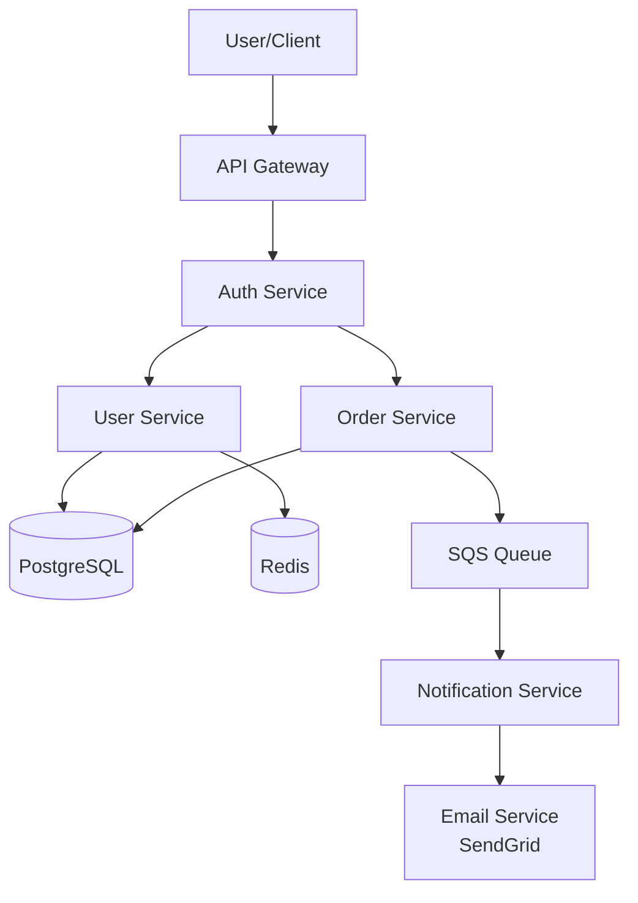
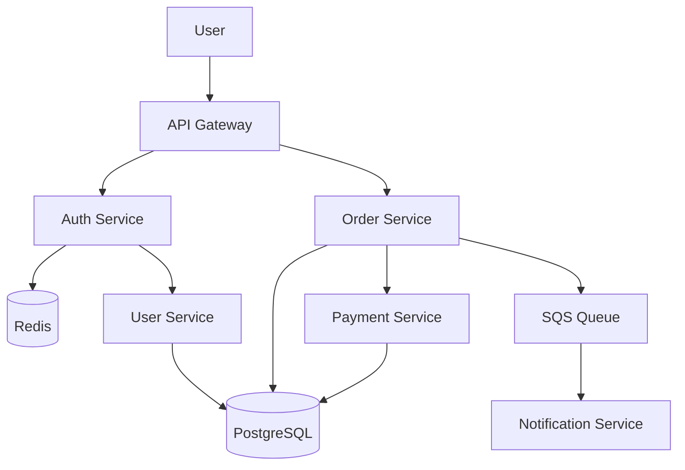
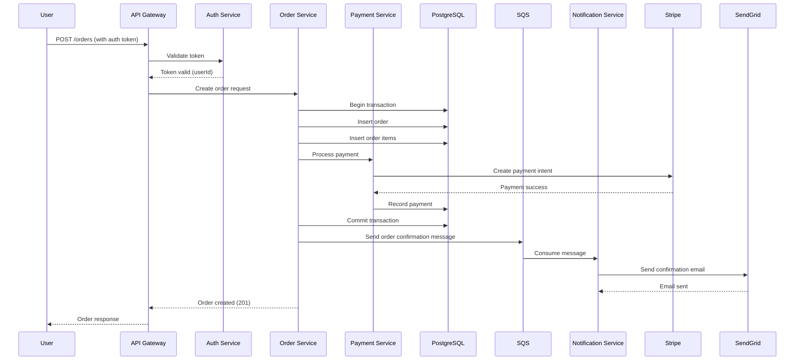

# Architecture Templates Analysis - Section 2: Backend Architecture Template

**Document Version**: 1.0
**Created**: 2025-10-14
**Author**: Claude Code (AI Agent)
**Part**: 2 of 5
**Task**: Phase 4, Task 4.2 - Architecture Templates Analysis

---

## Navigation

- [Section 1 - Introduction & Overview](architecture-templates-section1.md)
- **Current**: Section 2 - Backend Architecture Template
- **Next**: [Section 3 - Fullstack Architecture Template](architecture-templates-section3.md)
- [Section 4 - Frontend & Brownfield Architecture](architecture-templates-section4.md)
- [Section 5 - Technical Preferences & Summary](architecture-templates-section5.md)
- [Back to Phase 4 Tasks](../../tasks/PHASE-4-template-analysis.md)

---

## Table of Contents

1. [Template Overview](#template-overview)
2. [Template Metadata](#template-metadata)
3. [Section-by-Section Analysis](#section-by-section-analysis)
4. [Key Features & Innovations](#key-features--innovations)
5. [Template Variables](#template-variables)
6. [Conditional Logic](#conditional-logic)
7. [Validation Rules](#validation-rules)
8. [Integration Points](#integration-points)
9. [ADK Translation Recommendations](#adk-translation-recommendations)

---

## Template Overview

### Purpose

The **Backend Architecture Template** (`architecture-tmpl.yaml`) is designed for projects focused on **backend systems, APIs, and services** with no or minimal user interface concerns. It provides comprehensive guidance for system design, technology selection, and implementation standards for AI-driven development.

### When to Use

**Ideal for**:
- ✅ RESTful API services
- ✅ GraphQL APIs
- ✅ Microservices
- ✅ Background processing services
- ✅ Data pipelines
- ✅ Integration services
- ✅ Backend-for-Frontend (BFF) services

**NOT ideal for**:
- ❌ Projects with significant frontend/UI (use Fullstack template)
- ❌ Frontend-only applications (use Frontend template)
- ❌ Enhancing existing projects (use Brownfield template)

### Key Characteristics

| Characteristic | Value |
|----------------|-------|
| **Template ID** | `architecture-template-v2` |
| **Version** | 2.0 |
| **Size** | 652 lines of YAML |
| **Major Sections** | 13 |
| **Subsections** | 45+ |
| **Total Sections** | 58+ |
| **Elicitation Points** | 15 |
| **Conditional Sections** | 3 |
| **Repeatable Sections** | 4 |
| **Diagram Types** | 3 (graph, sequence, C4) |
| **Code Block Sections** | 6 |
| **Table Sections** | 3 |

---

## Template Metadata

### YAML Front Matter

```yaml
# <!-- Powered by BMAD™ Core -->
template:
  id: architecture-template-v2
  name: Architecture Document
  version: 2.0
  output:
    format: markdown
    filename: docs/architecture.md
    title: "{{project_name}} Architecture Document"
```

### Workflow Configuration

```yaml
workflow:
  mode: interactive
  elicitation: advanced-elicitation
```

**Analysis**:
- **Interactive Mode**: Requires active user engagement throughout
- **Advanced Elicitation**: Uses sophisticated questioning techniques
- **No YOLO Mode**: Architecture decisions are too critical for auto-generation

### Output Configuration

**Filename**: `docs/architecture.md`
**Format**: Markdown with YAML front matter
**Title**: Dynamic based on `{{project_name}}` variable

**Example Output**:
```markdown
---
title: "MyAPI Architecture Document"
version: 2.0
generated_by: BMad Framework
agent: Architect (Winston)
date: 2025-10-14
---

# MyAPI Architecture Document

[Content follows template structure...]
```

---

## Section-by-Section Analysis

### Section 1: Introduction

```yaml
- id: introduction
  title: Introduction
  instruction: |
    If available, review any provided relevant documents to gather all
    relevant context before beginning. If at a minimum you cannot locate
    docs/prd.md ask the user what docs will provide the basis for the
    architecture.
```

**Subsections**:

#### 1.1 Introduction Content (Static)

```yaml
- id: intro-content
  content: |
    This document outlines the overall project architecture for
    {{project_name}}, including backend systems, shared services, and
    non-UI specific concerns. Its primary goal is to serve as the guiding
    architectural blueprint for AI-driven development, ensuring consistency
    and adherence to chosen patterns and technologies.

    **Relationship to Frontend Architecture:**
    If the project includes a significant user interface, a separate Frontend
    Architecture Document will detail the frontend-specific design and MUST be
    used in conjunction with this document. Core technology stack choices
    documented herein (see "Tech Stack") are definitive for the entire project,
    including any frontend components.
```

**Key Insights**:
- Emphasizes **AI-driven development** as primary use case
- Establishes **backend/frontend separation** pattern
- Sets expectation for **companion Frontend Architecture** if UI exists
- Declares **Tech Stack section as definitive** for all components

#### 1.2 Starter Template Discovery (Critical)

```yaml
- id: starter-template
  title: Starter Template or Existing Project
  instruction: |
    Before proceeding further with architecture design, check if the
    project is based on a starter template or existing codebase:

    1. Review the PRD and brainstorming brief for any mentions of:
    - Starter templates (e.g., Create React App, Next.js, Vue CLI, Angular CLI, etc.)
    - Existing projects or codebases being used as a foundation
    - Boilerplate projects or scaffolding tools
    - Previous projects to be cloned or adapted

    2. If a starter template or existing project is mentioned:
    - Ask the user to provide access via one of these methods:
      - Link to the starter template documentation
      - Upload/attach the project files (for small projects)
      - Share a link to the project repository (GitHub, GitLab, etc.)
    - Analyze the starter/existing project to understand:
      - Pre-configured technology stack and versions
      - Project structure and organization patterns
      - Built-in scripts and tooling
      - Existing architectural patterns and conventions
      - Any limitations or constraints imposed by the starter
    - Use this analysis to inform and align your architecture decisions

    3. If no starter template is mentioned but this is a greenfield project:
    - Suggest appropriate starter templates based on the tech stack preferences
    - Explain the benefits (faster setup, best practices, community support)
    - Let the user decide whether to use one

    4. If the user confirms no starter template will be used:
    - Proceed with architecture design from scratch
    - Note that manual setup will be required for all tooling and configuration

    Document the decision here before proceeding with the architecture design.
    If none, just say N/A
  elicit: true
```

**Analysis**:
- **Mandatory first step** before any architectural decisions
- **4-step process**: Review → Analyze → Suggest → Document
- Recognizes that **starter templates impose constraints**
- AI must **analyze starter** to avoid conflicts
- Explicit **user decision point** on starter usage
- Falls back to **greenfield design** if no starter

**Example Scenarios**:

**Scenario 1: Express + TypeScript Starter**
```markdown
### Starter Template or Existing Project

**Decision**: Using [express-typescript-starter](https://github.com/example/express-ts-starter)

**Pre-Configured Stack**:
- Express 4.18.2
- TypeScript 5.1.6
- Jest for testing
- ESLint + Prettier
- Docker configuration

**Architectural Implications**:
- Must maintain Express middleware patterns
- TypeScript strict mode enabled
- Jest test structure already established
- Docker-based deployment assumed
```

**Scenario 2: No Starter**
```markdown
### Starter Template or Existing Project

N/A - Greenfield project with no starter template.

Manual configuration required for all tooling, build system, and deployment infrastructure.
```

#### 1.3 Change Log (Table)

```yaml
- id: changelog
  title: Change Log
  type: table
  columns: [Date, Version, Description, Author]
  instruction: Track document versions and changes
```

**Purpose**: Document evolution of architecture over time
**Type**: Structured table
**Columns**: Date, Version, Description, Author

**Example**:
| Date | Version | Description | Author |
|------|---------|-------------|--------|
| 2025-10-14 | 1.0 | Initial architecture | Winston (Architect) |
| 2025-10-20 | 1.1 | Added Redis caching | Winston (Architect) |
| 2025-11-05 | 2.0 | Migration to microservices | Winston (Architect) |

---

### Section 2: High Level Architecture

```yaml
- id: high-level-architecture
  title: High Level Architecture
  instruction: |
    This section contains multiple subsections that establish the foundation
    of the architecture. Present all subsections together at once.
  elicit: true
```

**Presentation Strategy**: All subsections presented together, then elicit feedback on complete section.

#### 2.1 Technical Summary

```yaml
- id: technical-summary
  title: Technical Summary
  instruction: |
    Provide a brief paragraph (3-5 sentences) overview of:
    - The system's overall architecture style
    - Key components and their relationships
    - Primary technology choices
    - Core architectural patterns being used
    - Reference back to the PRD goals and how this architecture supports them
```

**Purpose**: Executive summary of technical approach
**Length**: 3-5 sentences
**Content**: Architecture style, components, technologies, patterns, PRD alignment

**Example**:
```markdown
### Technical Summary

This API service follows a **RESTful microservices architecture** deployed on
AWS Lambda for auto-scaling and cost efficiency. The system comprises three
primary services: User Management, Order Processing, and Notification Service,
communicating via API Gateway and SQS message queues. Core technologies include
Node.js 20 with TypeScript, PostgreSQL for relational data, and Redis for
session caching. The architecture employs the **Repository Pattern** for data
access and **Event-Driven Communication** for service decoupling, supporting
the PRD's requirements for high availability (99.9% uptime) and horizontal
scalability to 10,000+ concurrent users.
```

#### 2.2 High Level Overview

```yaml
- id: high-level-overview
  title: High Level Overview
  instruction: |
    Based on the PRD's Technical Assumptions section, describe:

    1. The main architectural style (e.g., Monolith, Microservices, Serverless,
       Event-Driven)
    2. Repository structure decision from PRD (Monorepo/Polyrepo)
    3. Service architecture decision from PRD
    4. Primary user interaction flow or data flow at a conceptual level
    5. Key architectural decisions and their rationale
```

**Source**: PRD's Technical Assumptions section
**5 Required Topics**:
1. Architectural style
2. Repository structure
3. Service architecture
4. User/data flow
5. Key decisions with rationale

**Example**:
```markdown
### High Level Overview

**1. Architectural Style: Serverless Microservices**
The system uses AWS Lambda functions organized into domain-bounded services,
enabling independent scaling and deployment per service.

**2. Repository Structure: Monorepo**
Single repository with Nx workspace management for code sharing, unified CI/CD,
and atomic cross-service changes.

**3. Service Architecture: API Gateway + Lambda + SQS**
Synchronous requests via API Gateway to Lambda functions, asynchronous
processing via SQS queues with dedicated consumer Lambdas.

**4. Primary Flow**
User → API Gateway → Auth Lambda → Business Logic Lambda → PostgreSQL →
Response. Background jobs triggered via SQS → Worker Lambda → Database.

**5. Key Decisions**
- **Serverless over EC2**: Cost optimization for variable traffic patterns
- **Monorepo over Polyrepo**: Code sharing for TypeScript types across services
- **PostgreSQL over DynamoDB**: Complex relational queries required per PRD
```

#### 2.3 High Level Project Diagram (Mermaid)

```yaml
- id: project-diagram
  title: High Level Project Diagram
  type: mermaid
  mermaid_type: graph
  instruction: |
    Create a Mermaid diagram that visualizes the high-level architecture.
    Consider:
    - System boundaries
    - Major components/services
    - Data flow directions
    - External integrations
    - User entry points
```

**Diagram Type**: Mermaid `graph` (directed graph)
**Purpose**: Visual system overview

**Example Mermaid Diagram**:


#### 2.4 Architectural and Design Patterns

```yaml
- id: architectural-patterns
  title: Architectural and Design Patterns
  instruction: |
    List the key high-level patterns that will guide the architecture. For each
    pattern:

    1. Present 2-3 viable options if multiple exist
    2. Provide your recommendation with clear rationale
    3. Get user confirmation before finalizing
    4. These patterns should align with the PRD's technical assumptions and
       project goals

    Common patterns to consider:
    - Architectural style patterns (Serverless, Event-Driven, Microservices,
      CQRS, Hexagonal)
    - Code organization patterns (Dependency Injection, Repository, Module,
      Factory)
    - Data patterns (Event Sourcing, Saga, Database per Service)
    - Communication patterns (REST, GraphQL, Message Queue, Pub/Sub)
  template: "- **{{pattern_name}}:** {{pattern_description}} -
             _Rationale:_ {{rationale}}"
  examples:
    - "**Serverless Architecture:** Using AWS Lambda for compute -
       _Rationale:_ Aligns with PRD requirement for cost optimization and
       automatic scaling"
    - "**Repository Pattern:** Abstract data access logic - _Rationale:_
       Enables testing and future database migration flexibility"
    - "**Event-Driven Communication:** Using SNS/SQS for service decoupling -
       _Rationale:_ Supports async processing and system resilience"
```

**Pattern Selection Process**:
1. Present 2-3 viable options per pattern category
2. Recommend one with rationale
3. Get user confirmation
4. Align with PRD technical assumptions

**Pattern Categories**:
- **Architectural Style**: Serverless, Event-Driven, Microservices, CQRS, Hexagonal
- **Code Organization**: Dependency Injection, Repository, Module, Factory
- **Data Patterns**: Event Sourcing, Saga, Database per Service
- **Communication**: REST, GraphQL, Message Queue, Pub/Sub

**Example Output**:
```markdown
### Architectural and Design Patterns

- **Serverless Architecture:** Using AWS Lambda for compute - _Rationale:_
  Aligns with PRD requirement for cost optimization and automatic scaling

- **Repository Pattern:** Abstract data access logic - _Rationale:_ Enables
  testing and future database migration flexibility

- **Event-Driven Communication:** Using SNS/SQS for service decoupling -
  _Rationale:_ Supports async processing and system resilience

- **Hexagonal Architecture (Ports & Adapters):** Business logic isolated from
  infrastructure - _Rationale:_ Enables testing without infrastructure
  dependencies, supports future platform changes

- **Circuit Breaker Pattern:** Resilient external API calls - _Rationale:_
  Prevents cascade failures when third-party services are unavailable
```

---

### Section 3: Tech Stack (DEFINITIVE)

```yaml
- id: tech-stack
  title: Tech Stack
  instruction: |
    This is the DEFINITIVE technology selection section. Work with the user to
    make specific choices:

    1. Review PRD technical assumptions and any preferences from
       .bmad-core/data/technical-preferences.yaml or an attached
       technical-preferences
    2. For each category, present 2-3 viable options with pros/cons
    3. Make a clear recommendation based on project needs
    4. Get explicit user approval for each selection
    5. Document exact versions (avoid "latest" - pin specific versions)
    6. This table is the single source of truth - all other docs must reference
       these choices

    Key decisions to finalize - before displaying the table, ensure you are
    aware of or ask the user about - let the user know if they are not sure on
    any that you can also provide suggestions with rationale:

    - Starter templates (if any)
    - Languages and runtimes with exact versions
    - Frameworks and libraries / packages
    - Cloud provider and key services choices
    - Database and storage solutions - if unclear suggest sql or nosql or other
      types depending on the project and depending on cloud provider offer a
      suggestion
    - Development tools

    Upon render of the table, ensure the user is aware of the importance of
    this sections choices, should also look for gaps or disagreements with
    anything, ask for any clarifications if something is unclear why its in the
    list, and also right away elicit feedback - this statement and the options
    should be rendered and then prompt right all before allowing user input.
  elicit: true
```

**Critical Importance**: This section is the **single source of truth** for all technology decisions.

**6-Step Process**:
1. Review PRD + technical-preferences.yaml
2. Present 2-3 options with pros/cons per category
3. Make clear recommendation
4. Get explicit user approval
5. Document exact versions (NO "latest")
6. All docs reference these choices

**Key Decision Categories**:
- Starter templates
- Languages and runtimes (exact versions)
- Frameworks and libraries
- Cloud provider and services
- Databases and storage
- Development tools

**Immediate Elicitation Required**: Upon table render, prompt for gaps, disagreements, clarifications.

#### 3.1 Cloud Infrastructure

```yaml
- id: cloud-infrastructure
  title: Cloud Infrastructure
  template: |
    - **Provider:** {{cloud_provider}}
    - **Key Services:** {{core_services_list}}
    - **Deployment Regions:** {{regions}}
```

**Example**:
```markdown
### Cloud Infrastructure

- **Provider:** AWS
- **Key Services:** Lambda, API Gateway, RDS PostgreSQL, ElastiCache Redis,
  SQS, SNS, S3, CloudWatch
- **Deployment Regions:** us-east-1 (primary), us-west-2 (failover)
```

#### 3.2 Technology Stack Table

```yaml
- id: technology-stack-table
  title: Technology Stack Table
  type: table
  columns: [Category, Technology, Version, Purpose, Rationale]
  instruction: Populate the technology stack table with all relevant technologies
  examples:
    - "| **Language** | TypeScript | 5.3.3 | Primary development language |
       Strong typing, excellent tooling, team expertise |"
    - "| **Runtime** | Node.js | 20.11.0 | JavaScript runtime | LTS version,
       stable performance, wide ecosystem |"
    - "| **Framework** | NestJS | 10.3.2 | Backend framework |
       Enterprise-ready, good DI, matches team patterns |"
```

**Table Structure**:
- **Category**: Type of technology (Language, Runtime, Framework, Database, etc.)
- **Technology**: Specific tool/library name
- **Version**: **EXACT version** (pinned, not "latest")
- **Purpose**: What this technology does
- **Rationale**: Why this was chosen (team expertise, PRD requirements, etc.)

**Example Tech Stack Table**:

| Category | Technology | Version | Purpose | Rationale |
|----------|-----------|---------|---------|-----------|
| **Language** | TypeScript | 5.3.3 | Primary development language | Strong typing, excellent tooling, team expertise |
| **Runtime** | Node.js | 20.11.0 | JavaScript runtime | LTS version, stable performance, wide ecosystem |
| **Framework** | NestJS | 10.3.2 | Backend framework | Enterprise-ready, good DI, matches team patterns |
| **API Style** | REST | OpenAPI 3.0 | API specification | Well-understood, tooling support, client generation |
| **Database** | PostgreSQL | 15.4 | Primary data store | ACID compliance, complex queries, relational data |
| **Cache** | Redis | 7.2 | Session cache, rate limiting | In-memory speed, pub/sub support, wide adoption |
| **ORM** | Prisma | 5.6.0 | Database access | Type-safe queries, migrations, dev experience |
| **Testing** | Jest | 29.7.0 | Unit & integration tests | Standard for Node.js, good TypeScript support |
| **Validation** | Zod | 3.22.4 | Request validation | Type inference, composable, runtime safety |
| **IaC** | Terraform | 1.6.4 | Infrastructure as code | Cloud-agnostic, state management, mature ecosystem |
| **CI/CD** | GitHub Actions | N/A | Build and deployment | Free for public repos, tight GitHub integration |
| **Monitoring** | DataDog | N/A | APM and logging | Comprehensive observability, Lambda support |
| **Logging** | Winston | 3.11.0 | Structured logging | Transports support, production-ready |

**Version Pinning Philosophy**:
- ✅ `5.3.3` (pinned version)
- ❌ `latest` (forbidden)
- ❌ `^5.3.0` (semver range, not recommended)
- ❌ `~5.3.0` (semver patch range, not recommended)

**Rationale for Pinning**: Ensures reproducible builds, prevents unexpected breaking changes, aligns with DevOps best practices.

---

### Section 4: Data Models

```yaml
- id: data-models
  title: Data Models
  instruction: |
    Define the core data models/entities:

    1. Review PRD requirements and identify key business entities
    2. For each model, explain its purpose and relationships
    3. Include key attributes and data types
    4. Show relationships between models
    5. Discuss design decisions with user

    Create a clear conceptual model before moving to database schema.
  elicit: true
  repeatable: true
```

**Purpose**: Define business entities before technical schema
**Process**:
1. Identify entities from PRD
2. Explain purpose and relationships
3. Define key attributes and types
4. Show relationships
5. Discuss with user

**Repeatable**: True (multiple models)
**Elicitation**: Required

#### Model Structure

```yaml
- id: model
  title: "{{model_name}}"
  template: |
    **Purpose:** {{model_purpose}}

    **Key Attributes:**
    - {{attribute_1}}: {{type_1}} - {{description_1}}
    - {{attribute_2}}: {{type_2}} - {{description_2}}

    **Relationships:**
    - {{relationship_1}}
    - {{relationship_2}}
```

**Example Data Models**:

```markdown
### Data Models

#### User

**Purpose:** Represents a registered user of the system with authentication and profile information.

**Key Attributes:**
- `id`: UUID - Unique identifier
- `email`: string - Email address (unique, used for login)
- `passwordHash`: string - Hashed password (bcrypt)
- `firstName`: string - User's first name
- `lastName`: string - User's last name
- `role`: enum (USER, ADMIN) - Access control role
- `createdAt`: timestamp - Account creation date
- `lastLoginAt`: timestamp - Last successful login

**Relationships:**
- One User has many Orders (1:N)
- One User has one Profile (1:1, optional)
- One User belongs to many Teams (N:M via UserTeam join table)

#### Order

**Purpose:** Represents a customer order with line items and payment information.

**Key Attributes:**
- `id`: UUID - Unique identifier
- `userId`: UUID - Foreign key to User
- `status`: enum (PENDING, CONFIRMED, SHIPPED, DELIVERED, CANCELLED) - Order lifecycle state
- `totalAmount`: decimal - Total order value in cents
- `currency`: string - ISO 4217 currency code (e.g., "USD")
- `shippingAddress`: JSON - Structured address object
- `createdAt`: timestamp - Order creation date
- `updatedAt`: timestamp - Last modification date

**Relationships:**
- One Order belongs to one User (N:1)
- One Order has many OrderItems (1:N)
- One Order has one Payment (1:1)

#### OrderItem

**Purpose:** Line item within an order representing a product and quantity.

**Key Attributes:**
- `id`: UUID - Unique identifier
- `orderId`: UUID - Foreign key to Order
- `productId`: UUID - Foreign key to Product
- `quantity`: integer - Number of units
- `unitPrice`: decimal - Price per unit at time of order
- `subtotal`: decimal - quantity × unitPrice

**Relationships:**
- One OrderItem belongs to one Order (N:1)
- One OrderItem references one Product (N:1)
```

---

### Section 5: Components

```yaml
- id: components
  title: Components
  instruction: |
    Based on the architectural patterns, tech stack, and data models from above:

    1. Identify major logical components/services and their responsibilities
    2. Consider the repository structure (monorepo/polyrepo) from PRD
    3. Define clear boundaries and interfaces between components
    4. For each component, specify:
    - Primary responsibility
    - Key interfaces/APIs exposed
    - Dependencies on other components
    - Technology specifics based on tech stack choices

    5. Create component diagrams where helpful
  elicit: true
```

#### 5.1 Component List (Repeatable)

```yaml
- id: component-list
  repeatable: true
  title: "{{component_name}}"
  template: |
    **Responsibility:** {{component_description}}

    **Key Interfaces:**
    - {{interface_1}}
    - {{interface_2}}

    **Dependencies:** {{dependencies}}

    **Technology Stack:** {{component_tech_details}}
```

**Example Components**:

```markdown
### Components

#### Auth Service

**Responsibility:** Handles user authentication, session management, and JWT token generation/validation.

**Key Interfaces:**
- `POST /auth/register` - New user registration
- `POST /auth/login` - User login with credentials
- `POST /auth/refresh` - Refresh access token
- `POST /auth/logout` - Invalidate session

**Dependencies:**
- User Service (for user CRUD operations)
- Redis (for session storage)

**Technology Stack:**
- NestJS Auth module
- Passport.js for strategy pattern
- bcrypt for password hashing
- jsonwebtoken for JWT generation

#### User Service

**Responsibility:** Manages user profiles, preferences, and account operations.

**Key Interfaces:**
- `GET /users/:id` - Retrieve user profile
- `PUT /users/:id` - Update user profile
- `DELETE /users/:id` - Delete user account

**Dependencies:**
- PostgreSQL (via Prisma ORM)
- Auth Service (for permission validation)

**Technology Stack:**
- NestJS Service layer
- Prisma ORM for database access
- Zod for input validation

#### Order Service

**Responsibility:** Handles order creation, modification, and lifecycle management.

**Key Interfaces:**
- `POST /orders` - Create new order
- `GET /orders/:id` - Retrieve order details
- `PUT /orders/:id/status` - Update order status
- `GET /users/:userId/orders` - List user's orders

**Dependencies:**
- User Service (for user validation)
- Payment Service (for payment processing)
- Notification Service (for order status updates via SQS)
- PostgreSQL (for order persistence)

**Technology Stack:**
- NestJS Service layer
- Prisma ORM for database access
- AWS SQS for async notifications
- Zod for input validation
```

#### 5.2 Component Diagrams (Mermaid)

```yaml
- id: component-diagrams
  title: Component Diagrams
  type: mermaid
  instruction: |
    Create Mermaid diagrams to visualize component relationships. Options:
    - C4 Container diagram for high-level view
    - Component diagram for detailed internal structure
    - Sequence diagrams for complex interactions
    Choose the most appropriate for clarity
```

**Example C4 Container Diagram**:



---

### Section 6: External APIs (Conditional)

```yaml
- id: external-apis
  title: External APIs
  condition: Project requires external API integrations
  instruction: |
    For each external service integration:

    1. Identify APIs needed based on PRD requirements and component design
    2. If documentation URLs are unknown, ask user for specifics
    3. Document authentication methods and security considerations
    4. List specific endpoints that will be used
    5. Note any rate limits or usage constraints

    If no external APIs are needed, state this explicitly and skip to next section.
  elicit: true
  repeatable: true
```

**Conditional**: Only rendered if external APIs required
**Repeatable**: Multiple API integrations

#### API Structure

```yaml
- id: api
  title: "{{api_name}} API"
  template: |
    - **Purpose:** {{api_purpose}}
    - **Documentation:** {{api_docs_url}}
    - **Base URL(s):** {{api_base_url}}
    - **Authentication:** {{auth_method}}
    - **Rate Limits:** {{rate_limits}}

    **Key Endpoints Used:**
    - `{{method}} {{endpoint_path}}` - {{endpoint_purpose}}

    **Integration Notes:** {{integration_considerations}}
```

**Example External API Integration**:

```markdown
### External APIs

#### Stripe API

- **Purpose:** Process payments and manage subscriptions
- **Documentation:** https://stripe.com/docs/api
- **Base URL(s):** https://api.stripe.com/v1
- **Authentication:** Bearer token (API key in Authorization header)
- **Rate Limits:** 100 requests/second per API key

**Key Endpoints Used:**
- `POST /v1/payment_intents` - Create payment intent for checkout
- `GET /v1/payment_intents/:id` - Retrieve payment status
- `POST /v1/customers` - Create customer profile
- `POST /v1/subscriptions` - Create subscription
- `POST /v1/webhooks` - Receive webhook events

**Integration Notes:**
- Use webhook events for payment confirmations (not polling)
- Store Stripe customer ID in User model for future transactions
- Implement idempotency keys for payment requests
- Handle webhook signature verification for security

#### SendGrid API

- **Purpose:** Send transactional emails (order confirmations, password resets)
- **Documentation:** https://sendgrid.com/docs/api-reference/
- **Base URL(s):** https://api.sendgrid.com/v3
- **Authentication:** Bearer token (API key in Authorization header)
- **Rate Limits:** 600 requests/minute

**Key Endpoints Used:**
- `POST /v3/mail/send` - Send email via templates

**Integration Notes:**
- Use dynamic templates for email content
- Include unsubscribe links for compliance
- Monitor delivery rates via SendGrid dashboard
- Implement retry logic for transient failures
```

---

### Section 7: Core Workflows (Mermaid Sequence)

```yaml
- id: core-workflows
  title: Core Workflows
  type: mermaid
  mermaid_type: sequence
  instruction: |
    Illustrate key system workflows using sequence diagrams:

    1. Identify critical user journeys from PRD
    2. Show component interactions including external APIs
    3. Include error handling paths
    4. Document async operations
    5. Create both high-level and detailed diagrams as needed

    Focus on workflows that clarify architecture decisions or complex interactions.
  elicit: true
```

**Diagram Type**: Mermaid `sequence`
**Purpose**: Show component interactions over time

**Example Core Workflow - Order Creation**:



---

### Section 8: REST API Spec (Conditional)

```yaml
- id: rest-api-spec
  title: REST API Spec
  condition: Project includes REST API
  type: code
  language: yaml
  instruction: |
    If the project includes a REST API:

    1. Create an OpenAPI 3.0 specification
    2. Include all endpoints from epics/stories
    3. Define request/response schemas based on data models
    4. Document authentication requirements
    5. Include example requests/responses

    Use YAML format for better readability. If no REST API, skip this section.
  elicit: true
  template: |
    openapi: 3.0.0
    info:
      title: {{api_title}}
      version: {{api_version}}
      description: {{api_description}}
    servers:
      - url: {{server_url}}
        description: {{server_description}}
```

**Conditional**: Only if project includes REST API
**Format**: OpenAPI 3.0 YAML
**Language**: YAML code block

**Example OpenAPI Spec** (abbreviated):

```yaml
openapi: 3.0.0
info:
  title: E-Commerce API
  version: 1.0.0
  description: RESTful API for e-commerce platform
servers:
  - url: https://api.example.com/v1
    description: Production server
  - url: https://api-staging.example.com/v1
    description: Staging server

components:
  securitySchemes:
    BearerAuth:
      type: http
      scheme: bearer
      bearerFormat: JWT

  schemas:
    User:
      type: object
      properties:
        id:
          type: string
          format: uuid
        email:
          type: string
          format: email
        firstName:
          type: string
        lastName:
          type: string
        role:
          type: string
          enum: [USER, ADMIN]

    Order:
      type: object
      properties:
        id:
          type: string
          format: uuid
        userId:
          type: string
          format: uuid
        status:
          type: string
          enum: [PENDING, CONFIRMED, SHIPPED, DELIVERED, CANCELLED]
        totalAmount:
          type: integer
          description: Total in cents
        items:
          type: array
          items:
            $ref: '#/components/schemas/OrderItem'

paths:
  /auth/login:
    post:
      summary: User login
      tags: [Authentication]
      requestBody:
        required: true
        content:
          application/json:
            schema:
              type: object
              required: [email, password]
              properties:
                email:
                  type: string
                  format: email
                password:
                  type: string
                  format: password
      responses:
        200:
          description: Login successful
          content:
            application/json:
              schema:
                type: object
                properties:
                  accessToken:
                    type: string
                  refreshToken:
                    type: string
                  user:
                    $ref: '#/components/schemas/User'
        401:
          description: Invalid credentials

  /orders:
    post:
      summary: Create new order
      tags: [Orders]
      security:
        - BearerAuth: []
      requestBody:
        required: true
        content:
          application/json:
            schema:
              type: object
              required: [items, shippingAddress]
              properties:
                items:
                  type: array
                  items:
                    type: object
                    required: [productId, quantity]
                    properties:
                      productId:
                        type: string
                        format: uuid
                      quantity:
                        type: integer
                        minimum: 1
                shippingAddress:
                  type: object
                  required: [street, city, state, zip, country]
      responses:
        201:
          description: Order created
          content:
            application/json:
              schema:
                $ref: '#/components/schemas/Order'
        400:
          description: Invalid request
        401:
          description: Unauthorized
```

---

### Section 9: Database Schema

```yaml
- id: database-schema
  title: Database Schema
  instruction: |
    Transform the conceptual data models into concrete database schemas:

    1. Use the database type(s) selected in Tech Stack
    2. Create schema definitions using appropriate notation
    3. Include indexes, constraints, and relationships
    4. Consider performance and scalability
    5. For NoSQL, show document structures

    Present schema in format appropriate to database type (SQL DDL, JSON schema, etc.)
  elicit: true
```

**Purpose**: Convert conceptual models to technical schema
**Format**: SQL DDL, JSON schema, etc. (based on database type)
**Considerations**: Indexes, constraints, relationships, performance

**Example Database Schema (PostgreSQL SQL DDL)**:

```sql
-- Users table
CREATE TABLE users (
    id UUID PRIMARY KEY DEFAULT gen_random_uuid(),
    email VARCHAR(255) UNIQUE NOT NULL,
    password_hash VARCHAR(255) NOT NULL,
    first_name VARCHAR(100) NOT NULL,
    last_name VARCHAR(100) NOT NULL,
    role VARCHAR(20) NOT NULL DEFAULT 'USER' CHECK (role IN ('USER', 'ADMIN')),
    created_at TIMESTAMP NOT NULL DEFAULT NOW(),
    last_login_at TIMESTAMP,
    updated_at TIMESTAMP NOT NULL DEFAULT NOW()
);

CREATE INDEX idx_users_email ON users(email);
CREATE INDEX idx_users_role ON users(role);

-- Orders table
CREATE TABLE orders (
    id UUID PRIMARY KEY DEFAULT gen_random_uuid(),
    user_id UUID NOT NULL REFERENCES users(id) ON DELETE CASCADE,
    status VARCHAR(20) NOT NULL DEFAULT 'PENDING'
        CHECK (status IN ('PENDING', 'CONFIRMED', 'SHIPPED', 'DELIVERED', 'CANCELLED')),
    total_amount INTEGER NOT NULL CHECK (total_amount >= 0),
    currency VARCHAR(3) NOT NULL DEFAULT 'USD',
    shipping_address JSONB NOT NULL,
    created_at TIMESTAMP NOT NULL DEFAULT NOW(),
    updated_at TIMESTAMP NOT NULL DEFAULT NOW()
);

CREATE INDEX idx_orders_user_id ON orders(user_id);
CREATE INDEX idx_orders_status ON orders(status);
CREATE INDEX idx_orders_created_at ON orders(created_at DESC);

-- Order items table
CREATE TABLE order_items (
    id UUID PRIMARY KEY DEFAULT gen_random_uuid(),
    order_id UUID NOT NULL REFERENCES orders(id) ON DELETE CASCADE,
    product_id UUID NOT NULL REFERENCES products(id),
    quantity INTEGER NOT NULL CHECK (quantity > 0),
    unit_price INTEGER NOT NULL CHECK (unit_price >= 0),
    subtotal INTEGER NOT NULL CHECK (subtotal >= 0)
);

CREATE INDEX idx_order_items_order_id ON order_items(order_id);
CREATE INDEX idx_order_items_product_id ON order_items(product_id);

-- Trigger to update updated_at timestamps
CREATE OR REPLACE FUNCTION update_updated_at_column()
RETURNS TRIGGER AS $$
BEGIN
    NEW.updated_at = NOW();
    RETURN NEW;
END;
$$ language 'plpgsql';

CREATE TRIGGER update_users_updated_at BEFORE UPDATE ON users
    FOR EACH ROW EXECUTE FUNCTION update_updated_at_column();

CREATE TRIGGER update_orders_updated_at BEFORE UPDATE ON orders
    FOR EACH ROW EXECUTE FUNCTION update_updated_at_column();
```

---

### Section 10: Source Tree

```yaml
- id: source-tree
  title: Source Tree
  type: code
  language: plaintext
  instruction: |
    Create a project folder structure that reflects:

    1. The chosen repository structure (monorepo/polyrepo)
    2. The service architecture (monolith/microservices/serverless)
    3. The selected tech stack and languages
    4. Component organization from above
    5. Best practices for the chosen frameworks
    6. Clear separation of concerns

    Adapt the structure based on project needs. For monorepos, show service
    separation. For serverless, show function organization. Include
    language-specific conventions.
  elicit: true
  examples:
    - |
      project-root/
      ├── packages/
      │   ├── api/                    # Backend API service
      │   ├── web/                    # Frontend application
      │   ├── shared/                 # Shared utilities/types
      │   └── infrastructure/         # IaC definitions
      ├── scripts/                    # Monorepo management scripts
      └── package.json                # Root package.json with workspaces
```

**Purpose**: Define project folder organization
**Format**: Plaintext tree structure
**Considerations**: Monorepo/polyrepo, monolith/microservices/serverless, framework conventions

**Example Source Tree (NestJS Monorepo with Nx)**:

```
ecommerce-api/
├── apps/
│   ├── api/                          # Main API application
│   │   ├── src/
│   │   │   ├── auth/                 # Auth module
│   │   │   │   ├── auth.controller.ts
│   │   │   │   ├── auth.service.ts
│   │   │   │   ├── auth.module.ts
│   │   │   │   ├── strategies/
│   │   │   │   │   ├── jwt.strategy.ts
│   │   │   │   │   └── local.strategy.ts
│   │   │   │   └── guards/
│   │   │   │       └── jwt-auth.guard.ts
│   │   │   ├── users/                # Users module
│   │   │   │   ├── users.controller.ts
│   │   │   │   ├── users.service.ts
│   │   │   │   ├── users.module.ts
│   │   │   │   └── dto/
│   │   │   │       ├── create-user.dto.ts
│   │   │   │       └── update-user.dto.ts
│   │   │   ├── orders/               # Orders module
│   │   │   │   ├── orders.controller.ts
│   │   │   │   ├── orders.service.ts
│   │   │   │   ├── orders.module.ts
│   │   │   │   └── dto/
│   │   │   ├── common/               # Shared application code
│   │   │   │   ├── filters/
│   │   │   │   │   └── http-exception.filter.ts
│   │   │   │   ├── interceptors/
│   │   │   │   │   └── logging.interceptor.ts
│   │   │   │   └── pipes/
│   │   │   │       └── validation.pipe.ts
│   │   │   ├── app.module.ts
│   │   │   └── main.ts
│   │   ├── test/
│   │   │   ├── unit/
│   │   │   └── e2e/
│   │   ├── prisma/
│   │   │   ├── schema.prisma
│   │   │   └── migrations/
│   │   └── project.json              # Nx project config
│   │
│   └── worker/                       # Background job worker
│       ├── src/
│       │   ├── queues/
│       │   │   ├── order-queue.processor.ts
│       │   │   └── notification-queue.processor.ts
│       │   └── main.ts
│       └── project.json
│
├── libs/                             # Shared libraries
│   ├── shared/                       # Shared utilities
│   │   ├── src/
│   │   │   ├── types/                # TypeScript types/interfaces
│   │   │   │   ├── user.types.ts
│   │   │   │   ├── order.types.ts
│   │   │   │   └── index.ts
│   │   │   ├── constants/            # Shared constants
│   │   │   │   ├── status.constants.ts
│   │   │   │   └── index.ts
│   │   │   └── utils/                # Utility functions
│   │   │       ├── date.utils.ts
│   │   │       └── index.ts
│   │   └── project.json
│   │
│   └── database/                     # Database utilities
│       ├── src/
│       │   ├── prisma.service.ts
│       │   └── index.ts
│       └── project.json
│
├── infrastructure/                   # Infrastructure as Code
│   ├── terraform/
│   │   ├── main.tf
│   │   ├── variables.tf
│   │   ├── outputs.tf
│   │   └── modules/
│   │       ├── lambda/
│   │       ├── rds/
│   │       └── vpc/
│   └── docker/
│       ├── Dockerfile.api
│       └── Dockerfile.worker
│
├── scripts/                          # Build and utility scripts
│   ├── setup-local-db.sh
│   ├── seed-data.ts
│   └── migrate.ts
│
├── docs/                             # Documentation
│   ├── prd.md
│   ├── architecture.md
│   └── api/
│       └── openapi.yaml
│
├── .github/                          # CI/CD
│   └── workflows/
│       ├── ci.yaml
│       └── deploy.yaml
│
├── nx.json                           # Nx workspace config
├── package.json                      # Root package.json
├── tsconfig.base.json                # Base TypeScript config
├── .eslintrc.json                    # ESLint config
├── .prettierrc                       # Prettier config
├── .env.example                      # Environment variables template
└── README.md
```

---

### Section 11: Infrastructure and Deployment

```yaml
- id: infrastructure-deployment
  title: Infrastructure and Deployment
  instruction: |
    Define the deployment architecture and practices:

    1. Use IaC tool selected in Tech Stack
    2. Choose deployment strategy appropriate for the architecture
    3. Define environments and promotion flow
    4. Establish rollback procedures
    5. Consider security, monitoring, and cost optimization

    Get user input on deployment preferences and CI/CD tool choices.
  elicit: true
```

**Subsections**:

#### 11.1 Infrastructure as Code

```yaml
- id: infrastructure-as-code
  title: Infrastructure as Code
  template: |
    - **Tool:** {{iac_tool}} {{version}}
    - **Location:** `{{iac_directory}}`
    - **Approach:** {{iac_approach}}
```

#### 11.2 Deployment Strategy

```yaml
- id: deployment-strategy
  title: Deployment Strategy
  template: |
    - **Strategy:** {{deployment_strategy}}
    - **CI/CD Platform:** {{cicd_platform}}
    - **Pipeline Configuration:** `{{pipeline_config_location}}`
```

#### 11.3 Environments (Repeatable)

```yaml
- id: environments
  title: Environments
  repeatable: true
  template: "- **{{env_name}}:** {{env_purpose}} - {{env_details}}"
```

#### 11.4 Promotion Flow

```yaml
- id: promotion-flow
  title: Environment Promotion Flow
  type: code
  language: text
  template: "{{promotion_flow_diagram}}"
```

#### 11.5 Rollback Strategy

```yaml
- id: rollback-strategy
  title: Rollback Strategy
  template: |
    - **Primary Method:** {{rollback_method}}
    - **Trigger Conditions:** {{rollback_triggers}}
    - **Recovery Time Objective:** {{rto}}
```

**Example**:

```markdown
### Infrastructure and Deployment

#### Infrastructure as Code

- **Tool:** Terraform 1.6.4
- **Location:** `infrastructure/terraform/`
- **Approach:** Modular design with separate modules for VPC, RDS, Lambda, API Gateway

#### Deployment Strategy

- **Strategy:** Blue-Green deployment with automated rollback
- **CI/CD Platform:** GitHub Actions
- **Pipeline Configuration:** `.github/workflows/deploy.yaml`

#### Environments

- **Development:** Local development environment - Docker Compose stack with PostgreSQL, Redis
- **Staging:** Pre-production environment - AWS us-east-1, RDS PostgreSQL, ElastiCache Redis
- **Production:** Live environment - AWS us-east-1 (primary), us-west-2 (DR), RDS Multi-AZ

#### Environment Promotion Flow

```
Development (Local)
      ↓ (Pull Request merged)
Staging (AWS)
      ↓ (Manual approval after smoke tests)
Production (AWS)
```

#### Rollback Strategy

- **Primary Method:** Blue-Green switch via API Gateway stage variable
- **Trigger Conditions:** Error rate > 5%, response time > 2s, health check failures
- **Recovery Time Objective:** 5 minutes maximum downtime
```

---

### Section 12: Error Handling Strategy

```yaml
- id: error-handling-strategy
  title: Error Handling Strategy
  instruction: |
    Define comprehensive error handling approach:

    1. Choose appropriate patterns for the language/framework from Tech Stack
    2. Define logging standards and tools
    3. Establish error categories and handling rules
    4. Consider observability and debugging needs
    5. Ensure security (no sensitive data in logs)

    This section guides both AI and human developers in consistent error handling.
  elicit: true
```

**Subsections**:

#### 12.1 General Approach

```yaml
- id: general-approach
  title: General Approach
  template: |
    - **Error Model:** {{error_model}}
    - **Exception Hierarchy:** {{exception_structure}}
    - **Error Propagation:** {{propagation_rules}}
```

#### 12.2 Logging Standards

```yaml
- id: logging-standards
  title: Logging Standards
  template: |
    - **Library:** {{logging_library}} {{version}}
    - **Format:** {{log_format}}
    - **Levels:** {{log_levels_definition}}
    - **Required Context:**
      - Correlation ID: {{correlation_id_format}}
      - Service Context: {{service_context}}
      - User Context: {{user_context_rules}}
```

#### 12.3 Error Patterns

Includes subsections for:
- External API Errors (retry, circuit breaker, timeout, error translation)
- Business Logic Errors (custom exceptions, user-facing errors, error codes)
- Data Consistency (transactions, compensation, idempotency)

**Example**:

```markdown
### Error Handling Strategy

#### General Approach

- **Error Model:** Result<T, Error> pattern with typed errors
- **Exception Hierarchy:** Base `AppError` class with subclasses: `ValidationError`, `AuthError`, `BusinessError`, `InfrastructureError`
- **Error Propagation:** Exceptions caught at controller layer, transformed to HTTP responses

#### Logging Standards

- **Library:** Winston 3.11.0
- **Format:** JSON structured logs with timestamps
- **Levels:** ERROR (system failures), WARN (recoverable issues), INFO (significant events), DEBUG (detailed flow)
- **Required Context:**
  - Correlation ID: UUID v4 generated per request, propagated via `X-Correlation-ID` header
  - Service Context: Service name, version, environment, host
  - User Context: User ID (never log PII like email, name, password)

#### Error Handling Patterns

##### External API Errors

- **Retry Policy:** Exponential backoff, 3 retries, 100ms initial delay
- **Circuit Breaker:** Open after 5 consecutive failures, 30s timeout
- **Timeout Configuration:** 10s for third-party APIs
- **Error Translation:** Map external error codes to internal `InfrastructureError` types

##### Business Logic Errors

- **Custom Exceptions:** `OrderNotFoundError`, `InsufficientStockError`, `PaymentDeclinedError`
- **User-Facing Errors:** Translated to HTTP status codes with safe messages
- **Error Codes:** Format `ERR_<DOMAIN>_<CODE>` (e.g., `ERR_ORDER_INSUFFICIENT_STOCK`)

##### Data Consistency

- **Transaction Strategy:** Use database transactions for multi-step operations
- **Compensation Logic:** Saga pattern for distributed transactions (refund if payment succeeds but order creation fails)
- **Idempotency:** Idempotency keys for payment and order creation
```

---

### Section 13: Coding Standards

```yaml
- id: coding-standards
  title: Coding Standards
  instruction: |
    These standards are MANDATORY for AI agents. Work with user to define ONLY
    the critical rules needed to prevent bad code. Explain that:

    1. This section directly controls AI developer behavior
    2. Keep it minimal - assume AI knows general best practices
    3. Focus on project-specific conventions and gotchas
    4. Overly detailed standards bloat context and slow development
    5. Standards will be extracted to separate file for dev agent use

    For each standard, get explicit user confirmation it's necessary.
  elicit: true
```

**Philosophy**: Minimal, critical-only rules to prevent AI mistakes

**Subsections**:

#### 13.1 Core Standards

```yaml
- id: core-standards
  title: Core Standards
  template: |
    - **Languages & Runtimes:** {{languages_and_versions}}
    - **Style & Linting:** {{linter_config}}
    - **Test Organization:** {{test_file_convention}}
```

#### 13.2 Naming Conventions (Table)

```yaml
- id: naming-conventions
  title: Naming Conventions
  type: table
  columns: [Element, Convention, Example]
  instruction: Only include if deviating from language defaults
```

#### 13.3 Critical Rules (Repeatable)

```yaml
- id: critical-rules
  title: Critical Rules
  instruction: |
    List ONLY rules that AI might violate or project-specific requirements. Examples:
    - "Never use console.log in production code - use logger"
    - "All API responses must use ApiResponse wrapper type"
    - "Database queries must use repository pattern, never direct ORM"

    Avoid obvious rules like "use SOLID principles" or "write clean code"
  repeatable: true
  template: "- **{{rule_name}}:** {{rule_description}}"
```

**Example**:

```markdown
### Coding Standards

#### Core Standards

- **Languages & Runtimes:** TypeScript 5.3.3, Node.js 20.11.0
- **Style & Linting:** ESLint with Airbnb config, Prettier for formatting
- **Test Organization:** `*.spec.ts` for unit tests, `*.e2e-spec.ts` for E2E tests

#### Naming Conventions

| Element | Convention | Example |
|---------|-----------|---------|
| Classes | PascalCase | `OrderService` |
| Interfaces | PascalCase with 'I' prefix | `IUserRepository` |
| Functions | camelCase | `createOrder()` |
| Constants | UPPER_SNAKE_CASE | `MAX_RETRY_COUNT` |
| Database Tables | snake_case | `order_items` |

#### Critical Rules

- **No console.log:** Use Winston logger with appropriate log levels, never `console.log` in production
- **API Response Wrapper:** All endpoints must return `ApiResponse<T>` type with `{ data: T, meta: {...} }`
- **Database Access:** Use Prisma ORM only via repository classes, never call Prisma directly from services
- **Error Handling:** Never expose raw error messages to clients, use error codes and safe messages
- **Authentication:** All protected routes must use `@UseGuards(JwtAuthGuard)` decorator
- **Validation:** Use Zod schemas for all request DTOs, validate at controller layer
- **Async Patterns:** Always use async/await, never use callbacks or raw Promises
- **Test Coverage:** All services must have >80% unit test coverage
```

---

### Section 14: Test Strategy

```yaml
- id: test-strategy
  title: Test Strategy and Standards
  instruction: |
    Work with user to define comprehensive test strategy:

    1. Use test frameworks from Tech Stack
    2. Decide on TDD vs test-after approach
    3. Define test organization and naming
    4. Establish coverage goals
    5. Determine integration test infrastructure
    6. Plan for test data and external dependencies

    Note: Basic info goes in Coding Standards for dev agent. This detailed
    section is for QA agent and team reference.
  elicit: true
```

**Subsections**:
- Testing Philosophy (approach, coverage goals, test pyramid)
- Test Types (unit, integration, E2E with framework, location, mocking)
- Test Data Management (strategy, fixtures, factories, cleanup)
- Continuous Testing (CI integration, performance, security)

**Example**:

```markdown
### Test Strategy and Standards

#### Testing Philosophy

- **Approach:** Test-Driven Development (TDD) for business logic, test-after for UI
- **Coverage Goals:** 80% overall, 90% for business logic services
- **Test Pyramid:** 70% unit, 20% integration, 10% E2E

#### Test Types and Organization

##### Unit Tests

- **Framework:** Jest 29.7.0
- **File Convention:** `<filename>.spec.ts` next to source file
- **Location:** Colocated with source files
- **Mocking Library:** Jest built-in mocks
- **Coverage Requirement:** 80% line coverage

**AI Agent Requirements:**
- Generate tests for all public methods
- Cover edge cases and error conditions
- Follow AAA pattern (Arrange, Act, Assert)
- Mock all external dependencies

##### Integration Tests

- **Scope:** Multi-component interactions, database queries, external API calls
- **Location:** `test/integration/`
- **Test Infrastructure:**
  - **PostgreSQL:** Testcontainers for isolated database per test suite
  - **Redis:** In-memory Redis for caching tests
  - **External APIs:** WireMock for stubbing third-party services

##### End-to-End Tests

- **Framework:** Supertest for API testing
- **Scope:** Critical user journeys (auth flow, order creation, payment)
- **Environment:** Staging environment with test database
- **Test Data:** Seed scripts for consistent test data

#### Test Data Management

- **Strategy:** Factory pattern for test data generation
- **Fixtures:** JSON fixtures in `test/fixtures/` for static data
- **Factories:** TypeScript factory functions for dynamic data
- **Cleanup:** Rollback transactions or database reset after each test

#### Continuous Testing

- **CI Integration:** Run unit tests on every PR, integration tests on merge to main, E2E tests on deploy to staging
- **Performance Tests:** Load tests with k6 on staging before production deploy
- **Security Tests:** OWASP ZAP scan on staging API
```

---

### Section 15: Security

```yaml
- id: security
  title: Security
  instruction: |
    Define MANDATORY security requirements for AI and human developers:

    1. Focus on implementation-specific rules
    2. Reference security tools from Tech Stack
    3. Define clear patterns for common scenarios
    4. These rules directly impact code generation
    5. Work with user to ensure completeness without redundancy
  elicit: true
```

**Subsections**:
- Input Validation (library, location, rules)
- Authentication & Authorization (method, session, patterns)
- Secrets Management (dev, prod, code requirements)
- API Security (rate limiting, CORS, headers, HTTPS)
- Data Protection (encryption at rest/transit, PII, logging)
- Dependency Security (scanning, updates, approval)
- Security Testing (SAST, DAST, pentest)

**Example**:

```markdown
### Security

#### Input Validation

- **Validation Library:** Zod 3.22.4
- **Validation Location:** Controller layer before business logic
- **Required Rules:**
  - All external inputs MUST be validated
  - Validation at API boundary before processing
  - Whitelist approach preferred over blacklist

#### Authentication & Authorization

- **Auth Method:** JWT tokens with RS256 signing
- **Session Management:** Stateless with JWT access tokens (15min) + refresh tokens (7 days)
- **Required Patterns:**
  - Use `@UseGuards(JwtAuthGuard)` for protected routes
  - Validate permissions with RBAC (role-based access control)

#### Secrets Management

- **Development:** `.env.local` file (not committed, use `.env.example` template)
- **Production:** AWS Secrets Manager for credentials, environment variables for config
- **Code Requirements:**
  - NEVER hardcode secrets (API keys, passwords, tokens)
  - Access via configuration service only
  - No secrets in logs or error messages

#### API Security

- **Rate Limiting:** 100 requests/minute per IP via `@nestjs/throttler`
- **CORS Policy:** Whitelist of allowed origins only (no `*`)
- **Security Headers:** Helmet.js middleware for secure headers (CSP, HSTS, X-Frame-Options)
- **HTTPS Enforcement:** All environments use HTTPS only

#### Data Protection

- **Encryption at Rest:** RDS encryption enabled for database
- **Encryption in Transit:** TLS 1.3 for all connections
- **PII Handling:** Never log PII (email, name, address, payment info)
- **Logging Restrictions:** No passwords, tokens, credit cards in logs

#### Dependency Security

- **Scanning Tool:** npm audit + Snyk
- **Update Policy:** Review security updates weekly, apply critical patches within 48 hours
- **Approval Process:** All new dependencies reviewed for license, maintenance, security

#### Security Testing

- **SAST Tool:** SonarQube for static analysis
- **DAST Tool:** OWASP ZAP for dynamic API testing
- **Penetration Testing:** Annual third-party pentest
```

---

### Section 16: Checklist Results

```yaml
- id: checklist-results
  title: Checklist Results Report
  instruction: |
    Before running the checklist, offer to output the full architecture document.
    Once user confirms, execute the architect-checklist and populate results here.
```

**Purpose**: Execute quality validation checklist before architecture completion

**Integration**: References `architect-checklist.yaml` task

**Typical Checklist Items**:
- ✅ Tech stack selections documented with versions
- ✅ All data models defined with relationships
- ✅ Component responsibilities clearly defined
- ✅ Database schema matches data models
- ✅ API specification complete with all endpoints
- ✅ Security requirements documented
- ✅ Testing strategy defined
- ✅ Deployment strategy documented
- ✅ Error handling patterns established
- ✅ Coding standards are minimal and critical

---

### Section 17: Next Steps

```yaml
- id: next-steps
  title: Next Steps
  instruction: |
    After completing the architecture:

    1. If project has UI components:
    - Use "Frontend Architecture Mode"
    - Provide this document as input

    2. For all projects:
    - Review with Product Owner
    - Begin story implementation with Dev agent
    - Set up infrastructure with DevOps agent

    3. Include specific prompts for next agents if needed
```

**Subsection**: Architect Prompt (for Frontend Architecture handoff)

**Example**:

```markdown
### Next Steps

#### Architect Prompt

**For Frontend Architecture Creation:**

*I've completed the backend architecture for the E-Commerce API. The system uses:*
- *NestJS with TypeScript on Node.js 20*
- *PostgreSQL database with Prisma ORM*
- *AWS Lambda + API Gateway deployment*
- *JWT authentication with RBAC*

*Key integration points for frontend:*
- *RESTful API with OpenAPI spec (docs/architecture.md)*
- *JWT bearer token authentication*
- *Standardized API response format: `{ data: T, meta: {...} }`*
- *CORS configured for `https://app.example.com`*

*Please create a Frontend Architecture using the front-end-architecture-tmpl template that:*
- *Integrates with this backend via REST API*
- *Implements JWT token management*
- *Uses the shared TypeScript types from this architecture*
- *Follows the deployment strategy (same AWS account, different S3/CloudFront)*

#### Product Owner Review

- Schedule architecture review meeting with Sarah (PO)
- Present architecture diagram and tech stack decisions
- Get approval before story creation begins

#### Story Manager Handoff

- Provide this architecture document to Bob (SM) for story creation
- SM will create stories following this architecture's patterns
- First story: "Set up NestJS project with authentication module"
```

---

## Key Features & Innovations

### 1. **Starter Template Discovery**

**Innovation**: Mandatory analysis of existing project foundations before architectural decisions.

**Impact**:
- Prevents architectural conflicts with starter templates
- Respects pre-configured tech stacks
- Aligns with existing conventions
- Saves time by leveraging starter benefits

### 2. **Tech Stack as Single Source of Truth**

**Innovation**: Explicit declaration that Tech Stack section is definitive for all technology decisions.

**Impact**:
- Eliminates ambiguity across documents
- Enforces version consistency
- Enables reproducible builds
- Simplifies dependency management

### 3. **Minimal Coding Standards Philosophy**

**Innovation**: Explicit guidance to keep standards minimal and focused on preventing AI mistakes.

**Impact**:
- Reduces context bloat
- Faster AI response times
- Focus on critical project-specific rules
- Avoids obvious best practices

### 4. **Comprehensive Elicitation Points**

**Innovation**: 15+ elicitation points ensure user validation of critical decisions.

**Impact**:
- Prevents AI assumptions
- Ensures architecture aligns with user needs
- Builds user confidence through active engagement
- Reduces rework from misaligned decisions

### 5. **Mermaid Diagram Integration**

**Innovation**: Structured diagram types (graph, sequence, C4) for visual architecture.

**Impact**:
- Visual communication of complex architectures
- Diagrams as code (version controlled)
- Auto-generated documentation
- Facilitates team understanding

---

## Template Variables

The Backend Architecture Template uses **70+ template variables** for interpolation:

### Project Context Variables
- `{{project_name}}` - Project name for titles and descriptions
- `{{existing_project_purpose}}` - Purpose of existing project (if brownfield)

### Starter Template Variables
- `{{starter_template_name}}` - Name of starter template
- `{{starter_stack_summary}}` - Summary of pre-configured stack
- `{{starter_constraints}}` - Constraints imposed by starter

### High-Level Architecture Variables
- `{{architectural_style}}` - Monolith, Microservices, Serverless, etc.
- `{{repository_structure}}` - Monorepo or Polyrepo
- `{{service_architecture}}` - Service decomposition approach

### Tech Stack Variables
- `{{cloud_provider}}` - AWS, Azure, GCP, etc.
- `{{core_services_list}}` - Key cloud services used
- `{{regions}}` - Deployment regions
- `{{fe_language}}`, `{{be_language}}` - Frontend/backend languages
- `{{fe_framework}}`, `{{be_framework}}` - Frameworks
- `{{database}}`, `{{cache}}`, `{{storage}}` - Data layer technologies
- `{{auth}}`, `{{testing}}`, `{{iac_tool}}`, `{{cicd}}` - Supporting tools
- Versions for each technology (e.g., `{{be_language_version}}`)

### Component Variables
- `{{component_name}}` - Component name
- `{{component_description}}` - Component responsibility
- `{{component_tech_details}}` - Technologies used by component
- `{{interface_1}}`, `{{interface_2}}` - Component interfaces
- `{{dependencies}}` - Component dependencies

### API Variables
- `{{api_title}}`, `{{api_version}}`, `{{api_description}}` - API metadata
- `{{server_url}}`, `{{server_description}}` - API server info
- `{{api_name}}`, `{{api_purpose}}` - External API info
- `{{api_docs_url}}`, `{{api_base_url}}` - API documentation
- `{{auth_method}}`, `{{rate_limits}}` - API security

### Deployment Variables
- `{{iac_tool}}`, `{{iac_directory}}`, `{{iac_approach}}` - IaC config
- `{{deployment_strategy}}`, `{{cicd_platform}}` - Deployment strategy
- `{{env_name}}`, `{{env_purpose}}`, `{{env_details}}` - Environment info
- `{{rollback_method}}`, `{{rollback_triggers}}`, `{{rto}}` - Rollback config

### Error Handling Variables
- `{{error_model}}`, `{{exception_structure}}` - Error patterns
- `{{logging_library}}`, `{{log_format}}` - Logging config
- `{{correlation_id_format}}` - Request tracing

### Security Variables
- `{{validation_library}}` - Input validation tool
- `{{auth_implementation}}` - Auth method
- `{{prod_secrets_service}}` - Secrets management service
- `{{rate_limit_implementation}}` - Rate limiting approach
- `{{cors_configuration}}` - CORS policy

---

## Conditional Logic

The Backend Architecture Template includes **3 conditional sections**:

### 1. External APIs (Line 234)

```yaml
- id: external-apis
  title: External APIs
  condition: Project requires external API integrations
```

**Trigger**: Project requires third-party API integrations
**Skip**: Project is self-contained with no external dependencies

### 2. REST API Spec (Line 280)

```yaml
- id: rest-api-spec
  title: REST API Spec
  condition: Project includes REST API
```

**Trigger**: Project exposes REST API
**Skip**: Project is a background service, data pipeline, or uses different API style (GraphQL, gRPC)

### 3. Language-Specific Guidelines (Line 478)

```yaml
- id: language-specifics
  title: Language-Specific Guidelines
  condition: Critical language-specific rules needed
```

**Trigger**: Language-specific rules critical for preventing AI mistakes
**Skip**: Most projects don't need this section (language defaults sufficient)

---

## Validation Rules

### Version Pinning Validation

**Rule**: Tech Stack table MUST use exact versions, not "latest" or semver ranges.

**Enforcement**: Instruction explicitly states "avoid 'latest' - pin specific versions"

**Example**:
- ✅ Valid: `TypeScript 5.3.3`
- ❌ Invalid: `TypeScript latest`
- ❌ Invalid: `TypeScript ^5.3.0`

### Elicitation Validation

**Rule**: 15 sections require user elicitation before proceeding.

**Enforcement**: `elicit: true` flag triggers validation checkpoint

**Elicitation Points**:
1. Starter template selection
2. High-level architecture
3. Tech stack
4. Data models
5. Components
6. External APIs (if applicable)
7. Core workflows
8. REST API spec (if applicable)
9. Database schema
10. Source tree
11. Infrastructure & deployment
12. Error handling strategy
13. Coding standards
14. Test strategy
15. Security

### Minimal Standards Validation

**Rule**: Coding standards should be minimal and focused on critical rules only.

**Enforcement**: Instructions explicitly warn against verbose standards.

**Anti-Patterns**:
- ❌ "Use SOLID principles"
- ❌ "Write clean code"
- ❌ "Follow best practices"

**Good Patterns**:
- ✅ "Never use console.log - use Winston logger"
- ✅ "All API responses must use ApiResponse<T> wrapper"
- ✅ "Database queries must use repository pattern"

---

## Integration Points

### Upstream Integrations (Inputs)

The Backend Architecture Template requires these inputs:

1. **PRD** (`docs/prd.md`)
   - Technical assumptions
   - Functional requirements
   - Non-functional requirements
   - Project goals

2. **Technical Preferences** (`.bmad-core/data/technical-preferences.yaml`)
   - User-defined technology preferences
   - Framework preferences
   - Cloud provider preferences

3. **Brainstorming Brief** (optional)
   - Starter template mentions
   - Technology explorations
   - Alternative approaches considered

4. **Starter Template** (if applicable)
   - Starter documentation
   - Repository access
   - Pre-configured stack analysis

### Downstream Integrations (Outputs)

The Backend Architecture Template produces outputs consumed by:

1. **Frontend Architecture Template**
   - References backend architecture for integration points
   - Uses Tech Stack as single source of truth
   - Aligns with backend patterns

2. **Story Manager (Bob)**
   - Uses architecture for story creation
   - References component boundaries
   - Follows tech stack decisions

3. **Dev Agent (James)**
   - Implements based on architecture patterns
   - Uses coding standards
   - Follows tech stack versions

4. **QA Agent (Quinn)**
   - Uses test strategy for test design
   - References security requirements
   - Validates architecture decisions

5. **Infrastructure / DevOps**
   - Implements IaC based on deployment strategy
   - Sets up environments per architecture
   - Configures CI/CD pipeline

### Checklist Integration

The template ends with `architect-checklist.yaml` execution:

**Checklist Validates**:
- Completeness (all required sections)
- Consistency (no conflicting decisions)
- Alignment (architecture supports PRD goals)
- Quality (diagrams, examples, clarity)
- Security (security requirements defined)
- Testability (test strategy established)

---

## ADK Translation Recommendations

### Template Storage

**Cloud Storage Bucket**:
```
gs://bmad-templates/
├── architecture-tmpl-v2.yaml
├── fullstack-architecture-tmpl-v2.yaml
├── frontend-architecture-tmpl-v2.yaml
└── brownfield-architecture-tmpl-v2.yaml
```

**Firestore Metadata**:
```javascript
{
  templateId: "architecture-template-v2",
  name: "Architecture Document",
  version: "2.0",
  category: "architecture",
  projectTypes: ["greenfield"],
  scopes: ["backend"],
  agentOwner: "architect",
  sectionCount: 13,
  elicitationPoints: 15,
  estimatedTime: "2-4 hours",
  storagePath: "gs://bmad-templates/architecture-tmpl-v2.yaml"
}
```

### Rendering Engine

**Template Parser Service** (Cloud Function):

```python
def parse_architecture_template(template_id: str) -> Dict:
    """
    Parse architecture template YAML into structured format.

    Returns:
        {
            "metadata": {...},
            "workflow": {...},
            "sections": [...]
        }
    """
    storage_client = storage.Client()
    bucket = storage_client.bucket("bmad-templates")
    blob = bucket.blob(f"{template_id}.yaml")
    yaml_content = blob.download_as_text()
    return yaml.safe_load(yaml_content)
```

**Section Renderer** (Cloud Function):

```python
def render_section(section: Dict, context: Dict) -> str:
    """
    Render a template section with interpolated variables.

    Args:
        section: Section definition from template
        context: Variable values for interpolation

    Returns:
        Markdown content for section
    """
    if section.get("condition"):
        if not evaluate_condition(section["condition"], context):
            return ""  # Skip section

    content = section.get("template", section.get("content", ""))

    # Interpolate variables
    for var, value in context.items():
        content = content.replace(f"{{{{{var}}}}}", str(value))

    # Render nested sections
    if "sections" in section:
        for subsection in section["sections"]:
            content += "\n\n" + render_section(subsection, context)

    return content
```

### Architect Agent Tool Registration

```python
architect_tools = [
    {
        "name": "load_architecture_template",
        "description": "Load architecture template based on project type",
        "parameters": {
            "project_type": "greenfield | brownfield",
            "scope": "backend | frontend | fullstack"
        }
    },
    {
        "name": "populate_tech_stack",
        "description": "Populate Tech Stack section with user selections",
        "parameters": {
            "technologies": "array of {category, technology, version, purpose, rationale}"
        }
    },
    {
        "name": "generate_mermaid_diagram",
        "description": "Generate Mermaid diagram for architecture visualization",
        "parameters": {
            "diagram_type": "graph | sequence | flowchart",
            "content": "Mermaid diagram definition"
        }
    },
    {
        "name": "execute_architect_checklist",
        "description": "Run quality checklist on completed architecture",
        "parameters": {
            "architecture_doc": "string"
        }
    }
]
```

### Session Management

**Firestore Session Document**:

```javascript
{
  sessionId: "arch-session-uuid",
  projectId: "project-uuid",
  templateId: "architecture-template-v2",
  agentId: "architect",
  status: "in_progress",
  currentSection: "tech-stack",
  completedSections: ["introduction", "high-level-architecture"],
  pendingElicitations: ["data-models", "components", ...],
  context: {
    project_name: "E-Commerce API",
    cloud_provider: "AWS",
    be_language: "TypeScript",
    be_language_version: "5.3.3",
    // ... all populated variables
  },
  createdAt: "2025-10-14T10:00:00Z",
  updatedAt: "2025-10-14T11:30:00Z"
}
```

---

## Summary

The **Backend Architecture Template** is the most comprehensive single-purpose template in the BMad framework, providing:

- **652 lines** of structured YAML specification
- **58+ sections** covering all aspects of backend system design
- **15 elicitation points** ensuring user alignment
- **3 conditional sections** for optional features
- **70+ template variables** for dynamic content
- **Mermaid diagram integration** for visual architecture
- **Minimal coding standards philosophy** to prevent context bloat
- **Tech Stack as single source of truth** for all technology decisions

**Next**: [Section 3 - Fullstack Architecture Template](architecture-templates-section3.md) analyzes the unified fullstack template combining frontend and backend concerns.

---

[← Section 1](architecture-templates-section1.md) | **Current**: Section 2 | **Next**: [Section 3 →](architecture-templates-section3.md)
