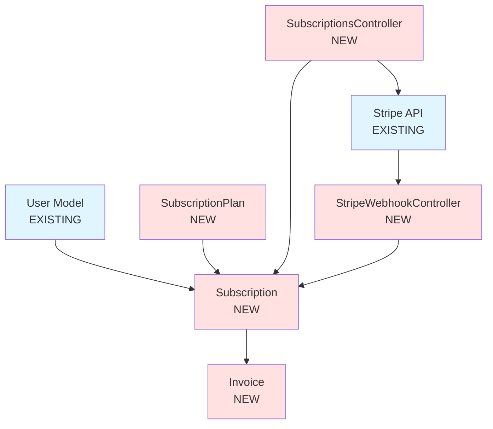

# Architecture Templates Analysis - Section 4: Frontend & Brownfield Architecture

**Document Version**: 1.0
**Created**: 2025-10-14
**Author**: Claude Code (AI Agent)
**Part**: 4 of 5
**Task**: Phase 4, Task 4.2 - Architecture Templates Analysis

---

## Navigation

- [Section 1 - Introduction & Overview](architecture-templates-section1.md)
- [Section 2 - Backend Architecture Template](architecture-templates-section2.md)
- [Section 3 - Fullstack Architecture Template](architecture-templates-section3.md)
- **Current**: Section 4 - Frontend & Brownfield Architecture
- **Next**: [Section 5 - Technical Preferences & Summary](architecture-templates-section5.md)
- [Back to Phase 4 Tasks](../../tasks/PHASE-4-template-analysis.md)

---

## Table of Contents

### Part A: Frontend Architecture Template
1. [Frontend Template Overview](#frontend-template-overview)
2. [Framework-Agnostic Design](#framework-agnostic-design)
3. [AI Tool Integration Focus](#ai-tool-integration-focus)
4. [Minimal But Complete Philosophy](#minimal-but-complete-philosophy)
5. [Key Sections Analysis - Frontend](#key-sections-analysis---frontend)

### Part B: Brownfield Architecture Template
6. [Brownfield Template Overview](#brownfield-template-overview)
7. [Deep Analysis Mandate](#deep-analysis-mandate)
8. [Continuous Validation Checkpoints](#continuous-validation-checkpoints)
9. [Integration-Focused Sections](#integration-focused-sections)
10. [Key Sections Analysis - Brownfield](#key-sections-analysis---brownfield)

### Part C: Comparative Analysis
11. [Template Comparison Matrix](#template-comparison-matrix)
12. [ADK Translation Recommendations](#adk-translation-recommendations)

---

# Part A: Frontend Architecture Template

## Frontend Template Overview

### Purpose

The **Frontend Architecture Template** (`front-end-architecture-tmpl.yaml`) is designed for projects that need **detailed frontend architecture** as a **companion to existing backend architecture**. It's the **smallest and most focused** architecture template.

### When to Use

**Ideal for**:
- ✅ Projects with separate frontend/backend teams
- ✅ Frontend-specific architecture for existing backend
- ✅ Projects where backend architecture already exists
- ✅ Frontend implementation details for AI code generation tools (v0, Cursor, etc.)
- ✅ Framework-specific guidance after backend decisions are made

**NOT ideal for**:
- ❌ Unified fullstack projects (use Fullstack template)
- ❌ Backend-only projects (use Backend template)
- ❌ Projects without backend architecture (create Backend first)

### Key Characteristics

| Characteristic | Value |
|----------------|-------|
| **Template ID** | `frontend-architecture-template-v2` |
| **Version** | 2.0 |
| **Size** | 220 lines of YAML (smallest architecture template) |
| **Major Sections** | 10 |
| **Subsections** | 25+ |
| **Total Sections** | 35+ |
| **Elicitation Points** | 10 |
| **Conditional Sections** | 1 |
| **Repeatable Sections** | 0 |
| **Diagram Types** | 0 (no Mermaid diagrams) |
| **Code Block Sections** | 8 |
| **Table Sections** | 1 |

**Size Comparison**:
- **66% smaller** than Backend Architecture template (652 lines)
- **73% smaller** than Fullstack Architecture template (825 lines)
- **54% smaller** than Brownfield Architecture template (478 lines)

### Template Metadata

```yaml
# <!-- Powered by BMAD™ Core -->
template:
  id: frontend-architecture-template-v2
  name: Frontend Architecture Document
  version: 2.0
  output:
    format: markdown
    filename: docs/ui-architecture.md
    title: "{{project_name}} Frontend Architecture Document"
```

**Key Insight**: Different output filename (`ui-architecture.md` vs `architecture.md`), emphasizing this is a **companion document**, not a replacement.

---

## Framework-Agnostic Design

### Template & Framework Selection Section

The Frontend template begins with **framework selection** as the foundational decision:

```yaml
- id: template-framework-selection
  title: Template and Framework Selection
  instruction: |
    Review provided documents including PRD, UX-UI Specification, and main
    Architecture Document. Focus on extracting technical implementation details
    needed for AI frontend tools and developer agents. Ask the user for any of
    these documents if you are unable to locate and were not provided.

    Before proceeding with frontend architecture design, check if the project
    is using a frontend starter template or existing codebase:

    1. Review the PRD, main architecture document, and brainstorming brief for
       mentions of:
       - Frontend starter templates (e.g., Create React App, Next.js, Vite, Vue
         CLI, Angular CLI, etc.)
       - UI kit or component library starters
       - Existing frontend projects being used as a foundation
       - Admin dashboard templates or other specialized starters
       - Design system implementations

    [Similar starter template discovery process as Backend template]
```

**Framework-Agnostic Approach**:
- Template adapts to **any frontend framework** (React, Vue, Angular, Svelte, etc.)
- Instructions guide agent to **detect framework** from starter/PRD
- Code examples use **framework-specific** patterns
- No hardcoded assumptions about framework choice

**Example Framework Detection**:
```markdown
Based on analysis:
- **Starter Template**: Vite + React TypeScript starter
- **Framework**: React 18.2
- **Build Tool**: Vite 5.0
- **Constraints**: Must use Vite plugin system, no CRA-specific patterns
```

### Framework-Specific Adaptation

The template uses **dynamic instructions** that adapt based on framework:

```yaml
- id: component-template
  title: Component Template
  instruction: Generate a minimal but complete component template following the
               framework's best practices. Include TypeScript types, proper
               imports, and basic structure.
  type: code
  language: typescript
```

**Agent Behavior**:
- For **React**: Generate functional component with hooks
- For **Vue**: Generate SFC (Single File Component) with Composition API
- For **Angular**: Generate component with decorator and lifecycle hooks
- For **Svelte**: Generate Svelte component syntax

**React Example**:
```typescript
// src/components/UserCard.tsx
import { FC } from 'react';

interface UserCardProps {
  name: string;
  email: string;
  onEdit?: () => void;
}

export const UserCard: FC<UserCardProps> = ({ name, email, onEdit }) => {
  return (
    <div className="user-card">
      <h3>{name}</h3>
      <p>{email}</p>
      {onEdit && (
        <button onClick={onEdit}>Edit</button>
      )}
    </div>
  );
};
```

**Vue Example** (same template, different framework):
```vue
<!-- src/components/UserCard.vue -->
<script setup lang="ts">
interface UserCardProps {
  name: string;
  email: string;
  onEdit?: () => void;
}

defineProps<UserCardProps>();
</script>

<template>
  <div class="user-card">
    <h3>{{ name }}</h3>
    <p>{{ email }}</p>
    <button v-if="onEdit" @click="onEdit">Edit</button>
  </div>
</template>

<style scoped>
.user-card {
  /* Component styles */
}
</style>
```

---

## AI Tool Integration Focus

### Design for AI Code Generation

The Frontend template is explicitly designed for **AI code generation tools**:

> "Focus on extracting technical implementation details needed for **AI frontend tools** and **developer agents**."
>
> — Template instruction, Line 17

**Supported AI Tools**:
- **v0 by Vercel**: React + Tailwind code generation
- **Cursor**: AI pair programming
- **GitHub Copilot**: Code completion
- **Lovable (formerly GPT Engineer)**: Full app generation
- **Claude Code**: Development agent

### Structured for Tool Consumption

The template provides **executable specifications** rather than documentation:

```yaml
- id: component-standards
  title: Component Standards
  instruction: Define exact patterns for component creation based on the chosen
               framework.
  elicit: true
  sections:
    - id: component-template
      title: Component Template
      instruction: Generate a minimal but complete component template following
                   the framework's best practices. Include TypeScript types,
                   proper imports, and basic structure.
      type: code
      language: typescript

    - id: naming-conventions
      title: Naming Conventions
      instruction: Provide naming conventions specific to the chosen framework
                   for components, files, services, state management, and other
                   architectural elements.
```

**Key Insight**: AI tools can **directly consume** these code templates and naming conventions to generate consistent code.

### Quick Reference Section

The template ends with a **Quick Reference** section optimized for AI agents:

```yaml
- id: quick-reference
  title: Quick Reference
  instruction: |
    Create a framework-specific cheat sheet with:
    - Common commands (dev server, build, test)
    - Key import patterns
    - File naming conventions
    - Project-specific patterns and utilities
```

**Example Quick Reference (Next.js)**:
```markdown
### Quick Reference

**Common Commands:**
```bash
npm run dev          # Start development server (localhost:3000)
npm run build        # Build for production
npm run start        # Start production server
npm run lint         # Run ESLint
npm run test         # Run Jest tests
```

**Key Import Patterns:**
```typescript
// Page components
import type { NextPage } from 'next';

// API routes
import type { NextApiRequest, NextApiResponse } from 'next';

// Client-side navigation
import { useRouter } from 'next/router';
import Link from 'next/link';

// Image optimization
import Image from 'next/image';

// SEO
import Head from 'next/head';
```

**File Naming Conventions:**
- Pages: `src/pages/profile.tsx` → `/profile`
- API Routes: `src/pages/api/users.ts` → `/api/users`
- Components: `src/components/UserCard.tsx`
- Hooks: `src/hooks/useAuth.ts`
- Utils: `src/lib/api.ts`

**Project-Specific Patterns:**
- Always use `Image` component, never ``
- API calls via `lib/apiClient.ts`, never direct `fetch`
- Forms use `react-hook-form` + `zod` validation
- All pages use `getServerSideProps` for data fetching
```

---

## Minimal But Complete Philosophy

### Small But Comprehensive

The Frontend template achieves **completeness in 220 lines** by:

1. **No Redundancy**: Assumes backend architecture exists, doesn't repeat infrastructure/deployment/security
2. **Framework-Agnostic**: Adapts to any framework instead of separate templates per framework
3. **Focused Scope**: Only frontend-specific concerns (components, state, routing, styling)
4. **Reference Architecture**: Points to main architecture doc for shared concerns

### Required Inputs

```yaml
instruction: |
  Review provided documents including PRD, UX-UI Specification, and main
  Architecture Document. Focus on extracting technical implementation details
  needed for AI frontend tools and developer agents. Ask the user for any of
  these documents if you are unable to locate and were not provided.
```

**Dependencies**:
1. **Main Architecture Document** (`docs/architecture.md`)
   - Tech stack (extracts frontend technologies)
   - API specification (backend endpoints)
   - Authentication approach
   - Deployment strategy

2. **PRD** (`docs/prd.md`)
   - Functional requirements
   - UI/UX requirements

3. **UX-UI Specification** (`docs/front-end-spec.md`)
   - UI component specifications
   - Design system
   - User flows

**Key Insight**: Frontend template is **dependent**, not standalone. It extracts and specializes information from other documents.

### Tech Stack Extraction

Instead of defining full tech stack, Frontend template **extracts** frontend technologies:

```yaml
- id: frontend-tech-stack
  title: Frontend Tech Stack
  instruction: Extract from main architecture's Technology Stack Table. This
               section MUST remain synchronized with the main architecture
               document.
  elicit: true
  sections:
    - id: tech-stack-table
      title: Technology Stack Table
      type: table
      columns: [Category, Technology, Version, Purpose, Rationale]
      instruction: Fill in appropriate technology choices based on the selected
                   framework and project requirements.
      rows:
        - ["Framework", "{{framework}}", "{{version}}", "{{purpose}}", "{{why_chosen}}"]
        - ["UI Library", "{{ui_library}}", "{{version}}", "{{purpose}}", "{{why_chosen}}"]
        - ["State Management", "{{state_management}}", "{{version}}", "{{purpose}}", "{{why_chosen}}"]
        - ["Routing", "{{routing_library}}", "{{version}}", "{{purpose}}", "{{why_chosen}}"]
        - ["Build Tool", "{{build_tool}}", "{{version}}", "{{purpose}}", "{{why_chosen}}"]
        - ["Styling", "{{styling_solution}}", "{{version}}", "{{purpose}}", "{{why_chosen}}"]
        - ["Testing", "{{test_framework}}", "{{version}}", "{{purpose}}", "{{why_chosen}}"]
        - ["Component Library", "{{component_lib}}", "{{version}}", "{{purpose}}", "{{why_chosen}}"]
        - ["Form Handling", "{{form_library}}", "{{version}}", "{{purpose}}", "{{why_chosen}}"]
        - ["Animation", "{{animation_lib}}", "{{version}}", "{{purpose}}", "{{why_chosen}}"]
        - ["Dev Tools", "{{dev_tools}}", "{{version}}", "{{purpose}}", "{{why_chosen}}"]
```

**Synchronization Rule**: "This section MUST remain synchronized with the main architecture document."

---

## Key Sections Analysis - Frontend

### Section 1: Template & Framework Selection

**Purpose**: Discover starter template and framework before architectural decisions.

**Subsections**:
- Starter template analysis (same as Backend template)
- Change log

**Unique Aspects**:
- Focuses on **frontend-specific starters** (CRA, Next.js, Vite, Vue CLI)
- Considers **UI kits** and **design systems**
- Analyzes **component library starters** (Material-UI templates, etc.)

### Section 2: Frontend Tech Stack

**Purpose**: Extract and document frontend-specific technologies from main architecture.

**Unique Aspects**:
- **11 predefined rows** (vs Backend's 15, Fullstack's 20)
- **No infrastructure** technologies (cloud, database, deployment)
- **Frontend-specific categories**: UI Library, Styling, Form Handling, Animation

### Section 3: Project Structure

**Purpose**: Define frontend-specific directory structure.

```yaml
- id: project-structure
  title: Project Structure
  instruction: Define exact directory structure for AI tools based on the chosen
               framework. Be specific about where each type of file goes.
               Generate a structure that follows the framework's best practices
               and conventions.
  elicit: true
  type: code
  language: plaintext
```

**Framework-Specific Examples**:

**React (CRA/Vite)**:
```
src/
├── components/           # Reusable components
│   ├── ui/               # Basic UI components
│   ├── forms/            # Form components
│   └── layouts/          # Layout components
├── pages/                # Page components
├── hooks/                # Custom React hooks
├── services/             # API services
├── store/                # State management
├── utils/                # Utility functions
├── types/                # TypeScript types
├── styles/               # Global styles
├── assets/               # Images, fonts, etc.
├── App.tsx
└── main.tsx
```

**Next.js (App Router)**:
```
app/
├── (auth)/               # Auth layout group
│   ├── login/
│   └── signup/
├── (app)/                # Main app layout group
│   ├── dashboard/
│   ├── profile/
│   └── settings/
├── api/                  # API routes
│   └── auth/
├── layout.tsx            # Root layout
└── page.tsx              # Home page

components/
├── ui/
├── forms/
└── layouts/

lib/
├── apiClient.ts
├── auth.ts
└── utils.ts
```

**Vue (Vue 3 + Vite)**:
```
src/
├── components/           # Components
│   ├── ui/
│   └── features/
├── views/                # Page views
├── router/               # Vue Router config
│   └── index.ts
├── stores/               # Pinia stores
│   └── auth.ts
├── composables/          # Composition API composables
├── services/             # API services
├── types/                # TypeScript types
├── assets/               # Static assets
├── App.vue
└── main.ts
```

### Section 4: Component Standards

**Purpose**: Define component creation patterns for AI agents.

```yaml
- id: component-standards
  title: Component Standards
  instruction: Define exact patterns for component creation based on the chosen
               framework.
  elicit: true
  sections:
    - id: component-template
      title: Component Template
      instruction: Generate a minimal but complete component template following
                   the framework's best practices. Include TypeScript types,
                   proper imports, and basic structure.
      type: code
      language: typescript

    - id: naming-conventions
      title: Naming Conventions
      instruction: Provide naming conventions specific to the chosen framework
                   for components, files, services, state management, and other
                   architectural elements.
```

**Example Component Template (React + TypeScript)**:
```typescript
// Standard functional component with props
import { FC } from 'react';
import styles from './ComponentName.module.css';

interface ComponentNameProps {
  title: string;
  description?: string;
  onAction?: () => void;
}

export const ComponentName: FC<ComponentNameProps> = ({
  title,
  description,
  onAction,
}) => {
  return (
    <div className={styles.container}>
      <h2>{title}</h2>
      {description && <p>{description}</p>}
      {onAction && (
        <button onClick={onAction}>Action</button>
      )}
    </div>
  );
};
```

### Section 5: State Management

**Purpose**: Define state management architecture.

```yaml
- id: state-management
  title: State Management
  instruction: Define state management patterns based on the chosen framework.
  elicit: true
  sections:
    - id: store-structure
      title: Store Structure
      instruction: Generate the state management directory structure appropriate
                   for the chosen framework and selected state management
                   solution.
      type: code
      language: plaintext

    - id: state-template
      title: State Management Template
      instruction: Provide a basic state management template/example following
                   the framework's recommended patterns. Include TypeScript
                   types and common operations like setting, updating, and
                   clearing state.
      type: code
      language: typescript
```

**Example State Template (Zustand)**:
```typescript
// store/useUserStore.ts
import { create } from 'zustand';
import { devtools, persist } from 'zustand/middleware';

interface User {
  id: string;
  name: string;
  email: string;
}

interface UserState {
  user: User | null;
  isLoading: boolean;
  error: string | null;

  // Actions
  setUser: (user: User) => void;
  clearUser: () => void;
  fetchUser: (id: string) => Promise<void>;
}

export const useUserStore = create<UserState>()(
  devtools(
    persist(
      (set, get) => ({
        user: null,
        isLoading: false,
        error: null,

        setUser: (user) => set({ user }),
        clearUser: () => set({ user: null }),

        fetchUser: async (id) => {
          set({ isLoading: true, error: null });
          try {
            const user = await apiClient.get(`/users/${id}`);
            set({ user, isLoading: false });
          } catch (error) {
            set({ error: error.message, isLoading: false });
          }
        },
      }),
      { name: 'user-storage' }
    )
  )
);
```

### Section 6: API Integration

**Purpose**: Define how frontend communicates with backend.

```yaml
- id: api-integration
  title: API Integration
  instruction: Define API service patterns based on the chosen framework.
  elicit: true
  sections:
    - id: service-template
      title: Service Template
      instruction: Provide an API service template that follows the framework's
                   conventions. Include proper TypeScript types, error handling,
                   and async patterns.
      type: code
      language: typescript

    - id: api-client-config
      title: API Client Configuration
      instruction: Show how to configure the HTTP client for the chosen
                   framework, including authentication interceptors/middleware
                   and error handling.
      type: code
      language: typescript
```

**Example API Client Config (Axios + React)**:
```typescript
// lib/apiClient.ts
import axios, { AxiosError } from 'axios';
import { useAuthStore } from '@/store/useAuthStore';

export const apiClient = axios.create({
  baseURL: import.meta.env.VITE_API_URL || 'http://localhost:3001/api',
  headers: {
    'Content-Type': 'application/json',
  },
  timeout: 10000,
});

// Request interceptor: Add auth token
apiClient.interceptors.request.use(
  (config) => {
    const token = useAuthStore.getState().accessToken;
    if (token) {
      config.headers.Authorization = `Bearer ${token}`;
    }
    return config;
  },
  (error) => Promise.reject(error)
);

// Response interceptor: Handle errors
apiClient.interceptors.response.use(
  (response) => response.data,
  (error: AxiosError<{ message: string }>) => {
    if (error.response?.status === 401) {
      // Token expired, logout
      useAuthStore.getState().logout();
      window.location.href = '/login';
    }

    const message = error.response?.data?.message || 'An error occurred';
    return Promise.reject(new Error(message));
  }
);
```

**Example Service Template**:
```typescript
// services/userService.ts
import { apiClient } from '@/lib/apiClient';
import type { User, UpdateUserRequest } from '@/types/user';

export const userService = {
  async getUser(id: string): Promise<User> {
    return apiClient.get(`/users/${id}`);
  },

  async updateUser(id: string, data: UpdateUserRequest): Promise<User> {
    return apiClient.put(`/users/${id}`, data);
  },

  async deleteUser(id: string): Promise<void> {
    return apiClient.delete(`/users/${id}`);
  },

  async getCurrentUser(): Promise<User> {
    return apiClient.get('/users/me');
  },
};
```

### Section 7: Routing

**Purpose**: Define routing structure and patterns.

```yaml
- id: routing
  title: Routing
  instruction: Define routing structure and patterns based on the chosen
               framework.
  elicit: true
  sections:
    - id: route-configuration
      title: Route Configuration
      instruction: Provide routing configuration appropriate for the chosen
                   framework. Include protected route patterns, lazy loading
                   where applicable, and authentication guards/middleware.
      type: code
      language: typescript
```

**Example Route Config (React Router v6)**:
```typescript
// router/index.tsx
import { createBrowserRouter, Navigate } from 'react-router-dom';
import { lazy, Suspense } from 'react';
import { ProtectedRoute } from '@/components/ProtectedRoute';
import { AppLayout } from '@/components/layouts/AppLayout';
import { AuthLayout } from '@/components/layouts/AuthLayout';

// Lazy load pages
const Dashboard = lazy(() => import('@/pages/Dashboard'));
const Profile = lazy(() => import('@/pages/Profile'));
const Settings = lazy(() => import('@/pages/Settings'));
const Login = lazy(() => import('@/pages/Login'));
const Signup = lazy(() => import('@/pages/Signup'));

export const router = createBrowserRouter([
  {
    path: '/auth',
    element: <AuthLayout />,
    children: [
      { path: 'login', element: <Login /> },
      { path: 'signup', element: <Signup /> },
    ],
  },
  {
    path: '/',
    element: <ProtectedRoute><AppLayout /></ProtectedRoute>,
    children: [
      { index: true, element: <Navigate to="/dashboard" replace /> },
      { path: 'dashboard', element: <Dashboard /> },
      { path: 'profile', element: <Profile /> },
      { path: 'settings', element: <Settings /> },
    ],
  },
  {
    path: '*',
    element: <Navigate to="/" replace />,
  },
]);
```

**Protected Route Component**:
```typescript
// components/ProtectedRoute.tsx
import { FC, ReactNode } from 'react';
import { Navigate } from 'react-router-dom';
import { useAuthStore } from '@/store/useAuthStore';

interface ProtectedRouteProps {
  children: ReactNode;
}

export const ProtectedRoute: FC<ProtectedRouteProps> = ({ children }) => {
  const isAuthenticated = useAuthStore((state) => state.isAuthenticated);

  if (!isAuthenticated) {
    return <Navigate to="/auth/login" replace />;
  }

  return <>{children}</>;
};
```

### Section 8: Styling Guidelines

**Purpose**: Define styling approach and theme system.

```yaml
- id: styling-guidelines
  title: Styling Guidelines
  instruction: Define styling approach based on the chosen framework.
  elicit: true
  sections:
    - id: styling-approach
      title: Styling Approach
      instruction: Describe the styling methodology appropriate for the chosen
                   framework (CSS Modules, Styled Components, Tailwind, etc.)
                   and provide basic patterns.

    - id: global-theme
      title: Global Theme Variables
      instruction: Provide a CSS custom properties (CSS variables) theme system
                   that works across all frameworks. Include colors, spacing,
                   typography, shadows, and dark mode support.
      type: code
      language: css
```

**Example Global Theme (CSS Variables)**:
```css
/* styles/theme.css */
:root {
  /* Colors - Light Mode */
  --color-primary: #3b82f6;
  --color-primary-hover: #2563eb;
  --color-secondary: #8b5cf6;
  --color-success: #10b981;
  --color-error: #ef4444;
  --color-warning: #f59e0b;

  /* Text Colors */
  --color-text-primary: #1f2937;
  --color-text-secondary: #6b7280;
  --color-text-disabled: #9ca3af;

  /* Background Colors */
  --color-bg-primary: #ffffff;
  --color-bg-secondary: #f9fafb;
  --color-bg-tertiary: #f3f4f6;

  /* Border Colors */
  --color-border: #e5e7eb;
  --color-border-hover: #d1d5db;

  /* Spacing */
  --spacing-xs: 0.25rem;   /* 4px */
  --spacing-sm: 0.5rem;    /* 8px */
  --spacing-md: 1rem;      /* 16px */
  --spacing-lg: 1.5rem;    /* 24px */
  --spacing-xl: 2rem;      /* 32px */
  --spacing-2xl: 3rem;     /* 48px */

  /* Typography */
  --font-family-sans: 'Inter', system-ui, sans-serif;
  --font-family-mono: 'Fira Code', monospace;

  --font-size-xs: 0.75rem;   /* 12px */
  --font-size-sm: 0.875rem;  /* 14px */
  --font-size-md: 1rem;      /* 16px */
  --font-size-lg: 1.125rem;  /* 18px */
  --font-size-xl: 1.25rem;   /* 20px */
  --font-size-2xl: 1.5rem;   /* 24px */
  --font-size-3xl: 1.875rem; /* 30px */

  /* Shadows */
  --shadow-sm: 0 1px 2px 0 rgba(0, 0, 0, 0.05);
  --shadow-md: 0 4px 6px -1px rgba(0, 0, 0, 0.1);
  --shadow-lg: 0 10px 15px -3px rgba(0, 0, 0, 0.1);
  --shadow-xl: 0 20px 25px -5px rgba(0, 0, 0, 0.1);

  /* Transitions */
  --transition-fast: 150ms ease-in-out;
  --transition-normal: 250ms ease-in-out;
  --transition-slow: 350ms ease-in-out;

  /* Border Radius */
  --radius-sm: 0.25rem;   /* 4px */
  --radius-md: 0.375rem;  /* 6px */
  --radius-lg: 0.5rem;    /* 8px */
  --radius-xl: 0.75rem;   /* 12px */
  --radius-full: 9999px;
}

/* Dark Mode */
[data-theme="dark"] {
  --color-text-primary: #f9fafb;
  --color-text-secondary: #d1d5db;
  --color-text-disabled: #9ca3af;

  --color-bg-primary: #111827;
  --color-bg-secondary: #1f2937;
  --color-bg-tertiary: #374151;

  --color-border: #374151;
  --color-border-hover: #4b5563;
}
```

### Section 9: Testing Requirements

**Purpose**: Define frontend testing strategy.

```yaml
- id: testing-requirements
  title: Testing Requirements
  instruction: Define minimal testing requirements based on the chosen framework.
  elicit: true
  sections:
    - id: component-test-template
      title: Component Test Template
      instruction: Provide a basic component test template using the framework's
                   recommended testing library. Include examples of rendering
                   tests, user interaction tests, and mocking.
      type: code
      language: typescript

    - id: testing-best-practices
      title: Testing Best Practices
      type: numbered-list
      items:
        - "**Unit Tests**: Test individual components in isolation"
        - "**Integration Tests**: Test component interactions"
        - "**E2E Tests**: Test critical user flows (using Cypress/Playwright)"
        - "**Coverage Goals**: Aim for 80% code coverage"
        - "**Test Structure**: Arrange-Act-Assert pattern"
        - "**Mock External Dependencies**: API calls, routing, state management"
```

**Example Component Test (React Testing Library)**:
```typescript
// components/__tests__/UserCard.test.tsx
import { render, screen, fireEvent } from '@testing-library/react';
import { vi, describe, it, expect } from 'vitest';
import { UserCard } from '../UserCard';

describe('UserCard', () => {
  it('renders user information', () => {
    render(
      <UserCard
        name="John Doe"
        email="john@example.com"
      />
    );

    expect(screen.getByText('John Doe')).toBeInTheDocument();
    expect(screen.getByText('john@example.com')).toBeInTheDocument();
  });

  it('calls onEdit when edit button is clicked', () => {
    const handleEdit = vi.fn();

    render(
      <UserCard
        name="John Doe"
        email="john@example.com"
        onEdit={handleEdit}
      />
    );

    const editButton = screen.getByRole('button', { name: /edit/i });
    fireEvent.click(editButton);

    expect(handleEdit).toHaveBeenCalledTimes(1);
  });

  it('does not render edit button when onEdit is not provided', () => {
    render(
      <UserCard
        name="John Doe"
        email="john@example.com"
      />
    );

    expect(screen.queryByRole('button')).not.toBeInTheDocument();
  });
});
```

### Section 10: Critical Rules & Quick Reference

**Purpose**: Provide AI-friendly coding rules and framework-specific cheat sheet.

```yaml
- id: frontend-developer-standards
  title: Frontend Developer Standards
  sections:
    - id: critical-coding-rules
      title: Critical Coding Rules
      instruction: List essential rules that prevent common AI mistakes,
                   including both universal rules and framework-specific ones.
      elicit: true

    - id: quick-reference
      title: Quick Reference
      instruction: |
        Create a framework-specific cheat sheet with:
        - Common commands (dev server, build, test)
        - Key import patterns
        - File naming conventions
        - Project-specific patterns and utilities
```

**Example Critical Rules (React)**:
```markdown
### Critical Coding Rules

- **Component Exports**: Always export components as named exports (for tree-shaking)
- **Hook Rules**: Only call hooks at top level, never in conditions/loops
- **State Updates**: Use functional updates when new state depends on old state
- **Key Props**: Always provide unique `key` prop for list items
- **Event Handlers**: Use arrow functions to avoid `this` binding issues
- **Async Effects**: Never return promise from useEffect, use async function inside
- **Dependencies**: Always include all dependencies in useEffect/useCallback/useMemo arrays
- **PropTypes**: Use TypeScript interfaces, never runtime PropTypes
- **Imports**: Use absolute imports (@ alias), never relative imports beyond 2 levels
```

---

# Part B: Brownfield Architecture Template

## Brownfield Template Overview

### Purpose

The **Brownfield Architecture Template** (`brownfield-architecture-tmpl.yaml`) is designed for **enhancing existing projects** with significant new features. It emphasizes **deep analysis**, **continuous validation**, and **integration with existing systems**.

### When to Use

**Ideal for**:
- ✅ Adding significant features to existing projects
- ✅ Architectural planning for enhancements
- ✅ Integration with legacy systems
- ✅ Projects with established patterns and constraints
- ✅ Systems where breaking changes must be minimized

**NOT ideal for**:
- ❌ Greenfield projects (use Backend, Frontend, or Fullstack templates)
- ❌ Simple bug fixes or minor features (use PO's brownfield-create-story instead)
- ❌ Complete system rewrites (consider greenfield)

**Key Decision**:

The template begins with **scope verification**:

```yaml
instruction: |
  IMPORTANT - SCOPE AND ASSESSMENT REQUIRED:

  This architecture document is for SIGNIFICANT enhancements to existing
  projects that require comprehensive architectural planning. Before proceeding:

  1. **Verify Complexity**: Confirm this enhancement requires architectural
     planning. For simpler changes that don't require architectural planning,
     recommend: "For simpler changes, consider using the brownfield-create-epic
     or brownfield-create-story task with the Product Owner instead."
```

### Key Characteristics

| Characteristic | Value |
|----------------|-------|
| **Template ID** | `brownfield-architecture-template-v2` |
| **Version** | 2.0 |
| **Size** | 478 lines of YAML |
| **Major Sections** | 13 |
| **Subsections** | 40+ |
| **Total Sections** | 53+ |
| **Elicitation Points** | 12 |
| **Conditional Sections** | 4 |
| **Repeatable Sections** | 3 |
| **Validation Checkpoints** | 5 (explicit validation prompts) |
| **Diagram Types** | 1 (graph for component integration) |
| **Code Block Sections** | 3 |
| **Table Sections** | 2 |

**Size Comparison**:
- **27% smaller** than Backend Architecture template (652 lines)
- **42% smaller** than Fullstack Architecture template (825 lines)
- **117% larger** than Frontend Architecture template (220 lines)

---

## Deep Analysis Mandate

### REQUIRED INPUTS Section

The Brownfield template has **strictest input requirements**:

```yaml
instruction: |
  IMPORTANT - SCOPE AND ASSESSMENT REQUIRED:

  [...]

  2. **REQUIRED INPUTS**:
     - Completed prd.md
     - Existing project technical documentation (from docs folder or
       user-provided)
     - Access to existing project structure (IDE or uploaded files)

  3. **DEEP ANALYSIS MANDATE**: You MUST conduct thorough analysis of the
     existing codebase, architecture patterns, and technical constraints before
     making ANY architectural recommendations. Every suggestion must be based on
     actual project analysis, not assumptions.

  4. **CONTINUOUS VALIDATION**: Throughout this process, explicitly validate
     your understanding with the user. For every architectural decision, confirm:
     "Based on my analysis of your existing system, I recommend [decision]
     because [evidence from actual project]. Does this align with your system's
     reality?"

  If any required inputs are missing, request them before proceeding.
```

**Three Pillars**:
1. **Required Inputs**: PRD + existing docs + code access
2. **Deep Analysis**: Evidence-based recommendations only
3. **Continuous Validation**: Confirm understanding at each decision

### Existing Project Analysis Section

**Mandatory first step** before any architectural decisions:

```yaml
- id: existing-project-analysis
  title: Existing Project Analysis
  instruction: |
    Analyze the existing project structure and architecture:

    1. Review existing documentation in docs folder
    2. Examine current technology stack and versions
    3. Identify existing architectural patterns and conventions
    4. Note current deployment and infrastructure setup
    5. Document any constraints or limitations

    CRITICAL: After your analysis, explicitly validate your findings: "Based on
    my analysis of your project, I've identified the following about your
    existing system: [key findings]. Please confirm these observations are
    accurate before I proceed with architectural recommendations."
  elicit: true
```

**Subsections**:

#### Current State
```yaml
- id: current-state
  title: Current Project State
  template: |
    - **Primary Purpose:** {{existing_project_purpose}}
    - **Current Tech Stack:** {{existing_tech_summary}}
    - **Architecture Style:** {{existing_architecture_style}}
    - **Deployment Method:** {{existing_deployment_approach}}
```

#### Available Documentation
```yaml
- id: available-docs
  title: Available Documentation
  type: bullet-list
  template: "- {{existing_docs_summary}}"
```

#### Identified Constraints
```yaml
- id: constraints
  title: Identified Constraints
  type: bullet-list
  template: "- {{constraint}}"
```

**Example Analysis Output**:
```markdown
### Existing Project Analysis

#### Current Project State

- **Primary Purpose:** E-commerce platform for selling physical products
- **Current Tech Stack:** Ruby on Rails 6.1, PostgreSQL 13, React 17 (separate frontend repo), Redis 6, Sidekiq for background jobs
- **Architecture Style:** Monolithic Rails API + separate React SPA, RESTful API
- **Deployment Method:** Heroku (Rails), Netlify (React)

#### Available Documentation

- `docs/api-documentation.md` - Outdated API docs (last updated 2022)
- `README.md` - Setup instructions
- Inline code comments (sparse)
- No formal architecture documentation

#### Identified Constraints

- Ruby on Rails 6.1 (cannot upgrade to Rails 7 due to legacy gems)
- PostgreSQL schema with 50+ tables, complex foreign key relationships
- Existing Stripe integration (v2020-08-27 API) - critical, cannot break
- Heroku deployment (CI/CD via Heroku Pipelines)
- Active user base (10,000+ users) - zero downtime requirement
- Limited test coverage (~40%) - must maintain existing behavior

**VALIDATION CHECKPOINT**: Based on my analysis of your project, I've identified the above about your existing system. Please confirm these observations are accurate before I proceed with architectural recommendations.
```

---

## Continuous Validation Checkpoints

### Validation Points Throughout Template

The Brownfield template includes **5 explicit validation checkpoints**:

#### Checkpoint 1: After Existing Project Analysis

```yaml
instruction: |
  CRITICAL: After your analysis, explicitly validate your findings: "Based on my
  analysis of your project, I've identified the following about your existing
  system: [key findings]. Please confirm these observations are accurate before
  I proceed with architectural recommendations."
```

#### Checkpoint 2: Before Integration Strategy

```yaml
instruction: |
  VALIDATION CHECKPOINT: Before presenting the integration strategy, confirm:
  "Based on my analysis, the integration approach I'm proposing takes into
  account [specific existing system characteristics]. These integration points
  and boundaries respect your current architecture patterns. Is this assessment
  accurate?"
```

#### Checkpoint 3: Before Component Architecture

```yaml
instruction: |
  MANDATORY VALIDATION: Before presenting component architecture, confirm: "The
  new components I'm proposing follow the existing architectural patterns I
  identified in your codebase: [specific patterns]. The integration interfaces
  respect your current component structure and communication patterns. Does this
  match your project's reality?"
```

#### Checkpoint 4: After Story Manager Handoff

```yaml
instruction: |
  Create a brief prompt for Story Manager to work with this brownfield
  enhancement. Include:
  - Reference to this architecture document
  - Key integration requirements validated with user
  - Existing system constraints based on actual project analysis
  - First story to implement with clear integration checkpoints
  - Emphasis on maintaining existing system integrity throughout implementation
```

#### Checkpoint 5: After Developer Handoff

```yaml
instruction: |
  Create a brief prompt for developers starting implementation. Include:
  - Reference to this architecture and existing coding standards analyzed from
    actual project
  - Integration requirements with existing codebase validated with user
  - Key technical decisions based on real project constraints
  - Existing system compatibility requirements with specific verification steps
  - Clear sequencing of implementation to minimize risk to existing functionality
```

**Pattern**: Every validation checkpoint follows format:
```
"Based on my analysis of [evidence], I recommend [decision] because [rationale].
Does this align with your system's reality?"
```

---

## Integration-Focused Sections

### Section 2: Enhancement Scope and Integration Strategy

**Unique to Brownfield template**:

```yaml
- id: enhancement-scope
  title: Enhancement Scope and Integration Strategy
  instruction: |
    Define how the enhancement will integrate with the existing system:

    1. Review the brownfield PRD enhancement scope
    2. Identify integration points with existing code
    3. Define boundaries between new and existing functionality
    4. Establish compatibility requirements

    [VALIDATION CHECKPOINT]
  elicit: true
```

**Subsections**:

#### Enhancement Overview
```yaml
- id: enhancement-overview
  title: Enhancement Overview
  template: |
    **Enhancement Type:** {{enhancement_type}}
    **Scope:** {{enhancement_scope}}
    **Integration Impact:** {{integration_impact_level}}
```

**Enhancement Types**:
- **Feature Addition**: New feature alongside existing features
- **Feature Extension**: Enhance existing feature with new capabilities
- **Data Migration**: Add new data structures/schemas
- **Integration**: Connect with new external system
- **Refactoring**: Improve existing code without changing behavior
- **Performance**: Optimize existing functionality
- **Security**: Add security features/fixes

**Integration Impact Levels**:
- **Low**: Isolated feature, minimal dependencies on existing code
- **Medium**: Integrates with 1-3 existing modules, some shared state
- **High**: Deep integration across many modules, schema changes, API changes

#### Integration Approach
```yaml
- id: integration-approach
  title: Integration Approach
  template: |
    **Code Integration Strategy:** {{code_integration_approach}}
    **Database Integration:** {{database_integration_approach}}
    **API Integration:** {{api_integration_approach}}
    **UI Integration:** {{ui_integration_approach}}
```

**Example**:
```markdown
**Code Integration Strategy:** Create new Rails engine (`Subscriptions`) within existing monolith, namespaced to avoid conflicts

**Database Integration:** Add new tables (`subscriptions`, `subscription_plans`) with foreign keys to existing `users` table, migration-based approach

**API Integration:** New API endpoints under `/api/v2/subscriptions`, maintain backward compatibility with v1 endpoints

**UI Integration:** New React components in `components/subscriptions/`, integrate into existing user dashboard
```

#### Compatibility Requirements
```yaml
- id: compatibility-requirements
  title: Compatibility Requirements
  template: |
    - **Existing API Compatibility:** {{api_compatibility}}
    - **Database Schema Compatibility:** {{db_compatibility}}
    - **UI/UX Consistency:** {{ui_compatibility}}
    - **Performance Impact:** {{performance_constraints}}
```

### Section 3: Tech Stack (Enhanced for Brownfield)

**Two subsections** instead of one:

#### Existing Stack
```yaml
- id: existing-stack
  title: Existing Technology Stack
  type: table
  columns: [Category, Current Technology, Version, Usage in Enhancement, Notes]
  instruction: Document the current stack that must be maintained or integrated
               with
```

**Example**:
| Category | Current Technology | Version | Usage in Enhancement | Notes |
|----------|-------------------|---------|---------------------|-------|
| Backend Language | Ruby | 2.7.6 | Must use same version | Cannot upgrade due to legacy gems |
| Backend Framework | Rails | 6.1.7 | Build on existing framework | Rails 7 upgrade blocked |
| Database | PostgreSQL | 13.8 | Add new tables + columns | Schema migrations required |
| Frontend Framework | React | 17.0.2 | New components in existing app | Cannot upgrade to 18 yet |
| Payment Gateway | Stripe | v2020-08-27 | Extend for subscriptions | Must maintain compatibility |

#### New Tech Additions
```yaml
- id: new-tech-additions
  title: New Technology Additions
  condition: Enhancement requires new technologies
  type: table
  columns: [Technology, Version, Purpose, Rationale, Integration Method]
  instruction: Only include if new technologies are required for the enhancement
```

**Example**:
| Technology | Version | Purpose | Rationale | Integration Method |
|-----------|---------|---------|-----------|-------------------|
| Sidekiq Cron | 1.10.1 | Scheduled subscription renewals | Existing Sidekiq, add cron scheduling | Add to Gemfile, config in `sidekiq.yml` |
| Stripe Webhooks | - | Real-time payment events | Required for subscription lifecycle | New endpoint `/webhooks/stripe` |

**Key Principle**: "Only introduce new technologies if absolutely necessary"

### Section 5: Data Models and Schema Changes

**Integration-focused data modeling**:

```yaml
- id: data-models
  title: Data Models and Schema Changes
  instruction: |
    Define new data models and how they integrate with existing schema:

    1. Identify new entities required for the enhancement
    2. Define relationships with existing data models
    3. Plan database schema changes (additions, modifications)
    4. Ensure backward compatibility
  elicit: true
```

**Subsections**:

#### New Models (Repeatable)
```yaml
- id: new-models
  title: New Data Models
  repeatable: true
  sections:
    - id: model
      title: "{{model_name}}"
      template: |
        **Purpose:** {{model_purpose}}
        **Integration:** {{integration_with_existing}}

        **Key Attributes:**
        - {{attribute_1}}: {{type_1}} - {{description_1}}
        - {{attribute_2}}: {{type_2}} - {{description_2}}

        **Relationships:**
        - **With Existing:** {{existing_relationships}}
        - **With New:** {{new_relationships}}
```

**Example**:
```markdown
#### Subscription

**Purpose:** Represents a user's recurring subscription to a product plan
**Integration:** Foreign key to existing `users` table, associated with new `subscription_plans` table

**Key Attributes:**
- `id`: UUID - Primary key
- `user_id`: integer - Foreign key to `users.id` (existing table)
- `plan_id`: integer - Foreign key to `subscription_plans.id`
- `status`: enum - `active`, `canceled`, `past_due`, `paused`
- `current_period_start`: timestamp
- `current_period_end`: timestamp
- `stripe_subscription_id`: string - Stripe subscription ID

**Relationships:**
- **With Existing:** Belongs to User (existing model)
- **With New:** Belongs to SubscriptionPlan (new model), has many Invoices (new model)
```

#### Schema Integration Strategy
```yaml
- id: schema-integration
  title: Schema Integration Strategy
  template: |
    **Database Changes Required:**
    - **New Tables:** {{new_tables_list}}
    - **Modified Tables:** {{modified_tables_list}}
    - **New Indexes:** {{new_indexes_list}}
    - **Migration Strategy:** {{migration_approach}}

    **Backward Compatibility:**
    - {{compatibility_measure_1}}
    - {{compatibility_measure_2}}
```

**Example**:
```markdown
**Database Changes Required:**
- **New Tables:** `subscriptions`, `subscription_plans`, `invoices`
- **Modified Tables:** `users` (add `subscription_tier` enum column for quick access)
- **New Indexes:** `index_subscriptions_on_user_id_and_status`, `index_subscriptions_on_current_period_end`
- **Migration Strategy:** Reversible ActiveRecord migrations, deploy with zero downtime (add columns with defaults, backfill, remove defaults)

**Backward Compatibility:**
- All new columns have default values to avoid breaking existing code
- No existing columns removed or renamed
- Foreign key constraints added with `ON DELETE` handling
- Migration tested against production-like dataset
```

### Section 6: Component Architecture (Integration Diagram)

**Integration-focused component analysis**:

```yaml
- id: component-architecture
  title: Component Architecture
  instruction: |
    Define new components and their integration with existing architecture:

    1. Identify new components required for the enhancement
    2. Define interfaces with existing components
    3. Establish clear boundaries and responsibilities
    4. Plan integration points and data flow

    [MANDATORY VALIDATION checkpoint]
  elicit: true
```

**Subsections include Integration Diagram**:

```yaml
- id: interaction-diagram
  title: Component Interaction Diagram
  type: mermaid
  mermaid_type: graph
  instruction: Create Mermaid diagram showing how new components interact with
               existing ones
```

**Example Diagram**:


**Legend**: Blue = Existing, Red = New

---

## Key Sections Analysis - Brownfield

### Section 7: API Design and Integration

**Conditional section**, only if API changes required:

```yaml
- id: api-design
  title: API Design and Integration
  condition: Enhancement requires API changes
  instruction: |
    Define new API endpoints and integration with existing APIs:

    1. Plan new API endpoints required for the enhancement
    2. Ensure consistency with existing API patterns
    3. Define authentication and authorization integration
    4. Plan versioning strategy if needed
  elicit: true
```

**API Integration Strategy**:
```yaml
- id: api-strategy
  title: API Integration Strategy
  template: |
    **API Integration Strategy:** {{api_integration_strategy}}
    **Authentication:** {{auth_integration}}
    **Versioning:** {{versioning_approach}}
```

**Example**:
```markdown
**API Integration Strategy:** Add new endpoints under `/api/v2/subscriptions` namespace, maintain backward compatibility with v1, use existing authentication middleware

**Authentication:** Reuse existing Devise token authentication, same header format (`Authorization: Bearer <token>`)

**Versioning:** Introduce `/api/v2` namespace for new subscription endpoints, v1 endpoints remain unchanged, shared models accessible to both versions
```

### Section 10: Coding Standards (Brownfield-Specific)

**Two subsections** instead of one:

#### Existing Standards Compliance
```yaml
- id: existing-standards
  title: Existing Standards Compliance
  template: |
    **Code Style:** {{existing_code_style}}
    **Linting Rules:** {{existing_linting}}
    **Testing Patterns:** {{existing_test_patterns}}
    **Documentation Style:** {{existing_doc_style}}
```

#### Enhancement-Specific Standards
```yaml
- id: enhancement-standards
  title: Enhancement-Specific Standards
  condition: New patterns needed for enhancement
  repeatable: true
  template: "- **{{standard_name}}:** {{standard_description}}"
```

#### Critical Integration Rules
```yaml
- id: integration-rules
  title: Critical Integration Rules
  template: |
    - **Existing API Compatibility:** {{api_compatibility_rule}}
    - **Database Integration:** {{db_integration_rule}}
    - **Error Handling:** {{error_handling_integration}}
    - **Logging Consistency:** {{logging_consistency}}
```

**Example**:
```markdown
### Existing Standards Compliance

**Code Style:** Ruby Style Guide (community standard), 2-space indentation, snake_case naming
**Linting Rules:** RuboCop with existing `.rubocop.yml` config (must pass on CI)
**Testing Patterns:** RSpec for unit tests, Request specs for API tests, FactoryBot for fixtures
**Documentation Style:** YARD comments for public methods, README updates for new features

### Enhancement-Specific Standards

- **Subscription Namespace**: All subscription code under `app/models/subscription/`, `app/controllers/api/v2/subscriptions_controller.rb`
- **Stripe Webhooks**: Idempotent handling with `idempotency_key`, log all webhook events

### Critical Integration Rules

- **Existing API Compatibility:** Never modify v1 API responses, all v1 tests must pass
- **Database Integration:** All migrations must be reversible (`up` and `down` defined), test rollback locally
- **Error Handling:** Use existing `ErrorHandler` concern, log to existing Rollbar integration
- **Logging Consistency:** Use Rails logger with existing format, include `request_id` for traceability
```

### Section 11: Testing Strategy (Enhanced)

**Regression testing emphasis**:

```yaml
- id: testing-strategy
  title: Testing Strategy
  instruction: |
    Define testing approach for the enhancement:

    1. Integrate with existing test suite
    2. Ensure existing functionality remains intact
    3. Plan for testing new features
    4. Define integration testing approach
  elicit: true
  sections:
    - id: existing-test-integration
      title: Integration with Existing Tests
      template: |
        **Existing Test Framework:** {{existing_test_framework}}
        **Test Organization:** {{existing_test_organization}}
        **Coverage Requirements:** {{existing_coverage_requirements}}

    - id: new-testing
      title: New Testing Requirements
      sections:
        - id: unit-tests
          title: Unit Tests for New Components
          template: |
            - **Framework:** {{test_framework}}
            - **Location:** {{test_location}}
            - **Coverage Target:** {{coverage_target}}
            - **Integration with Existing:** {{test_integration}}

        - id: integration-tests
          title: Integration Tests
          template: |
            - **Scope:** {{integration_test_scope}}
            - **Existing System Verification:** {{existing_system_verification}}
            - **New Feature Testing:** {{new_feature_testing}}

        - id: regression-tests
          title: Regression Testing
          template: |
            - **Existing Feature Verification:** {{regression_test_approach}}
            - **Automated Regression Suite:** {{automated_regression}}
            - **Manual Testing Requirements:** {{manual_testing_requirements}}
```

**Example**:
```markdown
### Integration with Existing Tests

**Existing Test Framework:** RSpec 3.12, FactoryBot for fixtures, WebMock for API mocking
**Test Organization:** `spec/models/`, `spec/requests/`, `spec/services/`, parallel test execution
**Coverage Requirements:** Maintain >80% code coverage (SimpleCov)

### New Testing Requirements

#### Unit Tests for New Components

- **Framework:** RSpec (same as existing)
- **Location:** `spec/models/subscription/`, `spec/services/subscription/`
- **Coverage Target:** >90% for new code
- **Integration with Existing:** Run in existing test suite, use existing factories for `User` model

#### Integration Tests

- **Scope:** End-to-end subscription lifecycle (create → renew → cancel), Stripe webhook handling
- **Existing System Verification:** Ensure user authentication still works, existing API endpoints unaffected
- **New Feature Testing:** Test subscription creation, plan upgrades, cancellation flows

#### Regression Testing

- **Existing Feature Verification:** Run full existing test suite on every commit (CI), all tests must pass
- **Automated Regression Suite:** Use existing RSpec suite (1,200+ tests), add new tests to ensure existing features work with subscriptions
- **Manual Testing Requirements:** QA team to verify critical user flows (signup, login, checkout) before deployment
```

---

## Template Comparison Matrix

| Feature | Backend | Fullstack | Frontend | Brownfield |
|---------|---------|-----------|----------|------------|
| **Size (lines)** | 652 | 825 | 220 | 478 |
| **Sections** | 58+ | 76+ | 35+ | 53+ |
| **Elicitation Points** | 15 | 18 | 10 | 12 |
| **Validation Checkpoints** | 0 | 0 | 0 | **5** |
| **Output File** | `architecture.md` | `architecture.md` | `ui-architecture.md` | `architecture.md` |
| **Platform-First** | Yes | **Strong** | No | No |
| **Monorepo Support** | Implicit | **Explicit** | No | No |
| **Starter Template Discovery** | Yes | Yes | Yes | Yes |
| **Existing System Analysis** | No | No | No | **Required** |
| **Integration Focus** | No | Medium | Low | **High** |
| **Compatibility Requirements** | No | No | No | **Required** |
| **Regression Testing** | Standard | Standard | Standard | **Emphasized** |
| **Tech Stack Approach** | Define new | Define new | Extract from main | Document existing + new |
| **Scope Verification** | No | No | No | **Mandatory** |
| **Evidence-Based Recommendations** | No | No | No | **Required** |
| **Framework-Agnostic** | No | No | **Yes** | No |
| **AI Tool Integration** | No | No | **Strong** | No |

---

## ADK Translation Recommendations

### Template Selection with Brownfield Detection

```python
def select_architecture_template_with_brownfield(
    project_type: str,
    enhancement_complexity: str = None,  # "simple", "moderate", "complex"
    existing_project_info: dict = None
) -> str:
    """
    Select template with brownfield complexity assessment.

    Args:
        project_type: "greenfield" or "brownfield"
        enhancement_complexity: Required if brownfield
        existing_project_info: {
            "has_docs": bool,
            "has_tests": bool,
            "tech_stack_known": bool,
            "code_access": bool
        }

    Returns:
        Template ID or recommendation
    """
    if project_type == "greenfield":
        # Use standard greenfield logic
        return select_architecture_template(...)

    # Brownfield-specific logic
    if enhancement_complexity == "simple":
        return {
            "template": None,
            "recommendation": "Use brownfield-create-story with Product Owner instead of architecture template"
        }

    if enhancement_complexity == "moderate":
        # Ask user if they want full architecture or just stories
        return {
            "template": None,
            "recommendation": "Enhancement may not need full architecture. Consider brownfield-create-epic or use brownfield-architecture-template for planning."
        }

    if enhancement_complexity == "complex":
        # Verify required inputs
        if not all([
            existing_project_info.get("has_docs"),
            existing_project_info.get("code_access")
        ]):
            return {
                "template": None,
                "error": "Brownfield architecture requires: PRD + existing docs + code access. Please provide missing inputs."
            }

        return "brownfield-architecture-template-v2"
```

### Brownfield Validation Agent

**Specialized agent** for brownfield validation checkpoints:

```python
class BrownfieldValidationAgent:
    """
    Agent that enforces validation checkpoints in brownfield architecture.
    """

    def __init__(self, project_id: str):
        self.project_id = project_id
        self.checkpoints_passed = []

    def validate_existing_analysis(self, analysis: dict) -> dict:
        """
        Validate existing project analysis.

        Returns:
            {
                "valid": bool,
                "feedback": str,
                "prompt": str  # Prompt to show user for validation
            }
        """
        prompt = f"""
Based on my analysis of your project, I've identified the following:

**Current Tech Stack:** {analysis['tech_stack']}
**Architecture Style:** {analysis['architecture_style']}
**Key Constraints:** {', '.join(analysis['constraints'])}

Please confirm these observations are accurate before I proceed with architectural recommendations.
        """

        return {
            "valid": False,  # Requires user confirmation
            "feedback": "Awaiting user validation",
            "prompt": prompt
        }

    def validate_integration_strategy(self, strategy: dict, existing_system: dict) -> dict:
        """
        Validate that integration strategy respects existing patterns.
        """
        # Analyze if strategy aligns with existing architecture
        alignment_score = self.calculate_alignment(strategy, existing_system)

        if alignment_score < 0.7:
            return {
                "valid": False,
                "feedback": f"Integration strategy alignment score: {alignment_score:.2f}. Proposed approach may conflict with existing patterns.",
                "prompt": "Please review the integration strategy for potential conflicts."
            }

        prompt = f"""
Based on my analysis, the integration approach I'm proposing:

**Code Integration:** {strategy['code_integration']}
**Database Integration:** {strategy['database_integration']}
**API Integration:** {strategy['api_integration']}

These integration points respect your current architecture patterns. Is this assessment accurate?
        """

        return {
            "valid": False,  # Requires user confirmation
            "feedback": "Strategy appears aligned, awaiting confirmation",
            "prompt": prompt
        }
```

### Existing System Analyzer Tool

```python
def analyze_existing_project(project_path: str) -> dict:
    """
    Analyze existing project to extract architecture information.

    Args:
        project_path: Path to existing project codebase

    Returns:
        {
            "tech_stack": {...},
            "architecture_style": str,
            "constraints": [...],
            "api_patterns": {...},
            "database_schema": {...},
            "test_framework": str,
            "deployment": str
        }
    """
    analysis = {}

    # Detect tech stack from dependencies
    analysis['tech_stack'] = detect_tech_stack(project_path)

    # Analyze architecture patterns
    analysis['architecture_style'] = detect_architecture_style(project_path)

    # Identify constraints
    analysis['constraints'] = identify_constraints(project_path)

    # Analyze API patterns
    analysis['api_patterns'] = analyze_api_patterns(project_path)

    # Extract database schema
    analysis['database_schema'] = extract_database_schema(project_path)

    # Detect test framework
    analysis['test_framework'] = detect_test_framework(project_path)

    # Detect deployment
    analysis['deployment'] = detect_deployment_method(project_path)

    return analysis


def detect_tech_stack(project_path: str) -> dict:
    """
    Detect tech stack from dependency files.
    """
    stack = {}

    # Check for different dependency files
    if os.path.exists(f"{project_path}/Gemfile"):
        # Ruby/Rails project
        stack['backend_language'] = 'Ruby'
        stack['backend_framework'] = detect_rails_version(project_path)

    elif os.path.exists(f"{project_path}/package.json"):
        # Node.js/JavaScript project
        package_json = read_json(f"{project_path}/package.json")
        stack['backend_language'] = 'JavaScript/TypeScript'

        if 'next' in package_json.get('dependencies', {}):
            stack['backend_framework'] = 'Next.js'
        elif 'express' in package_json.get('dependencies', {}):
            stack['backend_framework'] = 'Express'

    # Detect database
    if os.path.exists(f"{project_path}/config/database.yml"):
        stack['database'] = 'PostgreSQL'  # Parse from database.yml

    return stack
```

---

## Summary

### Frontend Architecture Template

The **Frontend Architecture Template** is:

- **220 lines** (smallest architecture template)
- **Framework-agnostic** design adapts to React, Vue, Angular, Svelte
- **AI tool integration focused** for v0, Cursor, Claude Code
- **Companion document** to Backend Architecture (`ui-architecture.md`)
- **Minimal but complete** with 10 focused sections
- **Quick reference** section for AI agent consumption
- **Extraction-based** tech stack (from main architecture)

**Key Innovation**: Framework-agnostic approach allows single template to serve multiple frontend frameworks.

### Brownfield Architecture Template

The **Brownfield Architecture Template** is:

- **478 lines** (medium-sized template)
- **Deep analysis mandate** requires existing project analysis
- **5 validation checkpoints** ensure evidence-based recommendations
- **Integration-focused** sections emphasize compatibility
- **Existing + new** tech stack documentation
- **Regression testing** emphasis
- **Scope verification** prevents over-engineering

**Key Innovation**: Continuous validation ensures AI recommendations align with actual project reality, not assumptions.

**Next**: [Section 5 - Technical Preferences & Summary](architecture-templates-section5.md) completes the architecture templates analysis with technical preferences and overall summary.

---

[← Section 3](architecture-templates-section3.md) | **Current**: Section 4 | **Next**: [Section 5 →](architecture-templates-section5.md)
