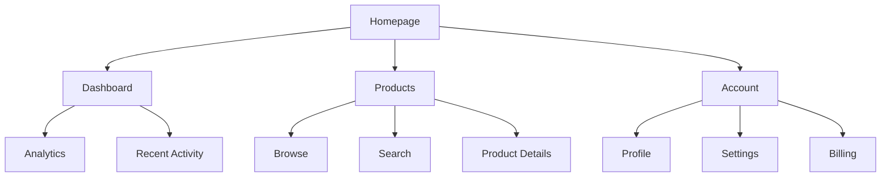

# Core Planning Templates Analysis - Section 3: Frontend Specification Template

[← Back to Section 2: PRD Templates](core-planning-templates-section2.md) | [→ Continue to Section 4: Story & Project Brief](core-planning-templates-section4.md)

---

## Section 3: Frontend Specification Template Analysis

### Template Identity

```yaml
template:
  id: frontend-spec-template-v2
  name: UI/UX Specification
  version: 2.0
  output:
    format: markdown
    filename: docs/front-end-spec.md
    title: "{{project_name}} UI/UX Specification"
```

**Key Characteristics**:
- **Lines**: 351 (largest of core planning templates)
- **Owner**: UX Expert Agent (Sally)
- **Mode**: Interactive with advanced-elicitation
- **Purpose**: Define user experience goals, information architecture, user flows, and visual design specifications
- **Output**: Single markdown file at docs/front-end-spec.md

### Purpose & Scope

This template serves as the foundation for:
1. Visual design creation (Figma, Sketch, etc.)
2. Frontend development implementation
3. Ensuring cohesive and user-centered experience
4. Establishing design system and component library
5. Defining accessibility and responsiveness strategies

**Relationship to Other Templates**:
- **Follows**: PRD (provides UI/UX requirements section)
- **Informs**: Frontend Architecture template (technical implementation)
- **Used by**: Dev Agent (implements UI stories)
- **Validated by**: QA Agent (UI/UX compliance checks)

---

### Workflow Configuration

```yaml
workflow:
  mode: interactive
  elicitation: advanced-elicitation
```

**Interaction Pattern**:
- Collaborative design conversation with user
- Review PRD and Project Brief for context
- Section-by-section design specification
- Iterative refinement with stakeholder feedback

---

### Section Structure

The Frontend Spec template defines **10 major sections** covering comprehensive UX/UI design:

---

## Section 1: Introduction

**Purpose**: Establish document foundation and overall UX goals.

### Sub-section: Document Purpose (content block)

**Fixed Content**:
> "This document defines the user experience goals, information architecture, user flows, and visual design specifications for {{project_name}}'s user interface. It serves as the foundation for visual design and frontend development, ensuring a cohesive and user-centered experience."

**Instruction** (for agent):
> "Review provided documents including Project Brief, PRD, and any user research to gather context. Focus on understanding user needs, pain points, and desired outcomes before beginning the specification. Establish the document's purpose and scope. Keep the content below but ensure project name is properly substituted."

**Design Insight**: Template emphasizes context gathering from prior documents before diving into design—UX Expert must understand "why" before defining "how".

---

### Sub-section: Overall UX Goals & Principles

**Purpose**: Establish foundation for all design decisions.

**Elicitation Flag**: `elicit: true`

**Instruction** (key excerpt):
> "Work with the user to establish and document the following. If not already defined, facilitate a discussion to determine:
> 1. Target User Personas - elicit details or confirm existing ones from PRD
> 2. Key Usability Goals - understand what success looks like for users
> 3. Core Design Principles - establish 3-5 guiding principles"

**Sub-sub-sections**:

#### 1. Target User Personas

**Template**: `"{{persona_descriptions}}"`

**Examples**:
- "**Power User:** Technical professionals who need advanced features and efficiency"
- "**Casual User:** Occasional users who prioritize ease of use and clear guidance"
- "**Administrator:** System managers who need control and oversight capabilities"

**Design Insight**: Personas may already exist from PRD—template instructs agent to confirm or elicit.

---

#### 2. Usability Goals

**Template**: `"{{usability_goals}}"`

**Examples**:
- "Ease of learning: New users can complete core tasks within 5 minutes"
- "Efficiency of use: Power users can complete frequent tasks with minimal clicks"
- "Error prevention: Clear validation and confirmation for destructive actions"
- "Memorability: Infrequent users can return without relearning"

**Design Insight**: Goals must be specific and measurable—"within 5 minutes", "minimal clicks".

---

#### 3. Design Principles

**Type**: numbered-list

**Template**: `"{{design_principles}}"`

**Examples**:
- "**Clarity over cleverness** - Prioritize clear communication over aesthetic innovation"
- "**Progressive disclosure** - Show only what's needed, when it's needed"
- "**Consistent patterns** - Use familiar UI patterns throughout the application"
- "**Immediate feedback** - Every action should have a clear, immediate response"
- "**Accessible by default** - Design for all users from the start"

**Design Insight**: 3-5 principles provide decision-making framework for entire design process.

---

### Sub-section: Change Log

**Type**: table

**Columns**: Date, Version, Description, Author

**Purpose**: Track document evolution as design iterates.

---

## Section 2: Information Architecture (IA)

**Purpose**: Define structure and organization of information.

**Elicitation Flag**: `elicit: true`

**Instruction** (key excerpt):
> "Collaborate with the user to create a comprehensive information architecture:
> 1. Build a Site Map or Screen Inventory showing all major areas
> 2. Define the Navigation Structure (primary, secondary, breadcrumbs)
> 3. Use Mermaid diagrams for visual representation
> 4. Consider user mental models and expected groupings"

---

### Sub-section: Site Map / Screen Inventory

**Type**: `mermaid` (graph diagram)

**Mermaid Type**: `graph`

**Template**: `"{{sitemap_diagram}}"`

**Example**:


**Design Insight**: Mermaid diagrams embedded in markdown enable visual IA documentation without external tools.

---

### Sub-section: Navigation Structure

**Template**:
```markdown
**Primary Navigation:** {{primary_nav_description}}

**Secondary Navigation:** {{secondary_nav_description}}

**Breadcrumb Strategy:** {{breadcrumb_strategy}}
```

**Design Considerations**:
- Primary nav: Top-level sections, always visible
- Secondary nav: Context-specific navigation within sections
- Breadcrumbs: Help users understand location in hierarchy

---

## Section 3: User Flows

**Purpose**: Map critical user tasks step-by-step.

**Elicitation Flag**: `elicit: true`

**Repeatable**: `repeatable: true` - One flow section per major task

**Instruction** (key excerpt):
> "For each critical user task identified in the PRD:
> 1. Define the user's goal clearly
> 2. Map out all steps including decision points
> 3. Consider edge cases and error states
> 4. Use Mermaid flow diagrams for clarity
> 5. Link to external tools (Figma/Miro) if detailed flows exist there
>
> Create subsections for each major flow."

---

### Sub-section: Flow (repeatable)

**Title Pattern**: "{{flow_name}}"

**Template**:
```markdown
**User Goal:** {{flow_goal}}

**Entry Points:** {{entry_points}}

**Success Criteria:** {{success_criteria}}
```

**Sub-sub-sections**:

#### 1. Flow Diagram

**Type**: `mermaid` (graph flowchart)

**Template**: `"{{flow_diagram}}"`

**Design Insight**: Visual flow diagrams essential for communicating complex user journeys.

---

#### 2. Edge Cases & Error Handling

**Type**: bullet-list

**Template**: `"- {{edge_case}}"`

**Purpose**: Document what happens when things don't go as expected.

**Examples**:
- "User enters invalid email format → Show inline validation error"
- "Network timeout during save → Show retry option with cached data"
- "User tries to access unauthorized content → Redirect to login with return URL"

---

#### 3. Notes

**Template**: `"**Notes:** {{flow_notes}}"`

**Purpose**: Capture additional context, dependencies, or implementation notes.

---

## Section 4: Wireframes & Mockups

**Purpose**: Clarify where visual designs will be created and how to reference them.

**Elicitation Flag**: `elicit: true`

**Instruction** (key excerpt):
> "Clarify where detailed visual designs will be created (Figma, Sketch, etc.) and how to reference them. If low-fidelity wireframes are needed, offer to help conceptualize layouts for key screens."

---

### Sub-section: Design Files

**Template**: `"**Primary Design Files:** {{design_tool_link}}"`

**Example**: "**Primary Design Files:** https://figma.com/file/abc123/MyProject"

---

### Sub-section: Key Screen Layouts (repeatable)

**Purpose**: Document essential screens even if detailed mockups exist elsewhere.

#### Screen (repeatable)

**Title Pattern**: "{{screen_name}}"

**Template**:
```markdown
**Purpose:** {{screen_purpose}}

**Key Elements:**
- {{element_1}}
- {{element_2}}
- {{element_3}}

**Interaction Notes:** {{interaction_notes}}

**Design File Reference:** {{specific_frame_link}}
```

**Design Insight**: Provides lightweight documentation for key screens with links to detailed designs.

---

## Section 5: Component Library / Design System

**Purpose**: Define reusable UI components and their behaviors.

**Elicitation Flag**: `elicit: true`

**Instruction** (key excerpt):
> "Discuss whether to use an existing design system or create a new one. If creating new, identify foundational components and their key states. Note that detailed technical specs belong in front-end-architecture."

---

### Sub-section: Design System Approach

**Template**: `"**Design System Approach:** {{design_system_approach}}"`

**Examples**:
- "Using Material Design 3 with custom theme"
- "Building custom design system from scratch"
- "Extending shadcn/ui component library"
- "Adopting company-wide design system v2.0"

---

### Sub-section: Core Components (repeatable)

**Purpose**: Document each foundational component.

#### Component (repeatable)

**Title Pattern**: "{{component_name}}"

**Template**:
```markdown
**Purpose:** {{component_purpose}}

**Variants:** {{component_variants}}

**States:** {{component_states}}

**Usage Guidelines:** {{usage_guidelines}}
```

**Examples**:

**Button Component**:
- **Purpose**: Primary action trigger throughout application
- **Variants**: Primary, Secondary, Tertiary, Danger
- **States**: Default, Hover, Active, Disabled, Loading
- **Usage Guidelines**: Use Primary for main CTA, Secondary for alternate actions, Danger for destructive operations

**Card Component**:
- **Purpose**: Container for grouped related content
- **Variants**: Default, Elevated, Outlined, Interactive
- **States**: Default, Hover (if interactive), Selected
- **Usage Guidelines**: Use for content grouping, product listings, dashboard widgets

**Design Insight**: Template distinguishes between UX specification (variants, states, usage) and technical implementation (belongs in architecture).

---

## Section 6: Branding & Style Guide

**Purpose**: Ensure consistency with brand guidelines.

**Elicitation Flag**: `elicit: true`

**Instruction**: "Link to existing style guide or define key brand elements. Ensure consistency with company brand guidelines if they exist."

---

### Sub-section: Visual Identity

**Template**: `"**Brand Guidelines:** {{brand_guidelines_link}}"`

---

### Sub-section: Color Palette

**Type**: table

**Columns**: Color Type, Hex Code, Usage

**Rows** (template-defined):
| Color Type | Hex Code | Usage |
|------------|----------|-------|
| Primary | {{primary_color}} | {{primary_usage}} |
| Secondary | {{secondary_color}} | {{secondary_usage}} |
| Accent | {{accent_color}} | {{accent_usage}} |
| Success | {{success_color}} | Positive feedback, confirmations |
| Warning | {{warning_color}} | Cautions, important notices |
| Error | {{error_color}} | Errors, destructive actions |
| Neutral | {{neutral_colors}} | Text, borders, backgrounds |

**Design Insight**: Color palette table structure ensures consistent semantic color usage across application.

---

### Sub-section: Typography

**Purpose**: Define font families and type scale.

#### Sub-sub-section: Font Families

**Template**:
```markdown
- **Primary:** {{primary_font}}
- **Secondary:** {{secondary_font}}
- **Monospace:** {{mono_font}}
```

**Examples**:
- Primary: Inter (headings and body text)
- Secondary: Merriweather (editorial content)
- Monospace: JetBrains Mono (code blocks)

---

#### Sub-sub-section: Type Scale

**Type**: table

**Columns**: Element, Size, Weight, Line Height

**Rows**:
| Element | Size | Weight | Line Height |
|---------|------|--------|-------------|
| H1 | {{h1_size}} | {{h1_weight}} | {{h1_line}} |
| H2 | {{h2_size}} | {{h2_weight}} | {{h2_line}} |
| H3 | {{h3_size}} | {{h3_weight}} | {{h3_line}} |
| Body | {{body_size}} | {{body_weight}} | {{body_line}} |
| Small | {{small_size}} | {{small_weight}} | {{small_line}} |

**Design Insight**: Type scale table ensures consistent typography hierarchy.

---

### Sub-section: Iconography

**Template**:
```markdown
**Icon Library:** {{icon_library}}

**Usage Guidelines:** {{icon_guidelines}}
```

**Examples**:
- Icon Library: Lucide Icons (React)
- Usage Guidelines: 24px default size, use outline style, consistent stroke width 2px

---

### Sub-section: Spacing & Layout

**Template**:
```markdown
**Grid System:** {{grid_system}}

**Spacing Scale:** {{spacing_scale}}
```

**Examples**:
- Grid System: 12-column responsive grid with 16px gutters
- Spacing Scale: 4px base unit (4, 8, 16, 24, 32, 48, 64, 96px)

---

## Section 7: Accessibility Requirements

**Purpose**: Define specific accessibility requirements and testing strategy.

**Elicitation Flag**: `elicit: true`

**Instruction**: "Define specific accessibility requirements based on target compliance level and user needs. Be comprehensive but practical."

---

### Sub-section: Compliance Target

**Template**: `"**Standard:** {{compliance_standard}}"`

**Examples**:
- "WCAG 2.1 Level AA"
- "WCAG 2.2 Level AAA"
- "Section 508 Compliance"

---

### Sub-section: Key Requirements

**Template**:
```markdown
**Visual:**
- Color contrast ratios: {{contrast_requirements}}
- Focus indicators: {{focus_requirements}}
- Text sizing: {{text_requirements}}

**Interaction:**
- Keyboard navigation: {{keyboard_requirements}}
- Screen reader support: {{screen_reader_requirements}}
- Touch targets: {{touch_requirements}}

**Content:**
- Alternative text: {{alt_text_requirements}}
- Heading structure: {{heading_requirements}}
- Form labels: {{form_requirements}}
```

**Example Population**:
```markdown
**Visual:**
- Color contrast ratios: Minimum 4.5:1 for normal text, 3:1 for large text
- Focus indicators: 2px solid outline, high contrast against background
- Text sizing: Support 200% zoom without horizontal scrolling

**Interaction:**
- Keyboard navigation: All interactive elements accessible via keyboard
- Screen reader support: ARIA labels and landmarks throughout
- Touch targets: Minimum 44x44px for all interactive elements

**Content:**
- Alternative text: Descriptive alt text for all images conveying content
- Heading structure: Logical heading hierarchy (no skipped levels)
- Form labels: Visible labels for all form inputs with proper association
```

**Design Insight**: Three-category organization (Visual, Interaction, Content) ensures comprehensive accessibility coverage.

---

### Sub-section: Testing Strategy

**Template**: `"{{accessibility_testing}}"`

**Example**:
"Automated testing with axe DevTools during development. Manual testing with NVDA and JAWS screen readers. Keyboard-only navigation testing for all user flows. Color contrast validation using WebAIM contrast checker."

---

## Section 8: Responsiveness Strategy

**Purpose**: Define how design adapts to different device sizes.

**Elicitation Flag**: `elicit: true`

**Instruction**: "Define breakpoints and adaptation strategies for different device sizes. Consider both technical constraints and user contexts."

---

### Sub-section: Breakpoints

**Type**: table

**Columns**: Breakpoint, Min Width, Max Width, Target Devices

**Rows**:
| Breakpoint | Min Width | Max Width | Target Devices |
|------------|-----------|-----------|----------------|
| Mobile | {{mobile_min}} | {{mobile_max}} | {{mobile_devices}} |
| Tablet | {{tablet_min}} | {{tablet_max}} | {{tablet_devices}} |
| Desktop | {{desktop_min}} | {{desktop_max}} | {{desktop_devices}} |
| Wide | {{wide_min}} | - | {{wide_devices}} |

**Example**:
| Breakpoint | Min Width | Max Width | Target Devices |
|------------|-----------|-----------|----------------|
| Mobile | 0 | 767px | Smartphones |
| Tablet | 768px | 1023px | Tablets, small laptops |
| Desktop | 1024px | 1439px | Laptops, desktop monitors |
| Wide | 1440px | - | Large monitors, 4K displays |

---

### Sub-section: Adaptation Patterns

**Template**:
```markdown
**Layout Changes:** {{layout_adaptations}}

**Navigation Changes:** {{nav_adaptations}}

**Content Priority:** {{content_adaptations}}

**Interaction Changes:** {{interaction_adaptations}}
```

**Example**:
```markdown
**Layout Changes:** Single column on mobile, 2-column on tablet, 3-column on desktop. Sidebars collapse to drawers on mobile.

**Navigation Changes:** Hamburger menu on mobile/tablet, horizontal nav on desktop. Persistent bottom navigation on mobile for key actions.

**Content Priority:** Hide secondary content on mobile, progressive disclosure. Show full content on desktop with richer visualizations.

**Interaction Changes:** Touch-optimized controls on mobile (larger targets), hover states on desktop, swipe gestures on mobile.
```

---

## Section 9: Animation & Micro-interactions

**Purpose**: Define motion design principles and key animations.

**Elicitation Flag**: `elicit: true`

**Instruction**: "Define motion design principles and key interactions. Keep performance and accessibility in mind."

---

### Sub-section: Motion Principles

**Template**: `"{{motion_principles}}"`

**Example**:
"Subtle and purposeful motion that guides attention and provides feedback. All animations under 300ms for immediate feel. Respect prefers-reduced-motion system preference. Use easing functions that feel natural (ease-out for entrances, ease-in for exits)."

---

### Sub-section: Key Animations (repeatable)

**Template**: `"- **{{animation_name}}:** {{animation_description}} (Duration: {{duration}}, Easing: {{easing}})"`

**Examples**:
- **Button Press**: Scale down to 0.95 on active (Duration: 100ms, Easing: ease-out)
- **Modal Entrance**: Fade in with slight scale up from 0.95 (Duration: 200ms, Easing: ease-out)
- **List Item Addition**: Slide in from top with fade (Duration: 250ms, Easing: ease-out)
- **Loading Spinner**: Continuous rotation (Duration: 1000ms, Easing: linear)
- **Toast Notification**: Slide in from top-right (Duration: 300ms, Easing: ease-out)

**Design Insight**: Specifying duration and easing ensures consistent motion across application.

---

## Section 10: Performance Considerations

**Purpose**: Define performance goals that impact UX design decisions.

---

### Sub-section: Performance Goals

**Template**:
```markdown
- **Page Load:** {{load_time_goal}}
- **Interaction Response:** {{interaction_goal}}
- **Animation FPS:** {{animation_goal}}
```

**Example**:
```markdown
- **Page Load:** Initial paint under 1 second, interactive under 2.5 seconds
- **Interaction Response:** All interactions respond within 100ms
- **Animation FPS:** Maintain 60fps for all animations
```

---

### Sub-section: Design Strategies

**Template**: `"{{performance_strategies}}"`

**Example**:
"Lazy load images below fold. Use progressive image loading (blur-up). Minimize web font usage (2 families max). Implement virtual scrolling for long lists. Use CSS animations over JavaScript where possible. Optimize SVG icons. Implement skeleton screens for loading states."

**Design Insight**: Performance considerations influence design decisions—template ensures UX Expert thinks about performance from start.

---

## Section 11: Next Steps

**Purpose**: Guide transition from specification to implementation.

**Instruction** (key excerpt):
> "After completing the UI/UX specification:
> 1. Recommend review with stakeholders
> 2. Suggest creating/updating visual designs in design tool
> 3. Prepare for handoff to Design Architect for frontend architecture
> 4. Note any open questions or decisions needed"

---

### Sub-section: Immediate Actions

**Type**: numbered-list

**Template**: `"{{action}}"`

**Example**:
1. Review UI/UX spec with product stakeholders
2. Create high-fidelity mockups in Figma for key screens
3. Build interactive prototype for user testing
4. Conduct usability testing with 5 representative users
5. Refine designs based on feedback
6. Hand off to Architect for frontend architecture specification

---

### Sub-section: Design Handoff Checklist

**Type**: checklist

**Items** (pre-defined):
- [ ] All user flows documented
- [ ] Component inventory complete
- [ ] Accessibility requirements defined
- [ ] Responsive strategy clear
- [ ] Brand guidelines incorporated
- [ ] Performance goals established

**Design Insight**: Checklist ensures nothing forgotten before handoff to next phase.

---

## Section 12: Checklist Results

**Purpose**: Execute UI/UX checklist (if exists) and report validation results.

**Instruction**: "If a UI/UX checklist exists, run it against this document and report results here."

**Integration Point**: Links to execute-checklist task with potential ui-ux-checklist.

---

## Data Flow & Dependencies

**Input Dependencies**:
- (Required) PRD (especially UI Goals section)
- (Recommended) Project Brief (user personas, goals)
- (Optional) Brainstorming results (creative ideas)
- (Optional) Existing brand guidelines
- (Optional) User research data

**Output Artifact**:
- docs/front-end-spec.md - Complete UI/UX specification

**Downstream Consumers**:
- Architect (Winston) - Creates front-end-architecture.md (technical implementation)
- Dev Agent (James) - Implements UI components and screens
- QA Agent (Quinn) - Validates UI/UX compliance
- External designers - Create detailed mockups and prototypes

**Workflow Integration**:
- Used by: create-doc.md task (UX Expert agent)
- Followed by: front-end-architecture template (Architect)
- Validated by: execute-checklist.md task (if ui-ux-checklist exists)

---

## Template Variables & Interpolation

**Project Variables**:
- `{{project_name}}` - Project identifier

**UX/Design Variables**:
- `{{persona_descriptions}}` - User persona definitions
- `{{usability_goals}}` - Measurable usability targets
- `{{design_principles}}` - Core design principles (3-5)
- `{{sitemap_diagram}}` - Mermaid diagram code
- `{{primary_nav_description}}` - Primary navigation description
- `{{secondary_nav_description}}` - Secondary navigation description
- `{{breadcrumb_strategy}}` - Breadcrumb usage strategy
- `{{flow_name}}` - User flow name
- `{{flow_goal}}` - User flow objective
- `{{entry_points}}` - Where users start flow
- `{{success_criteria}}` - How users know they succeeded
- `{{flow_diagram}}` - Mermaid flow diagram code
- `{{edge_case}}` - Edge case description
- `{{flow_notes}}` - Additional flow notes
- `{{design_tool_link}}` - Link to Figma/Sketch/etc.
- `{{screen_name}}` - Screen name
- `{{screen_purpose}}` - What screen accomplishes
- `{{element_N}}` - Key UI elements on screen
- `{{interaction_notes}}` - Interaction behaviors
- `{{specific_frame_link}}` - Link to specific design frame
- `{{design_system_approach}}` - Which design system to use
- `{{component_name}}` - Component name
- `{{component_purpose}}` - What component does
- `{{component_variants}}` - Component variations
- `{{component_states}}` - Component states
- `{{usage_guidelines}}` - When/how to use component
- `{{brand_guidelines_link}}` - Link to brand guidelines
- `{{primary_color}}` - Primary brand color hex
- `{{primary_usage}}` - How to use primary color
- (Similar for secondary, accent, success, warning, error, neutral colors)
- `{{primary_font}}` - Primary typeface
- `{{secondary_font}}` - Secondary typeface
- `{{mono_font}}` - Monospace font
- `{{h1_size}}`, `{{h1_weight}}`, `{{h1_line}}` - H1 typography specs
- (Similar for H2, H3, Body, Small)
- `{{icon_library}}` - Which icon set to use
- `{{icon_guidelines}}` - Icon usage rules
- `{{grid_system}}` - Grid specification
- `{{spacing_scale}}` - Spacing system
- `{{compliance_standard}}` - Accessibility standard (WCAG, etc.)
- `{{contrast_requirements}}` - Color contrast rules
- `{{focus_requirements}}` - Focus indicator specs
- `{{text_requirements}}` - Text sizing requirements
- `{{keyboard_requirements}}` - Keyboard navigation specs
- `{{screen_reader_requirements}}` - Screen reader support
- `{{touch_requirements}}` - Touch target sizes
- `{{alt_text_requirements}}` - Alt text rules
- `{{heading_requirements}}` - Heading hierarchy rules
- `{{form_requirements}}` - Form label requirements
- `{{accessibility_testing}}` - How to test accessibility
- `{{mobile_min}}`, `{{mobile_max}}`, `{{mobile_devices}}` - Mobile breakpoint
- (Similar for tablet, desktop, wide)
- `{{layout_adaptations}}` - How layout changes by size
- `{{nav_adaptations}}` - How navigation changes by size
- `{{content_adaptations}}` - Content prioritization by size
- `{{interaction_adaptations}}` - Interaction changes by size
- `{{motion_principles}}` - Motion design philosophy
- `{{animation_name}}` - Animation identifier
- `{{animation_description}}` - What animation does
- `{{duration}}` - Animation duration
- `{{easing}}` - Easing function
- `{{load_time_goal}}` - Page load performance target
- `{{interaction_goal}}` - Interaction response target
- `{{animation_goal}}` - Animation FPS target
- `{{performance_strategies}}` - Design strategies for performance
- `{{action}}` - Next step action item

**Total Variables**: 70+ unique interpolation points

---

## Validation Rules & Quality Standards

**Built-in Validation**:
1. **PRD Review Required** - Agent must review PRD before starting
2. **User Persona Confirmation** - Confirm or elicit user personas
3. **Design Principles** - Must establish 3-5 core principles
4. **Information Architecture** - Site map and navigation required
5. **User Flow Completeness** - Must include edge cases and error states
6. **Component Documentation** - Must document variants, states, usage
7. **Color Semantics** - Must define semantic colors (success, warning, error)
8. **Typography Scale** - Must define consistent type scale
9. **Accessibility Compliance** - Must specify standard and requirements
10. **Responsive Strategy** - Must define breakpoints and adaptations
11. **Performance Goals** - Must set measurable performance targets
12. **Design Handoff Checklist** - Must complete before handoff
13. **Optional Checklist Execution** - If ui-ux-checklist exists, must execute

---

## Key Design Patterns

**1. PRD Integration**
- Template instructs agent to review PRD first
- UI Goals section from PRD informs specification
- User personas may already exist in PRD

**2. Mermaid Diagrams for Visual Documentation**
- Site map as graph diagram
- User flows as flowcharts
- Enables visual documentation without external tools
- Rendered in markdown viewers and documentation sites

**3. Semantic Color System**
- Predefined color roles (primary, secondary, accent, success, warning, error, neutral)
- Ensures consistent color meaning across application
- Aids accessibility (e.g., error always red)

**4. Component-Driven Design**
- Document reusable components
- Define variants and states
- Provide usage guidelines
- Foundation for component library

**5. Accessibility-First**
- Dedicated section for accessibility
- Requirements organized by category (Visual, Interaction, Content)
- Testing strategy included
- Compliance target explicit

**6. Performance-Aware Design**
- Performance section influences design decisions
- Measurable goals (load time, interaction response, FPS)
- Strategies documented (lazy loading, skeleton screens, etc.)

**7. Responsive Design Thinking**
- Breakpoints defined up-front
- Adaptation patterns across categories (Layout, Navigation, Content, Interaction)
- Mobile-first considerations

**8. Motion with Purpose**
- Motion principles guide animation decisions
- Specific animations documented with duration and easing
- Accessibility consideration (prefers-reduced-motion)

**9. Design System Integration**
- Option to use existing design system or create new
- Component library documentation
- Consistency through shared patterns

**10. External Tool Integration**
- Links to design tools (Figma, Sketch, Miro)
- Template documents key screens even when detailed mockups exist elsewhere
- Hybrid approach: structured documentation + visual design files

---

## ADK Translation Considerations for Frontend Spec Template

**1. Template Rendering with Mermaid Support**
- Cloud Function must support Mermaid syntax
- Render Mermaid diagrams for preview
- Store Mermaid code in Firestore
- Display rendered diagrams in web UI using mermaid.js

**2. Interactive Component Library Builder**
- Web UI for defining components with variants and states
- Visual preview of components
- Generate component documentation automatically
- Export to Figma or Storybook

**3. Color Palette Picker**
- Interactive color picker for brand colors
- Contrast ratio validation (WCAG compliance)
- Generate color scale variants automatically
- Preview colors throughout UI

**4. Typography Scale Calculator**
- Visual type scale builder
- Preview typography in context
- Generate CSS custom properties
- Export to design tokens

**5. User Flow Editor**
- Visual flow builder (alternative to Mermaid code)
- Drag-and-drop flow creation
- Export to Mermaid syntax
- Store flows as structured data in Firestore

**6. Responsive Preview**
- Live preview at different breakpoints
- Device frame simulators
- Adaptation pattern visualization
- Screenshot capture for documentation

**7. Accessibility Validator Integration**
- Automated axe-core checks during spec creation
- Color contrast validation in real-time
- Keyboard navigation simulation
- Screen reader compatibility checks

**8. Design File Integration**
- Figma API integration for importing screens
- Automatic component extraction from design files
- Sync design changes back to specification
- Version control for design assets

**9. Animation Previewer**
- Visual animation builder
- Duration and easing curve editor
- Performance impact estimation
- Export to CSS animations or Framer Motion

**10. Performance Budget Tool**
- Set performance targets
- Estimate impact of design decisions
- Alert when design exceeds budgets
- Generate performance checklist

**11. Design Handoff Package Generator**
- Auto-generate design handoff document
- Include all specs, assets, and guidelines
- Export to PDF or interactive web page
- Notify Architect when ready

**12. Version Control Integration**
- Track specification changes over time
- Diff views for design iterations
- Rollback to previous versions
- Branching for design explorations

---

## Key Insights: Frontend Specification Template

**1. Most Comprehensive Template**
- 351 lines (largest of planning templates)
- Covers 10 major areas of UX/UI design
- 70+ interpolation variables
- Extremely thorough coverage

**2. User-Centered Design Process**
- Starts with user personas and goals
- All design decisions traced back to user needs
- Usability goals are measurable
- Design principles guide all decisions

**3. Accessibility Baked In**
- Dedicated accessibility section
- Not optional—required for all projects
- Three-category organization (Visual, Interaction, Content)
- Testing strategy included

**4. Performance-Aware from Start**
- Performance section influences design decisions
- Measurable goals prevent performance issues later
- Design strategies documented up-front

**5. Mermaid Diagrams Enable Visual Documentation**
- Site maps and user flows as diagrams
- No external tool dependencies
- Version controlled with spec
- Rendered in markdown viewers

**6. Component-Driven Design Methodology**
- Component library as first-class concept
- Variants and states documented
- Usage guidelines prevent inconsistency
- Foundation for design system

**7. Responsive Design Thinking Up-Front**
- Breakpoints defined early
- Adaptation patterns across categories
- Mobile-first considerations
- Prevents desktop-only designs

**8. Design System Integration**
- Supports both existing and new design systems
- Documents component library regardless
- Ensures consistency across application

**9. External Tool Integration**
- Links to Figma/Sketch/Miro
- Hybrid approach: structured docs + visual designs
- Prevents tool lock-in

**10. Handoff Checklist Ensures Completeness**
- Pre-defined checklist prevents forgotten items
- Clear handoff to Architect
- Quality gate before implementation

**11. Template Is Teaching Tool**
- Extensive instructions guide UX Expert
- Examples provide concrete reference
- Best practices encoded in structure
- Helps less experienced designers

**12. Distinction Between UX and Architecture**
- Template focuses on "what" and "why"
- Technical implementation ("how") belongs in architecture
- Clear boundary between design and development

---

**End of Section 3**

[← Back to Section 2: PRD Templates](core-planning-templates-section2.md) | [→ Continue to Section 4: Story & Project Brief](core-planning-templates-section4.md)
