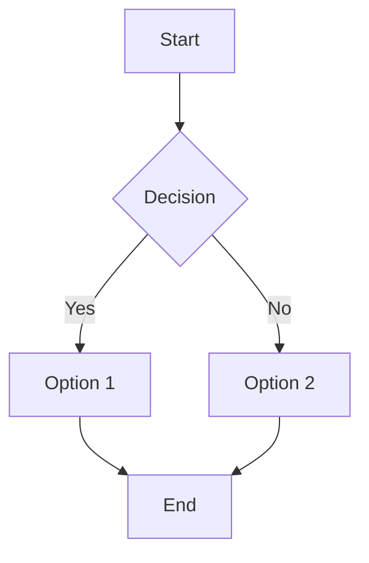
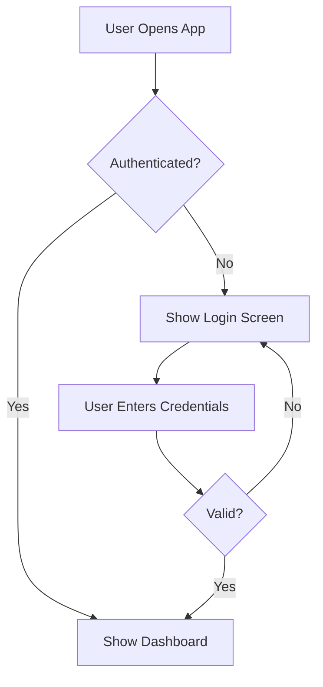

# BMad Framework Output Format Standards - Section 3: Markdown Formatting Conventions

**Analysis Date**: 2025-10-14
**Analyzer**: Claude Code (AI Agent)
**Phase**: Phase 4, Task 4.4
**Document Version**: 1.0

---

## Table of Contents

- [Section 1: Introduction & Core Patterns](output-format-standards-section1.md)
- [Section 2: File Naming & Directory Structure Standards](output-format-standards-section2.md)
- [Section 3: Markdown Formatting Conventions](#section-3-markdown-formatting-conventions) (This document)
- [Section 4: Metadata, Versioning & Status Standards](output-format-standards-section4.md)
- [Section 5: ADK Translation & Summary](output-format-standards-section5.md)

---

## Section 3: Markdown Formatting Conventions

### 3.1 Heading Hierarchy

BMad follows strict heading hierarchy rules for semantic structure and agent parsing.

#### 3.1.1 Heading Level Guidelines

**H1 (`# Title`)**: Document Title Only
- One H1 per document
- Appears at the top of the document
- Includes document type and project name when applicable
- Examples:
  - `# Product Requirements Document (PRD)`
  - `# System Architecture`
  - `# Story 1.2: User Authentication`

**H2 (`## Section`)**: Top-Level Sections
- Primary document sections
- Maps to template top-level sections
- Examples:
  - `## Goals and Background Context`
  - `## Requirements`
  - `## Epic List`
  - `## Status`
  - `## Story`

**H3 (`### Sub-Section`)**: Sub-Sections
- Nested content within H2 sections
- Maps to template sub-sections
- Examples:
  - `### Goals`
  - `### Background Context`
  - `### Functional Requirements`
  - `### Non-Functional Requirements`

**H4 (`#### Item`)**: Specific Items or Deep Nesting
- Detailed breakdowns
- Epic and story titles within PRDs
- Examples:
  - `#### Story 1.1: Project Setup`
  - `#### Acceptance Criteria`
  - `#### Testing Standards`

**H5 (`##### Detail`)**: Fine-Grained Details
- Rarely used
- Deep nesting for complex structures
- Examples:
  - `##### Agent Model Used`
  - `##### Completion Notes List`

**H6 (`###### Micro-Detail`)**: Extreme Nesting
- Very rarely used
- Reserved for complex hierarchical content

#### 3.1.2 Heading Formatting Rules

**Capitalization**:
- Title case for H1, H2
- Sentence case for H3, H4, H5, H6
- Examples:
  - H1: `# Product Requirements Document (PRD)`
  - H2: `## Goals and Background Context`
  - H3: `### Functional requirements` or `### Functional Requirements` (both acceptable)
  - H4: `#### Story 1.1: Project setup`

**Spacing**:
- One blank line before headings
- One blank line after headings
- Exception: No blank line between H1 and immediate content if no H2 follows

**Example**:
```markdown
# Product Requirements Document (PRD)

## Goals and Background Context

### Goals

- Goal 1: Deliver user authentication
- Goal 2: Enable user profile management

### Background Context

This project aims to build a modern web application...
```

#### 3.1.3 Heading Consistency with Templates

Headings in generated documents must match template section titles exactly:

**Template Definition**:
```yaml
sections:
  - id: dev-agent-record
    title: Dev Agent Record
    sections:
      - id: agent-model
        title: Agent Model Used
```

**Generated Output**:
```markdown
## Dev Agent Record

### Agent Model Used
claude-sonnet-4-5-20250929
```

---

### 3.2 List Formatting

BMad uses lists extensively for requirements, criteria, tasks, and structured content.

#### 3.2.1 Bullet Lists (Unordered)

**Syntax**: Hyphen with space (`- Item`)

**Examples**:
```markdown
### Goals

- Deliver secure user authentication
- Enable comprehensive user profile management
- Provide analytics dashboard for administrators
```

**Nesting**:
```markdown
### Key Features

- User Management
  - Registration
  - Login/Logout
  - Profile editing
- Authentication
  - JWT-based sessions
  - OAuth2 integration
```

**Rules**:
- Use hyphen (`-`), not asterisk (`*`) or plus (`+`)
- Single space after hyphen
- Nested items indented by 2 spaces
- No blank lines between items (unless separating logical groups)

#### 3.2.2 Numbered Lists (Ordered)

**Syntax**: Number with period and space (`1. Item`)

**Examples**:
```markdown
### Functional Requirements

1. FR1: Users can register with email and password
2. FR2: Users can log in with valid credentials
3. FR3: Users can reset their password via email
```

**Auto-Numbering**:
BMad often uses sequential numbering (`1.`, `2.`, `3.`), but markdown supports lazy numbering:
```markdown
1. First item
1. Second item (displays as "2.")
1. Third item (displays as "3.")
```

**Prefixed Requirements**:
BMad uses prefixed identifiers for traceability:

**Functional Requirements**:
```markdown
1. FR1: Users can register with email and password
2. FR2: Users can log in with credentials
3. FR3: Users can reset passwords via email
```

**Non-Functional Requirements**:
```markdown
1. NFR1: System must handle 1000 concurrent users
2. NFR2: API response time under 200ms for 95th percentile
3. NFR3: Maintain 99.9% uptime
```

**Compatibility Requirements** (Brownfield):
```markdown
1. CR1: Must integrate with existing user database schema
2. CR2: Must support legacy API endpoints
3. CR3: Must maintain backward compatibility with v1 clients
```

**Acceptance Criteria**:
```markdown
#### Acceptance Criteria

1. Users can register with email and password
2. Registration validates email format
3. Passwords are hashed with bcrypt
4. Duplicate emails are rejected with clear error message
```

**Integration Verification** (Brownfield):
```markdown
#### Integration Verification

1. IV1: Verify existing user sessions are preserved
2. IV2: Confirm API backward compatibility with v1 clients
3. IV3: Validate data migration completed successfully
```

#### 3.2.3 Checklist Format (Task Lists)

**Syntax**: `- [ ]` for unchecked, `- [x]` for checked

**Examples**:
```markdown
## Tasks / Subtasks

- [ ] Task 1: Set up authentication library (AC: 1)
  - [ ] Install passport and passport-local
  - [ ] Configure passport strategy
  - [ ] Add middleware to Express app
- [ ] Task 2: Implement registration endpoint (AC: 1, 2, 3)
  - [ ] Create POST /auth/register route
  - [ ] Validate email and password
  - [ ] Hash password with bcrypt
  - [ ] Store user in database
- [x] Task 3: Write tests (AC: 4)
  - [x] Test valid registration
  - [x] Test duplicate email handling
  - [x] Test invalid email format
```

**Rules**:
- Space between brackets: `[ ]` not `[]`
- Lowercase 'x' for checked: `[x]` not `[X]`
- Tasks nested by indentation (2 spaces per level)
- Acceptance criteria references: `(AC: 1, 2)` links tasks to criteria

#### 3.2.4 Description Lists (Definition Lists)

BMad occasionally uses description lists for term definitions:

**Syntax** (HTML in Markdown):
```markdown
<dl>
  <dt>Term 1</dt>
  <dd>Definition of term 1</dd>

  <dt>Term 2</dt>
  <dd>Definition of term 2</dd>
</dl>
```

**More Common Alternative** (Bold Labels):
```markdown
**Term 1**: Definition of term 1

**Term 2**: Definition of term 2
```

---

### 3.3 Table Formatting

BMad uses tables for structured data like change logs, test scenarios, and metadata.

#### 3.3.1 Standard Table Syntax

**Format**:
```markdown
| Column 1 | Column 2 | Column 3 |
|----------|----------|----------|
| Data 1   | Data 2   | Data 3   |
| Data 4   | Data 5   | Data 6   |
```

**Rules**:
- Header row with column names
- Separator row with hyphens
- Data rows
- Pipes (`|`) align columns visually (optional but recommended)
- Minimum 3 hyphens per column in separator

#### 3.3.2 Change Log Tables

**Standard Format**:
```markdown
## Change Log

| Date       | Version | Description          | Author   |
|------------|---------|----------------------|----------|
| 2025-10-14 | 1.0     | Initial draft        | PM Agent |
| 2025-10-15 | 1.1     | Updated requirements | PM Agent |
| 2025-10-16 | 2.0     | Finalized PRD        | PO Agent |
```

**Columns**:
- **Date**: ISO format `YYYY-MM-DD`
- **Version**: Semantic versioning (major.minor) or sequential (1.0, 1.1, 2.0)
- **Description**: Brief summary of changes
- **Author**: Agent or human author name

#### 3.3.3 Test Scenario Tables

**Format**:
```markdown
| Test Scenario | Priority | Test Level | Risk Link | Acceptance Criteria |
|--------------|----------|------------|-----------|---------------------|
| Valid user registration | P0 | Unit | R1 | AC1, AC2, AC3 |
| Duplicate email handling | P0 | Integration | R2 | AC4 |
| Password strength validation | P1 | Unit | R3 | AC3 |
```

**Columns**:
- **Test Scenario**: Descriptive test name
- **Priority**: P0 (critical), P1 (high), P2 (medium), P3 (low)
- **Test Level**: Unit, Integration, E2E
- **Risk Link**: Reference to risk profile (R1, R2, etc.)
- **Acceptance Criteria**: AC references (AC1, AC2, etc.)

#### 3.3.4 Metadata Tables

Used in templates and specifications:

**Example** (Frontend Component Metadata):
```markdown
| Property | Value |
|----------|-------|
| Component Name | UserRegistrationForm |
| Component Type | Form |
| Primary Use Case | New user registration |
| State Management | Local state |
| API Endpoints | POST /auth/register |
```

#### 3.3.5 Alignment

Markdown tables support alignment using colons in separator row:

```markdown
| Left-aligned | Center-aligned | Right-aligned |
|:-------------|:--------------:|--------------:|
| Data         | Data           | Data          |
```

**BMad Convention**: Left-aligned by default (no colons in separator).

---

### 3.4 Emphasis & Formatting

#### 3.4.1 Bold Text

**Syntax**: `**text**` or `__text__`

**BMad Convention**: Double asterisks (`**text**`)

**Usage**:
- Emphasize important terms
- Labels in definition-style lists
- "CRITICAL" and "IMPORTANT" markers in instructions
- User story components

**Examples**:
```markdown
**CRITICAL**: Epic 1 must establish foundational infrastructure.

**As a** developer,
**I want** to set up authentication,
**so that** users can securely access the application

**Term**: Definition of the term
```

#### 3.4.2 Italic Text

**Syntax**: `*text*` or `_text_`

**BMad Convention**: Single asterisks (`*text*`)

**Usage** (Rare in BMad):
- Subtle emphasis
- Foreign terms
- Variable placeholders in prose

**Examples**:
```markdown
The *de facto* standard for authentication is OAuth2.

Agents use *advanced elicitation* to gather requirements.
```

#### 3.4.3 Bold + Italic

**Syntax**: `***text***` or `___text___`

**Usage**: Very rare; typically indicates extreme emphasis or special notation.

#### 3.4.4 Code Formatting

**Inline Code**: `` `code` ``

**Usage**:
- File names: `` `prd.md` ``, `` `architecture.md` ``
- Function names: `` `getUserById()` ``
- Variable names: `` `userId` ``, `` `authToken` ``
- Technical terms: `` `JWT` ``, `` `bcrypt` ``
- Commands: `` `npm install` ``

**Code Blocks**: Triple backticks with language

**Usage**:
- Code examples
- Configuration snippets
- YAML examples
- JSON examples
- Command sequences

**Examples**:

**JavaScript**:
````markdown
```javascript
function authenticate(email, password) {
  // Implementation
}
```
````

**TypeScript**:
````markdown
```typescript
interface User {
  id: string;
  email: string;
  passwordHash: string;
}
```
````

**YAML**:
````markdown
```yaml
template:
  id: prd-template-v2
  name: Product Requirements Document
  version: 2.0
```
````

**Shell Commands**:
````markdown
```bash
npm install passport passport-local
npm run test
```
````

**No Language (Plain Text)**:
````markdown
```
Plain text or pseudo-code
```
````

---

### 3.5 Links & References

#### 3.5.1 Internal Links (Cross-References)

**Syntax**: `[Link Text](relative/path.md#section-anchor)`

**Examples**:
```markdown
See [System Architecture](./architecture.md) for technical details.

Review [Tech Stack](./architecture.md#tech-stack) decisions.

Epic details in [Epic 1: Foundation](./prd/epic-01-foundation.md).
```

**Rules**:
- Use relative paths from current file location
- Include section anchors for precision
- Use descriptive link text (not "click here")

#### 3.5.2 External Links

**Syntax**: `[Link Text](https://example.com)`

**Examples**:
```markdown
Read the [OAuth2 Specification](https://oauth.net/2/)

See [Express.js Documentation](https://expressjs.com/en/api.html)
```

**Rules**:
- Full URLs with protocol (`https://`)
- Descriptive link text
- External links open in new tabs (handled by markdown renderer)

#### 3.5.3 Reference-Style Links

**Syntax**:
```markdown
This is a [reference link][ref-id].

[ref-id]: https://example.com "Optional Title"
```

**Usage**: Rare in BMad; inline links preferred for simplicity.

#### 3.5.4 Citation Format

BMad uses a specific citation format for source attribution:

**Pattern**: `[Source: file/path.md#section]`

**Examples**:
```markdown
[Source: architecture/tech-stack.md#authentication]

- Using Passport.js for authentication
- JWT tokens for session management
- bcrypt for password hashing

[Source: architecture/coding-standards.md#testing]

- Use Jest for unit tests
- Minimum 80% code coverage
- Test file naming: `{filename}.test.ts`
```

**Rules**:
- Citation appears **before** referenced content
- File path relative to `docs/` directory
- Section anchor for precision
- Used heavily in story Dev Notes sections

---

### 3.6 Blockquotes & Callouts

#### 3.6.1 Blockquotes

**Syntax**: `> Text`

**Examples**:
```markdown
> This is a blockquote.
> It can span multiple lines.

> **Note**: This is an important note in a blockquote.
```

**Usage**:
- Quotations
- Highlighted notes
- Nested agent instructions (in checklists)

#### 3.6.2 Callout Boxes (GitHub-Flavored Markdown)

BMad documents occasionally use GitHub-style callouts:

**Syntax**:
```markdown
> [!NOTE]
> This is a note callout

> [!WARNING]
> This is a warning callout

> [!IMPORTANT]
> This is an important callout
```

**Rendering**: Depends on markdown renderer (GitHub, VS Code, etc.)

**BMad Convention**: Less common; typically uses bold text for emphasis instead:

```markdown
**CRITICAL**: Epic 1 must establish foundational infrastructure.

**IMPORTANT**: Agents should validate all inputs before processing.

**NOTE**: This section is optional for backend-only projects.
```

---

### 3.7 Horizontal Rules

**Syntax**: `---` (three hyphens on their own line)

**Usage**:
- Separate major sections
- Visual breaks in long documents
- Appear in some templates and checklists

**Example**:
```markdown
## Section 1

Content for section 1...

---

## Section 2

Content for section 2...
```

**Rules**:
- Blank line before and after
- Three or more hyphens (`---`, `----`, `-----` all work)
- BMad convention: Exactly three hyphens

---

### 3.8 Special Formatting

#### 3.8.1 Mermaid Diagrams

BMad supports Mermaid diagrams for visualizations:

**Syntax**:
````markdown

````

**Usage**:
- System architecture diagrams
- Workflow flowcharts
- Data flow diagrams
- State transition diagrams
- Entity relationship diagrams

**Example** (User Flow):
````markdown

````

**Diagram Types Used in BMad**:
- `flowchart` / `graph`: Flowcharts and diagrams
- `sequenceDiagram`: Sequence diagrams for API interactions
- `classDiagram`: Class relationships (rare)
- `erDiagram`: Entity-relationship diagrams for database schemas

#### 3.8.2 HTML Comments

**Syntax**: `<!-- Comment -->`

**Usage**:
- BMad framework markers: `<!-- Powered by BMAD™ Core -->`
- Conditional section markers in templates
- Agent instructions (hidden in rendered output)

**Examples**:
```markdown
<!-- Powered by BMAD™ Core -->

<!-- This section is only visible in source -->

<!-- [[BROWNFIELD ONLY]] -->
```

#### 3.8.3 YAML Front Matter

**Syntax**:
```yaml
---
key: value
another_key: another value
---
```

**Usage**: Rare in generated documents; primarily in templates (which are pure YAML).

**Example** (If used):
```markdown
---
title: Product Requirements Document
version: 2.0
author: PM Agent
date: 2025-10-14
---

# Product Requirements Document (PRD)

...
```

#### 3.8.4 Embedded YAML Blocks

BMad checklists embed YAML instructions for agents:

**Example**:
```markdown
# Checklist Title

[[LLM: INITIALIZATION INSTRUCTIONS

PROJECT TYPE DETECTION:
First, determine the project type by checking:
...

DOCUMENT REQUIREMENTS:
Based on project type, ensure you have access to:
...
]]

## Checklist Section

- [ ] Item 1
- [ ] Item 2
```

**Format**:
- Wrapped in `[[LLM: ... ]]` markers
- Not standard markdown; custom BMad convention
- Instructions are hidden in rendered output (appear as text in source)
- Agents parse and execute instructions

---

### 3.9 Spacing & Whitespace

#### 3.9.1 Blank Lines

**BMad Conventions**:
- One blank line before headings
- One blank line after headings (before content)
- One blank line between list groups
- Two blank lines between major sections (optional)

**Example**:
```markdown
## Section Title

Content starts here...

### Sub-Section

More content...

- List item 1
- List item 2
- List item 3

Another paragraph after the list.
```

#### 3.9.2 Line Length

**BMad Convention**: No hard line length limit

**Practices**:
- Sentences can extend to natural breaks
- Tables may have long rows
- Code blocks maintain original formatting
- Agents typically don't wrap lines at specific column

**Rationale**: Modern editors handle soft wrapping; hard wrapping complicates diffs.

#### 3.9.3 Indentation

**BMad Conventions**:
- **Lists**: 2 spaces per nesting level
- **Code blocks**: Language-specific (2 or 4 spaces typical for JS/TS)
- **YAML**: 2 spaces per nesting level (YAML standard)

**Examples**:

**Nested Lists**:
```markdown
- Level 1
  - Level 2
    - Level 3
```

**YAML**:
```yaml
template:
  sections:
    - id: section-id
      title: Section Title
```

#### 3.9.4 Trailing Whitespace

**BMad Convention**: Avoid trailing whitespace

**Exception**: Two spaces at end of line for hard line break (rare usage).

---

### 3.10 Common Markdown Anti-Patterns (Avoided in BMad)

#### 3.10.1 Inconsistent Heading Levels

**Anti-Pattern**:
```markdown
# Title

### Sub-section (skipped H2!)
```

**BMad Pattern**:
```markdown
# Title

## Section

### Sub-section
```

#### 3.10.2 Mixed List Markers

**Anti-Pattern**:
```markdown
- Item 1
* Item 2
+ Item 3
```

**BMad Pattern**:
```markdown
- Item 1
- Item 2
- Item 3
```

#### 3.10.3 Inconsistent Code Fence Markers

**Anti-Pattern**:
````markdown
```javascript
code
```

~~~javascript
code
~~~
````

**BMad Pattern**: Always triple backticks (`` ``` ``)

#### 3.10.4 Ambiguous Links

**Anti-Pattern**:
```markdown
Click [here](./docs/prd.md) for more information.
```

**BMad Pattern**:
```markdown
See [Product Requirements Document](./docs/prd.md) for more information.
```

#### 3.10.5 Missing Language Tags in Code Blocks

**Anti-Pattern**:
````markdown
```
npm install express
```
````

**BMad Pattern**:
````markdown
```bash
npm install express
```
````

---

## Section Summary

Section 3 has established the markdown formatting conventions used throughout BMad:

1. **Heading Hierarchy**: Strict H1-H6 rules with semantic meaning
2. **List Formatting**: Bullet, numbered, and checklist conventions with prefixed identifiers
3. **Table Formatting**: Change logs, test scenarios, and metadata tables
4. **Emphasis & Code**: Bold, italic, inline code, and code blocks
5. **Links & Citations**: Internal links, external links, and source citations
6. **Special Formatting**: Mermaid diagrams, HTML comments, embedded instructions
7. **Spacing & Whitespace**: Blank lines, indentation, and line length practices

These conventions ensure consistent, readable, and parsable markdown across all BMad-generated artifacts.

---

[← Section 2: File Naming & Directory Structure](output-format-standards-section2.md) | **[Section 4: Metadata, Versioning & Status Standards →](output-format-standards-section4.md)**
