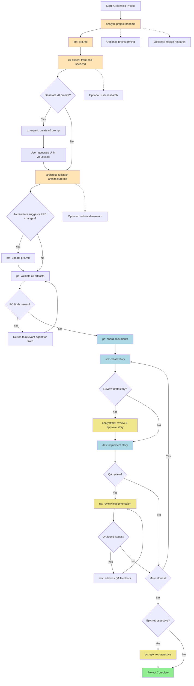

# Greenfield Workflows Analysis

**Document Version**: 1.0
**Created**: 2025-10-14
**Status**: Complete
**Workflows Analyzed**: 3 (greenfield-fullstack, greenfield-service, greenfield-ui)

---

## Table of Contents

1. [Executive Summary](#executive-summary)
2. [Workflow Overview](#workflow-overview)
3. [Workflow 1: Greenfield Full-Stack Application](#workflow-1-greenfield-full-stack-application)
4. [Workflow 2: Greenfield Service/API](#workflow-2-greenfield-serviceapi)
5. [Workflow 3: Greenfield UI/Frontend](#workflow-3-greenfield-uifrontend)
6. [Common Patterns & Shared Structure](#common-patterns--shared-structure)
7. [Decision Points & Branching Logic](#decision-points--branching-logic)
8. [Agent Collaboration Patterns](#agent-collaboration-patterns)
9. [State Management & Transitions](#state-management--transitions)
10. [Optional vs Required Steps](#optional-vs-required-steps)
11. [Context Passing Mechanisms](#context-passing-mechanisms)
12. [Success Criteria & Validation Checkpoints](#success-criteria--validation-checkpoints)
13. [ADK Translation Recommendations](#adk-translation-recommendations)

---

## Executive Summary

The BMad framework defines three greenfield workflows for building new projects from concept to development. These workflows orchestrate 10 specialized AI agents through structured, multi-phase sequences that progress from ideation through planning, validation, and iterative development.

### Key Characteristics

**Workflow Scope:**
- **greenfield-fullstack**: Complete web applications with frontend and backend (longest, most comprehensive)
- **greenfield-service**: Backend services and APIs (backend-focused)
- **greenfield-ui**: Frontend applications and interfaces (frontend-focused)

**Common Architecture:**
1. **Discovery Phase** - Analyst elicitation and research
2. **Planning Phase** - PM, UX Expert, and Architect create comprehensive specifications
3. **Validation Phase** - PO validates all artifacts for cohesion and completeness
4. **Preparation Phase** - PO shards documents; SM creates stories
5. **Development Cycle** - Iterative Dev → QA → Fix loops until all stories complete
6. **Completion** - Optional retrospectives and project handoff

**Shared Patterns:**
- Linear progression through planning phases
- Conditional PO intervention when issues arise
- Optional research and AI generation steps
- Web UI → IDE transition at development phase
- Repeating development cycles (SM → Dev → QA)
- Quality gates and validation checkpoints throughout

### Workflow Statistics

| Workflow | Sequence Steps | Agents Involved | Optional Steps | Decision Points | Artifacts Created |
|----------|---------------|-----------------|----------------|-----------------|-------------------|
| **greenfield-fullstack** | 23 | 6 | 9 | 7 | 8+ |
| **greenfield-service** | 18 | 5 | 5 | 5 | 5+ |
| **greenfield-ui** | 20 | 5 | 7 | 6 | 7+ |

**Common Agent Sequence:**
```
Planning: Analyst → PM → [UX Expert] → Architect → PO
Development: SM → Dev → QA (repeating)
```

**Critical Insights:**
1. **Planning First, Code Later** - Extensive upfront planning before any development
2. **Validation Gates** - PO acts as gatekeeper between planning and development
3. **Optional Flexibility** - Research, AI generation, and QA review are all optional
4. **Artifact-Driven** - All agent collaboration happens through structured documents
5. **Two Modes** - Web UI for planning, IDE for development
6. **Repeatable Cycles** - Development follows consistent SM → Dev → QA pattern

---

## Workflow Overview

### Purpose and Scope

Greenfield workflows guide teams through the complete process of building new projects from initial concept to implemented, tested features. They support:

**Project Types:**

*Full-Stack:*
- Web applications
- SaaS platforms
- Enterprise applications
- Prototypes
- MVPs

*Service/API:*
- REST APIs
- GraphQL APIs
- Microservices
- Backend services
- API prototypes
- Simple services

*UI/Frontend:*
- Single-page applications (SPAs)
- Mobile apps
- Micro-frontends
- Static sites
- UI prototypes
- Simple interfaces

### High-Level Flow

All three greenfield workflows follow this general pattern:

```
┌─────────────────────────────────────────────────────────────────┐
│                      PLANNING PHASE (Web UI)                     │
│                                                                   │
│  Discovery → Specification → Architecture → Validation → Sharding │
│   (Analyst)   (PM + UX)      (Architect)      (PO)        (PO)   │
│                                                                   │
│  Outputs: project-brief, PRD, specs, architecture (in docs/)     │
└──────────────────────┬──────────────────────────────────────────┘
                       │
                       │ TRANSITION: Copy artifacts to project,
                       │             move to IDE environment
                       ▼
┌─────────────────────────────────────────────────────────────────┐
│                    DEVELOPMENT PHASE (IDE)                       │
│                                                                   │
│  Story Creation → Implementation → Review → Repeat               │
│     (SM)            (Dev)           (QA)                         │
│                                                                   │
│  Outputs: story files, implementation code, QA assessments       │
└──────────────────────┬──────────────────────────────────────────┘
                       │
                       ▼
                 Project Complete
```

### Workflow Components

Each workflow definition contains:

**Metadata:**
- `id` - Unique workflow identifier
- `name` - Human-readable workflow name
- `description` - Purpose and use cases
- `type` - Always "greenfield" for these workflows
- `project_types` - Supported project categories

**Execution Definition:**
- `sequence` - Ordered list of agent actions and steps
- `flow_diagram` - Mermaid diagram visualization
- `decision_guidance` - When to use this workflow
- `handoff_prompts` - Agent-to-agent transition messages

**Sequence Step Structure:**
```yaml
- agent: [agent-id]              # Which agent executes
  creates: [artifact-name]       # What gets produced
  requires: [dependencies]       # Prerequisites (artifacts)
  optional_steps: [...]          # Optional sub-activities
  condition: [when-clause]       # Conditional execution
  notes: "Implementation details and user guidance"
```

### Workflow Execution Context

**Environment Split:**

*Web UI Mode (Planning Phase):*
- Platform: Claude Web, Gemini Gems, Custom GPTs
- Agents: Analyst, PM, UX Expert, Architect, PO
- Purpose: Comprehensive planning without codebase access
- Output: Planning artifacts in docs/ folder

*IDE Mode (Development Phase):*
- Platform: Claude Code, Cursor, Windsurf
- Agents: SM, Dev, QA, (PO for validation)
- Purpose: Implementation with full codebase access
- Output: Code, tests, QA assessments

**Critical Transition Point:**
After PO validates planning artifacts, users copy documents to project and switch to IDE. This transition enables codebase-aware development while preserving planning done in web UI.

---

## Workflow 1: Greenfield Full-Stack Application

### Overview

**ID**: `greenfield-fullstack`
**Purpose**: Build complete web applications with both frontend and backend from concept to development
**Complexity**: Highest (23 sequence steps, 6 agents, 9 optional steps)

**Supported Project Types:**
- Web applications
- SaaS platforms
- Enterprise applications
- Prototypes
- MVPs

**When to Use:**
- Building production-ready applications
- Multiple team members involved
- Complex feature requirements
- Comprehensive documentation needed
- Long-term maintenance expected
- Enterprise or customer-facing applications

### Complete Sequence Flow

The full-stack workflow contains 23 distinct sequence steps organized into phases:

**Phase 1: Discovery (Steps 1)**
- Analyst creates project brief with optional brainstorming and market research

**Phase 2: Planning (Steps 2-6)**
- PM creates PRD
- UX Expert creates frontend spec (optional AI UI generation)
- Architect creates fullstack architecture
- PM updates PRD if architecture suggests changes

**Phase 3: Validation (Steps 7-8)**
- PO validates all artifacts using master checklist
- Agents fix any flagged issues

**Phase 4: Preparation (Steps 9-10)**
- Project setup guidance (if AI-generated UI exists)
- Development order guidance

**Phase 5: Document Sharding (Step 11)**
- PO shards PRD and architecture documents

**Phase 6: Development Cycle (Steps 12-21)**
- SM creates stories from sharded docs (repeating for each epic)
- Optional story review by Analyst/PM
- Dev implements story
- Optional QA comprehensive review
- Dev addresses QA feedback if needed
- Cycle repeats for all stories

**Phase 7: Completion (Steps 22-23)**
- Optional epic retrospective
- Project complete notification

### Detailed Step-by-Step Analysis

#### Step 1: Analyst - Project Brief Creation

**Agent**: Analyst (Mary)
**Creates**: `project-brief.md`
**Requires**: Nothing (workflow initiation)
**Optional Steps**:
- `brainstorming_session` - Facilitated brainstorming before brief
- `market_research_prompt` - Deep research prompt generation

**Process**:
1. Analyst can optionally facilitate brainstorming session first
2. Analyst can optionally create deep research prompts
3. Analyst creates comprehensive project brief
4. **User Action**: Copy final `project-brief.md` to project's `docs/` folder

**Output**: `docs/project-brief.md`

**Handoff Prompt**: *"Project brief is complete. Save it as docs/project-brief.md in your project, then create the PRD."*

#### Step 2: PM - PRD Creation

**Agent**: PM (John)
**Creates**: `prd.md`
**Requires**: `project-brief.md`
**Optional Steps**: None

**Process**:
1. PM loads project brief from docs/
2. PM creates PRD using `prd-tmpl` template
3. PM can use interactive or YOLO mode for template population
4. **User Action**: Copy final `prd.md` to project's `docs/` folder

**Output**: `docs/prd.md`

**Handoff Prompt**: *"PRD is ready. Save it as docs/prd.md in your project, then create the UI/UX specification."*

#### Step 3: UX Expert - Frontend Spec Creation

**Agent**: UX Expert (Sally)
**Creates**: `front-end-spec.md`
**Requires**: `prd.md`
**Optional Steps**:
- `user_research_prompt` - User research deep dive

**Process**:
1. UX Expert loads PRD from docs/
2. UX Expert optionally creates user research prompt
3. UX Expert creates UI/UX specification using `front-end-spec-tmpl` template
4. **User Action**: Copy final `front-end-spec.md` to project's `docs/` folder

**Output**: `docs/front-end-spec.md`

**Handoff Prompt**: *"UI/UX spec complete. Save it as docs/front-end-spec.md in your project, then create the fullstack architecture."*

#### Step 4: UX Expert - AI UI Prompt Generation (Optional)

**Agent**: UX Expert (Sally)
**Creates**: `v0_prompt` (AI UI generation prompt)
**Requires**: `front-end-spec.md`
**Condition**: `user_wants_ai_generation`
**Optional**: Yes, but RECOMMENDED

**Process**:
1. UX Expert loads frontend spec
2. UX Expert executes `generate-ai-frontend-prompt` task
3. UX Expert generates optimized prompt for v0, Lovable, Bolt, or similar AI UI generators
4. User takes prompt to external tool (v0.dev, Lovable.dev, etc.)
5. User generates UI project structure in external tool
6. User downloads generated project

**Output**: AI-optimized prompt text (not saved as file, copied by user)

**Note**: This is a critical workflow enhancement allowing rapid UI prototyping before architecture phase.

#### Step 5: Architect - Fullstack Architecture Creation

**Agent**: Architect (Winston)
**Creates**: `fullstack-architecture.md`
**Requires**: `prd.md`, `front-end-spec.md`
**Optional Steps**:
- `technical_research_prompt` - Deep technical research
- `review_generated_ui_structure` - If user generated UI with v0/Lovable

**Process**:
1. Architect loads PRD and frontend spec
2. Architect optionally creates technical research prompts
3. If user generated UI, Architect reviews the project structure
4. Architect creates comprehensive architecture using `fullstack-architecture-tmpl`
5. Architect incorporates generated UI structure into architecture (if applicable)
6. Architect may suggest changes to PRD stories or propose new stories
7. **User Action**: Copy final `fullstack-architecture.md` to project's `docs/` folder

**Output**: `docs/fullstack-architecture.md`

**Critical Note**: If UI was generated, architecture incorporates actual project structure rather than speculative design.

**Handoff Prompt**: *"Architecture complete. Save it as docs/fullstack-architecture.md. Do you suggest any changes to the PRD stories or need new stories added?"*

#### Step 6: PM - PRD Update (Conditional)

**Agent**: PM (John)
**Updates**: `prd.md`
**Requires**: `fullstack-architecture.md`
**Condition**: `architecture_suggests_prd_changes`
**Optional**: Conditional (only if architecture suggests changes)

**Process**:
1. PM reviews architecture feedback
2. PM updates PRD with suggested story changes
3. PM may add new stories, modify existing stories, or reorder epics
4. **User Action**: Re-export complete unredacted `prd.md` to docs/ folder

**Output**: Updated `docs/prd.md`

**Handoff Prompt**: *"Please update the PRD with the suggested story changes, then re-export the complete prd.md to docs/."*

#### Step 7: PO - Master Checklist Validation

**Agent**: PO (Sarah)
**Validates**: All artifacts (PRD, frontend spec, architecture)
**Uses**: `po-master-checklist`
**Requires**: All planning artifacts complete
**Optional**: No (critical quality gate)

**Process**:
1. PO loads all planning documents
2. PO executes comprehensive master checklist validation (10 categories, 200+ items)
3. PO can use Interactive (section-by-section) or YOLO (all at once) mode
4. PO generates validation report with findings
5. PO makes Go/No-Go decision

**Decision Outcomes**:
- **APPROVED**: Proceed to document sharding
- **CONDITIONAL**: Address specific issues then proceed
- **REJECTED**: Critical deficiencies require replanning

**Output**: Validation report (console/chat output)

**Note**: This is the primary quality gate between planning and development phases.

#### Step 8: Various Agents - Fix Flagged Documents (Conditional)

**Agent**: PM, Architect, or UX Expert (as needed)
**Updates**: Any flagged documents
**Condition**: `po_checklist_issues`
**Optional**: Conditional (only if PO finds issues)

**Process**:
1. Relevant agent reviews PO validation findings
2. Agent addresses specific issues in their artifact
3. Agent re-exports updated document to docs/ folder
4. Return to Step 7 for re-validation (if critical issues)

**Output**: Updated planning artifacts

**Handoff Prompt**: *"PO found issues with [document]. Please return to [agent] to fix and re-save the updated document."*

#### Step 9: Project Setup Guidance (Conditional)

**Step Type**: Guidance (not agent-driven)
**Action**: `guide_project_structure`
**Condition**: `user_has_generated_ui`
**Optional**: Conditional (only if UI was generated with v0/Lovable)

**Guidance Provided**:
- **Polyrepo Setup**: Place downloaded frontend project in separate repo alongside backend repo
- **Monorepo Setup**: Place in `apps/web` or `packages/frontend` directory
- **Architecture Reference**: Review architecture document for specific guidance

**Purpose**: Help user properly integrate AI-generated UI into project structure.

#### Step 10: Development Order Guidance

**Step Type**: Guidance (not agent-driven)
**Action**: `guide_development_sequence`
**Optional**: No (always provided)

**Guidance Based on PRD Stories**:
- **Frontend-Heavy Stories**: Start with frontend project/directory first
- **Backend-Heavy or API-First**: Start with backend
- **Tightly Coupled Features**: Follow story sequence in monorepo setup
- **General Sequence**: Reference sharded PRD epics for development order

**Purpose**: Provide strategic development sequence recommendations.

#### Step 11: PO - Document Sharding

**Agent**: PO (Sarah)
**Action**: `shard_documents`
**Creates**: Sharded docs (PRD epics, architecture sections)
**Requires**: All artifacts in project, validation passed
**Optional**: No (critical for development preparation)

**Process**:
1. PO shards `docs/prd.md` into `docs/prd/` with epic files
2. PO shards `docs/architecture.md` into `docs/architecture/` with component files
3. PO creates index.md files in each sharded directory

**Two Methods**:
- **Option A**: Use PO agent - `@po` then ask to shard docs/prd.md
- **Option B**: Manual - Drag `shard-doc` task + `docs/prd.md` into chat

**Output**:
- `docs/prd/index.md` + epic files (`epic-1-*.md`, `epic-2-*.md`, ...)
- `docs/architecture/index.md` + component files (`tech-stack.md`, `database-design.md`, ...)

**Critical Note**: Sharding is the transition from monolithic planning documents to development-ready structures.

#### Step 12: SM - Story Creation (Repeating)

**Agent**: SM (Bob)
**Action**: `create_story`
**Creates**: `story.md` (individual story file)
**Requires**: Sharded docs (PRD epics, architecture sections)
**Repeats**: `for_each_epic` (continues until all epics/stories complete)
**Optional**: No (core development workflow)

**Process**:
1. **New Chat Session**: Activate SM Agent with `@sm`
2. SM executes `*create` command (create-next-story task)
3. SM identifies next story from sharded PRD epics
4. SM gathers requirements from epic file
5. SM gathers architecture context by story type (backend/frontend/fullstack)
6. SM populates story template with complete Dev Notes
7. SM sets story status to "Draft"

**Output**: `docs/stories/{epic}.{story}.{title}.md` with status "Draft"

**Handoff Prompt**: SM presents story for optional review or direct development.

#### Step 13: Analyst/PM - Review Draft Story (Optional)

**Agent**: Analyst (Mary) or PM (John)
**Action**: `review_draft_story`
**Updates**: `story.md` (status change)
**Requires**: Story in Draft status
**Optional**: Yes (recommended for critical stories)
**Condition**: `user_wants_story_review`

**Process**:
1. Analyst or PM reviews story completeness
2. Reviews alignment with epic and architecture
3. Validates acceptance criteria clarity
4. Updates story status: Draft → Approved

**Output**: Story with status "Approved"

**Note**: `story-review` task is coming soon (currently manual review).

#### Step 14: Dev - Story Implementation

**Agent**: Dev (James)
**Action**: `implement_story`
**Creates**: Implementation files (code, tests)
**Requires**: Story in Draft or Approved status
**Optional**: No (core development workflow)

**Process**:
1. **New Chat Session**: Activate Dev Agent with `@dev`
2. Dev loads story file
3. Dev checks story status (must NOT be "Draft" for autonomous start)
4. Dev loads `devLoadAlwaysFiles` from core-config.yaml
5. Dev implements all tasks sequentially
6. Dev writes tests per story testing standards
7. Dev runs regression validations
8. Dev updates Dev Agent Record sections:
   - Agent Model Used
   - Debug Log References
   - Completion Notes
   - File List (all changed files)
9. Dev marks story status as "Review" when complete

**Output**:
- Implementation code and tests
- Updated story file with Dev Agent Record populated
- Story status "Review"

**Blocking Conditions** (Dev must HALT):
- Unapproved dependencies needed
- Ambiguous requirements after story check
- 3 repeated failures
- Failing regression tests

#### Step 15: QA - Review Implementation (Optional)

**Agent**: QA (Quinn)
**Action**: `review_implementation`
**Updates**: Implementation files (refactoring), story QA Results
**Requires**: Story in "Review" status, implementation files
**Optional**: Yes (highly recommended for quality)

**Process**:
1. **New Chat Session**: Activate QA Agent with `@qa`
2. QA executes `*review-story` command
3. QA performs comprehensive review with active refactoring authority
4. QA can directly fix small issues (typos, code style, minor bugs)
5. QA leaves checklist in story for remaining items Dev must address
6. QA updates story status:
   - "Review" → "Done" (if all items addressed)
   - Stays "Review" (if unchecked items remain)

**Output**:
- Potentially refactored code
- Story QA Results section populated
- Checklist of remaining items (if any)
- Story status update

**Note**: QA acts as senior developer with refactoring authority, not just passive tester.

#### Step 16: Dev - Address QA Feedback (Conditional)

**Agent**: Dev (James)
**Action**: `address_qa_feedback`
**Updates**: Implementation files
**Condition**: `qa_left_unchecked_items`
**Optional**: Conditional (only if QA left unchecked items)

**Process**:
1. **New Chat Session**: Reactivate Dev Agent with `@dev`
2. Dev reviews QA's unchecked items in story
3. Dev addresses all remaining items
4. Dev updates File List with additional changes
5. Dev hands back to QA for final approval

**Output**:
- Updated implementation addressing QA feedback
- Updated Dev Agent Record

**Handoff**: Return to Step 15 (QA review) for final approval.

#### Step 17: Repeat Development Cycle

**Step Type**: Control flow instruction
**Action**: `continue_for_all_stories`
**Repeats**: Steps 12-16

**Process**:
- Continue SM → Dev → QA cycle for all stories in all epics
- Each story goes through full cycle before moving to next
- Epic completes when all its stories reach "Done" status
- Move to next epic and repeat

**Completion Criteria**: All stories in PRD are in "Done" status.

#### Step 18: PO - Epic Retrospective (Optional)

**Agent**: PO (Sarah)
**Action**: `epic_retrospective`
**Creates**: `epic-retrospective.md`
**Condition**: `epic_complete`
**Optional**: Yes (recommended after each epic)

**Process**:
1. PO validates epic was completed correctly
2. PO documents learnings and improvements
3. PO identifies process optimizations for next epic

**Output**: `docs/epic-retrospective.md` (or similar)

**Note**: `epic-retrospective` task is coming soon (currently manual).

#### Step 19: Workflow End

**Step Type**: Completion notification
**Action**: `project_complete`
**Notification**: "All stories implemented and reviewed! Project development phase complete."

**Reference**: `.bmad-core/data/bmad-kb.md#IDE Development Workflow`

### Mermaid Flow Diagram

The workflow includes a comprehensive Mermaid diagram:



**Legend:**
- Orange (FFE4B5): Planning phase agents (Analyst, PM, UX Expert, Architect)
- Blue (ADD8E6): Development cycle core (PO sharding, SM, Dev)
- Yellow (F0E68C): Optional validation/review (Analyst/PM story review, QA, PO retrospective)
- Lavender (E6E6FA): AI UI generation (v0/Lovable)
- Green (90EE90): Completion

### Decision Points

The full-stack workflow contains 7 critical decision points:

**Decision 1: Generate v0 Prompt?**
- **Trigger**: After frontend spec complete
- **Options**: Yes (generate AI UI) | No (skip to architecture)
- **Impact**: If Yes, user generates UI externally before architecture phase
- **Recommendation**: Yes for rapid prototyping, No for custom UI requirements

**Decision 2: Architecture Suggests PRD Changes?**
- **Trigger**: After architecture complete
- **Options**: Yes (PM updates PRD) | No (proceed to validation)
- **Impact**: If Yes, PRD is updated before PO validation
- **Common**: Architect often suggests story sequencing changes or new infrastructure stories

**Decision 3: PO Finds Issues?**
- **Trigger**: After master checklist validation
- **Options**: Yes (return to agents for fixes) | No (proceed to sharding)
- **Impact**: If Yes, blocks progression until issues resolved
- **Critical**: This is the main quality gate

**Decision 4: Review Draft Story?**
- **Trigger**: After SM creates story draft
- **Options**: Yes (Analyst/PM reviews) | No (Dev implements directly)
- **Impact**: If Yes, story gets human validation before development
- **Recommendation**: Yes for critical or complex stories

**Decision 5: QA Review?**
- **Trigger**: After Dev completes implementation
- **Options**: Yes (QA comprehensive review) | No (story complete)
- **Impact**: If Yes, adds quality layer and potential refactoring
- **Recommendation**: Yes for production code, optional for prototypes

**Decision 6: QA Found Issues?**
- **Trigger**: After QA review completes
- **Options**: Yes (Dev addresses feedback) | No (story done)
- **Impact**: If Yes, creates feedback loop until QA approves
- **Iteration**: Can repeat multiple times until all issues resolved

**Decision 7: Epic Retrospective?**
- **Trigger**: After all stories in epic complete
- **Options**: Yes (PO documents learnings) | No (proceed to next epic)
- **Impact**: If Yes, captures process improvements for next epic
- **Recommendation**: Yes after first epic, optional for subsequent epics

### Handoff Prompts

The workflow defines explicit handoff messages for agent transitions:

| From | To | Prompt |
|------|-----|---------|
| Analyst | PM | "Project brief is complete. Save it as docs/project-brief.md in your project, then create the PRD." |
| PM | UX Expert | "PRD is ready. Save it as docs/prd.md in your project, then create the UI/UX specification." |
| UX Expert | Architect | "UI/UX spec complete. Save it as docs/front-end-spec.md in your project, then create the fullstack architecture." |
| Architect | PM (conditional) | "Please update the PRD with the suggested story changes, then re-export the complete prd.md to docs/." |
| Architect | Review | "Architecture complete. Save it as docs/fullstack-architecture.md. Do you suggest any changes to the PRD stories or need new stories added?" |
| All | PO | "All documents ready in docs/ folder. Please validate all artifacts for consistency." |
| PO | Agent (issues) | "PO found issues with [document]. Please return to [agent] to fix and re-save the updated document." |
| Planning | Development | "All planning artifacts validated and saved in docs/ folder. Move to IDE environment to begin development." |

### Unique Features of Full-Stack Workflow

**1. AI UI Generation Integration**
- Only full-stack and UI workflows include v0/Lovable prompt generation
- Architect can review generated UI structure and incorporate into architecture
- Supports rapid prototyping with AI-generated starting point

**2. Three-Document Planning**
- Project brief + PRD + Frontend spec + Architecture (most comprehensive)
- UX Expert involvement required
- Frontend and backend architecture both documented

**3. Project Setup Guidance**
- Specific guidance for integrating AI-generated UI
- Polyrepo vs monorepo structure recommendations
- Development order based on PRD story balance (frontend-heavy vs backend-heavy)

**4. Architecture Feedback Loop**
- Architect can suggest PRD changes after reviewing technical feasibility
- PM updates PRD before validation
- Prevents architectural mismatches

**3. Project Setup Guidance**
- Specific guidance for integrating AI-generated UI
- Polyrepo vs monorepo structure recommendations
- Development order based on PRD story balance (frontend-heavy vs backend-heavy)

**4. Architecture Feedback Loop**
- Architect can suggest PRD changes after reviewing technical feasibility
- PM updates PRD before validation
- Prevents architectural mismatches

---

## Workflow 2: Greenfield Service/API

### Overview

**ID**: `greenfield-service`
**Purpose**: Build backend services and APIs from concept to development
**Complexity**: Medium (18 sequence steps, 5 agents, 5 optional steps)

**Supported Project Types:**
- REST APIs
- GraphQL APIs
- Microservices
- Backend services
- API prototypes
- Simple services

**When to Use:**
- Building production APIs or microservices
- Multiple endpoints and complex business logic
- Comprehensive documentation and testing needed
- Multiple team members involved
- Long-term maintenance expected
- Enterprise or external-facing APIs

### Key Differences from Full-Stack

**Removed Steps:**
- No UX Expert involvement (no frontend spec)
- No AI UI prompt generation
- No frontend-related validation
- No project setup guidance for UI integration
- No development order guidance (backend-only is straightforward)

**Simplified Planning:**
- Analyst → PM → Architect (3-agent planning sequence)
- Architecture uses `architecture-tmpl` (not `fullstack-architecture-tmpl`)
- Fewer optional research steps

**Development Cycle:** Same as full-stack (SM → Dev → QA repeating)

### Sequence Summary

1. Analyst: project-brief.md (with optional brainstorming/market research)
2. PM: prd.md
3. Architect: architecture.md (with optional technical research)
4. PM: Update PRD if architecture suggests changes (conditional)
5. PO: Validate all artifacts
6. Various: Fix flagged documents (conditional)
7. PO: Shard documents
8-17. **Development Cycle** (same as full-stack):
   - SM: create story (repeat)
   - Analyst/PM: review draft story (optional)
   - Dev: implement story
   - QA: review implementation (optional)
   - Dev: address QA feedback (conditional)
   - Repeat for all stories
18. PO: Epic retrospective (optional)
19. Workflow end

### Handoff Prompts

| From | To | Prompt |
|------|-----|---------|
| Analyst | PM | "Project brief is complete. Save it as docs/project-brief.md in your project, then create the PRD." |
| PM | Architect | "PRD is ready. Save it as docs/prd.md in your project, then create the service architecture." |
| Architect | Review | "Architecture complete. Save it as docs/architecture.md. Do you suggest any changes to the PRD stories or need new stories added?" |
| Architect | PM (conditional) | "Please update the PRD with the suggested story changes, then re-export the complete prd.md to docs/." |
| All | PO | "All documents ready in docs/ folder. Please validate all artifacts for consistency." |
| PO | Agent (issues) | "PO found issues with [document]. Please return to [agent] to fix and re-save the updated document." |
| Planning | Development | "All planning artifacts validated and saved in docs/ folder. Move to IDE environment to begin development." |

### Unique Features

**1. Service-Focused Architecture**
- Uses `architecture-tmpl` instead of `fullstack-architecture-tmpl`
- Emphasis on API design, data models, backend services
- No frontend/UI considerations

**2. Streamlined Planning**
- Fewer planning documents (no frontend spec)
- Faster path from concept to development
- Suitable for backend-only projects

**3. API-First Development**
- Stories focus on endpoints, business logic, data operations
- Architecture emphasizes scalability, performance, API contracts
- Testing focuses on integration tests, API tests, unit tests

---

## Workflow 3: Greenfield UI/Frontend

### Overview

**ID**: `greenfield-ui`
**Purpose**: Build frontend applications and interfaces from concept to development
**Complexity**: Medium-High (20 sequence steps, 5 agents, 7 optional steps)

**Supported Project Types:**
- Single-page applications (SPAs)
- Mobile apps
- Micro-frontends
- Static sites
- UI prototypes
- Simple interfaces

**When to Use:**
- Building production frontend applications
- Multiple views/pages with complex interactions
- Comprehensive UI/UX design and testing needed
- Multiple team members involved
- Long-term maintenance expected
- Customer-facing applications

### Key Differences from Full-Stack

**Removed Elements:**
- No backend-focused architecture
- Architecture uses `front-end-architecture-tmpl` (not `fullstack-architecture-tmpl`)
- Project setup guidance for frontend-only projects
- Simplified development order (frontend-only is straightforward)

**Included Elements:**
- All frontend-specific features from full-stack
- AI UI generation (v0/Lovable) support
- UX Expert creates frontend spec
- Architect creates frontend architecture

**Development Cycle:** Same as full-stack (SM → Dev → QA repeating)

### Sequence Summary

1. Analyst: project-brief.md (with optional brainstorming/market research)
2. PM: prd.md
3. UX Expert: front-end-spec.md (with optional user research)
4. UX Expert: v0 prompt generation (optional but recommended)
5. Architect: front-end-architecture.md (with optional technical research, review generated UI)
6. PM: Update PRD if architecture suggests changes (conditional)
7. PO: Validate all artifacts
8. Various: Fix flagged documents (conditional)
9. Project setup guidance (conditional - if UI generated)
10. PO: Shard documents
11-19. **Development Cycle** (same as full-stack):
    - SM: create story (repeat)
    - Analyst/PM: review draft story (optional)
    - Dev: implement story
    - QA: review implementation (optional)
    - Dev: address QA feedback (conditional)
    - Repeat for all stories
20. PO: Epic retrospective (optional)
21. Workflow end

### Handoff Prompts

| From | To | Prompt |
|------|-----|---------|
| Analyst | PM | "Project brief is complete. Save it as docs/project-brief.md in your project, then create the PRD." |
| PM | UX Expert | "PRD is ready. Save it as docs/prd.md in your project, then create the UI/UX specification." |
| UX Expert | Architect | "UI/UX spec complete. Save it as docs/front-end-spec.md in your project, then create the frontend architecture." |
| Architect | Review | "Frontend architecture complete. Save it as docs/front-end-architecture.md. Do you suggest any changes to the PRD stories or need new stories added?" |
| Architect | PM (conditional) | "Please update the PRD with the suggested story changes, then re-export the complete prd.md to docs/." |
| All | PO | "All documents ready in docs/ folder. Please validate all artifacts for consistency." |
| PO | Agent (issues) | "PO found issues with [document]. Please return to [agent] to fix and re-save the updated document." |
| Planning | Development | "All planning artifacts validated and saved in docs/ folder. Move to IDE environment to begin development." |

### Unique Features

**1. Frontend-Focused Architecture**
- Uses `front-end-architecture-tmpl` instead of fullstack template
- Emphasis on component design, state management, routing, styling
- No backend architecture considerations

**2. AI UI Generation Support**
- Same v0/Lovable integration as full-stack
- Architect reviews generated UI structure
- Rapid prototyping before full architecture phase

**3. Project Setup Guidance (Frontend-Only)**
- Polyrepo: Place downloaded project in separate frontend repo
- Monorepo: Place in `apps/web` or `frontend/` directory
- Review architecture for specific guidance

---

## Common Patterns & Shared Structure

### Universal Planning Phase Pattern

All three greenfield workflows share this identical planning structure:

```
Analyst creates brief
   ↓
PM creates PRD
   ↓
[Optional: UX Expert creates frontend spec for full-stack/UI]
   ↓
Architect creates architecture
   ↓
[Conditional: PM updates PRD based on architecture feedback]
   ↓
PO validates all artifacts (QUALITY GATE)
   ↓
[Conditional: Agents fix issues if PO finds problems]
   ↓
PO shards documents
```

### Universal Development Cycle Pattern

All three workflows use identical development cycles:

```
SM creates story (Draft status)
   ↓
[Optional: Analyst/PM reviews and approves story]
   ↓
Dev implements story (Review status)
   ↓
[Optional: QA reviews implementation]
   ↓
[Conditional: Dev addresses QA feedback if issues found]
   ↓
Story complete (Done status)
   ↓
Repeat for next story until all epics complete
   ↓
[Optional: PO epic retrospective]
   ↓
Project complete
```

### Shared Agent Roles

**Planning Phase Agents** (same behavior across workflows):
- **Analyst (Mary)**: Discovery and research
- **PM (John)**: Requirements and product strategy
- **PO (Sarah)**: Validation and quality gatekeeper

**Planning Variant Agents** (conditional participation):
- **UX Expert (Sally)**: Only in full-stack and UI workflows
- **Architect (Winston)**: All workflows, but different templates

**Development Phase Agents** (identical across all workflows):
- **SM (Bob)**: Story creation from sharded docs
- **Dev (James)**: Implementation with testing
- **QA (Quinn)**: Comprehensive review and refactoring

### Shared Workflow Mechanics

**1. Optional Steps Philosophy**
- All research steps are optional (brainstorming, market research, user research, technical research)
- AI UI generation is optional but recommended
- Story draft review is optional
- QA review is optional (but highly recommended)
- Epic retrospective is optional

**2. Conditional Execution**
- Architecture feedback → PM PRD update
- PO finds issues → Agent fixes
- QA finds issues → Dev fixes
- User generated UI → Project setup guidance

**3. Quality Gates**
- **Planning Gate**: PO master checklist validation (APPROVED/CONDITIONAL/REJECTED)
- **Story Gate**: Optional PO story draft validation (GO/NO-GO)
- **Implementation Gate**: Optional QA review (PASS/CONCERNS/FAIL/WAIVED)

**4. Artifact Handoffs**
- All collaboration via file artifacts in `docs/` folder
- Explicit handoff prompts for each agent transition
- User manually copies artifacts between web UI and IDE

**5. Web UI → IDE Transition**
- All planning in web UI (no codebase access needed)
- Transition after PO validation and document sharding
- Development in IDE (codebase access required)
- User responsible for artifact transfer

---

## Decision Points & Branching Logic

### Shared Decision Points (All Workflows)

**Decision: Architecture Suggests PRD Changes?**
- **When**: After Architect completes architecture
- **Branch**: Yes → PM updates PRD | No → Proceed to PO validation
- **Rationale**: Architecture may reveal missing infrastructure stories, dependency issues, or sequencing problems

**Decision: PO Finds Issues?**
- **When**: After PO master checklist validation
- **Branch**: Yes → Return to agent(s) for fixes | No → Proceed to sharding
- **Rationale**: Quality gate - blocks development if critical planning deficiencies exist
- **Impact**: Can loop multiple times until APPROVED

**Decision: Review Draft Story?**
- **When**: After SM creates story draft
- **Branch**: Yes → Analyst/PM reviews | No → Dev implements directly
- **Rationale**: Optional human validation for critical/complex stories
- **Impact**: Adds planning review before code

**Decision: QA Review?**
- **When**: After Dev completes implementation
- **Branch**: Yes → QA comprehensive review | No → Story complete
- **Rationale**: Optional quality layer with refactoring authority
- **Impact**: Can significantly improve code quality

**Decision: QA Found Issues?**
- **When**: After QA review completes
- **Branch**: Yes → Dev addresses feedback | No → Story done
- **Rationale**: Iterative quality improvement
- **Impact**: Can loop multiple times until QA satisfied

**Decision: Epic Retrospective?**
- **When**: After all epic stories complete
- **Branch**: Yes → PO documents learnings | No → Continue to next epic
- **Rationale**: Process improvement capture
- **Impact**: Helps optimize subsequent epics

### Full-Stack & UI Specific Decisions

**Decision: Generate v0 Prompt?**
- **When**: After UX Expert creates frontend spec
- **Branch**: Yes → Generate prompt, user creates UI externally | No → Proceed to architecture
- **Rationale**: Rapid prototyping with AI-generated UI
- **Impact**: Architect incorporates actual project structure vs speculative design

**Decision: User Has Generated UI?**
- **When**: After validation, before sharding
- **Branch**: Yes → Provide project setup guidance | No → Skip guidance
- **Rationale**: Help integrate AI-generated UI into project structure
- **Impact**: Polyrepo vs monorepo placement guidance

### Decision Outcome Paths

**Planning Validation Outcomes:**
```
APPROVED → Proceed immediately to sharding
CONDITIONAL → Fix specific issues, then proceed (no re-validation needed)
REJECTED → Major replanning required, return to PM/Architect
```

**Story Review Outcomes:**
```
GO → Dev implements immediately
NO-GO → SM revises story, re-validation required
```

**QA Review Outcomes:**
```
All items addressed → Story Done, move to next story
Unchecked items remain → Dev fixes, return to QA
No QA review → Story Done automatically (user decision)
```

---

## Agent Collaboration Patterns

### File-Based Collaboration Model

All agent collaboration happens through structured file artifacts, not direct communication:

**Pattern:**
```
Agent A creates artifact → saves to docs/
    ↓
User manually copies artifact (web UI → project)
    ↓
Agent B reads artifact from docs/
    ↓
Agent B updates artifact → saves to docs/
    ↓
Agent C reads updated artifact
```

**Benefits:**
- Stateless agents (no session dependencies)
- Version control friendly (all changes tracked in git)
- Clear audit trail
- Resumable workflows (pick up where left off)

### Planning Phase Collaboration

**Linear Handoff Chain:**
```
Analyst (Brief) → PM (PRD) → [UX Expert (Spec)] → Architect (Architecture)
```

**Feedback Loop:**
```
Architect → PM (if changes suggested) → PO (validation) → Agents (if issues)
```

**Characteristics:**
- Each agent reads previous artifacts
- Each agent creates new artifact or updates existing
- User responsible for artifact transfer (web UI → project)
- PO validates cohesion across all artifacts

### Development Phase Collaboration

**Story Lifecycle Collaboration:**
```
SM (creates story Draft) 
   → [Analyst/PM (approves to Approved)]
   → Dev (implements to Review)
   → [QA (reviews, may refactor)]
   → [Dev (fixes if QA issues)]
   → Done
```

**Characteristics:**
- New chat session for each agent invocation
- Agents read story file, update specific sections only
- Dev updates Dev Agent Record sections only
- QA updates QA Results section only
- Strict section ownership enforced

### Context Passing Mechanisms

**Sharded Documents as Context:**
- SM reads sharded PRD epics for requirements
- SM reads sharded architecture sections for technical context
- Dev reads story Dev Notes (self-contained context)
- QA reads story + implementation files

**Configuration-Driven Context:**
- `core-config.yaml` defines file locations
- `devLoadAlwaysFiles` specifies Dev Agent always-loaded context
- Agents dynamically locate artifacts via configuration

**Explicit Source Citations:**
- SM cites architecture sections in Dev Notes
- Anti-hallucination validation ensures all claims traceable
- Story template requires source references

---

## State Management & Transitions

### Story Status Lifecycle

All workflows use identical story status progression:

```
Draft → [Approved] → InProgress → Review → Done
```

**Status Definitions:**

| Status | Owner | Meaning | Next Action |
|--------|-------|---------|-------------|
| **Draft** | SM | Story created, not yet validated | Optional review by Analyst/PM |
| **Approved** | Analyst/PM | Story reviewed and approved | Dev implementation |
| **InProgress** | Dev | Dev actively implementing | Dev continues |
| **Review** | Dev | Implementation complete, awaiting review | Optional QA review |
| **Done** | QA or Dev | Story complete and validated | Move to next story |

**Transitions:**
- Draft → Approved (Analyst/PM review)
- Draft → InProgress (Dev starts without approval - allowed)
- Approved → InProgress (Dev starts)
- InProgress → Review (Dev completes)
- Review → Done (QA approves or no QA)
- Review → InProgress (Dev addresses QA feedback)

### Epic Completion Tracking

**Epic Status:**
- Epic is "In Progress" when any story is not Done
- Epic is "Complete" when all stories are Done
- Epics processed sequentially (complete Epic 1 before Epic 2)

**Tracking Mechanism:**
- Story status in story file YAML front matter
- SM identifies next story by scanning story statuses
- Epic completion detected when no more stories in epic

### Workflow Position Persistence

**Resumability:**
- Workflow position tracked via artifact existence and story statuses
- Can pause workflow at any point
- Resume by checking latest artifact state and story statuses
- No centralized state database required

**State Indicators:**
- Planning complete: All planning artifacts exist in docs/
- Sharding complete: docs/prd/ and docs/architecture/ exist
- Current epic/story: Identified by latest Draft or InProgress story
- Development complete: All stories have Done status

### Quality Gate Persistence

**Gate Decisions Saved:**
- PO validation report (planning gate) - console output, not persisted
- QA gate decisions - saved in `docs/qa/gates/{epic}.{story}-{slug}.yml`

**Gate File Format:**
```yaml
decision: PASS | CONCERNS | FAIL | WAIVED
rationale: "Explanation"
date: timestamp
created_by: "qa-agent"
```

---

## Optional vs Required Steps

### Always Required Steps

**Planning Phase (All Workflows):**
1. Analyst: Create project brief
2. PM: Create PRD
3. Architect: Create architecture (template varies by workflow)
4. PO: Validate all artifacts (master checklist)
5. PO: Shard documents

**Planning Phase (Full-Stack & UI Only):**
- UX Expert: Create frontend spec

**Development Phase (All Workflows):**
1. SM: Create stories from sharded docs
2. Dev: Implement stories
3. Story completion (Done status)

### Optional Steps

**Research & Discovery (All Workflows):**
- Analyst: Brainstorming session
- Analyst: Market research prompt generation
- Architect: Technical research prompt generation

**Frontend-Specific (Full-Stack & UI):**
- UX Expert: User research prompt generation
- UX Expert: AI UI prompt generation (v0/Lovable)
- Architect: Review generated UI structure

**Validation & Quality (All Workflows):**
- Analyst/PM: Review draft story
- QA: Comprehensive review implementation
- PO: Epic retrospective

### Conditional Steps

**Triggered by Circumstances:**
- PM: Update PRD (if architect suggests changes)
- Various agents: Fix documents (if PO finds issues)
- Dev: Address QA feedback (if QA leaves unchecked items)
- Project setup guidance (if user generated UI)

### Optional vs Recommended

**Optional but Highly Recommended:**
- AI UI generation for full-stack and UI workflows (rapid prototyping)
- QA review for production code (quality assurance)
- Epic retrospective after first epic (process improvement)

**Truly Optional:**
- Research prompts (market, user, technical)
- Brainstorming sessions
- Story draft review
- Epic retrospectives after first epic

---

## Context Passing Mechanisms

### Artifact-Based Context Passing

**Primary Mechanism:** All context passed through file artifacts in `docs/` folder.

**Planning to Planning:**
```
Analyst creates docs/project-brief.md
   ↓ (PM reads)
PM creates docs/prd.md
   ↓ (UX Expert reads)
UX Expert creates docs/front-end-spec.md
   ↓ (Architect reads)
Architect creates docs/architecture.md
   ↓ (PO reads all)
PO validates cohesion
```

**Planning to Development:**
```
PO shards docs/prd.md → docs/prd/epic-*.md
PO shards docs/architecture.md → docs/architecture/*.md
   ↓ (SM reads)
SM creates docs/stories/{epic}.{story}.md with Dev Notes from architecture
   ↓ (Dev reads)
Dev implements with context from story Dev Notes
```

### Sharding as Context Distribution

**Purpose:** Break monolithic documents into focused, consumable sections for development.

**PRD Sharding:**
- Input: `docs/prd.md` (monolithic, 100s of pages)
- Output: `docs/prd/epic-1-*.md`, `epic-2-*.md`, etc.
- SM reads one epic at a time to create stories

**Architecture Sharding:**
- Input: `docs/architecture.md` (monolithic)
- Output: `docs/architecture/tech-stack.md`, `database-design.md`, `backend-architecture.md`, etc.
- SM reads relevant sections based on story type (backend/frontend/fullstack)

**Benefits:**
- Reduces context window usage
- Focuses agents on relevant information only
- Enables parallel story creation (different epics)

### Configuration-Driven Context

**core-config.yaml as Context Source:**
```yaml
devLoadAlwaysFiles:
  - docs/architecture/coding-standards.md
  - docs/architecture/tech-stack.md
  - docs/architecture/source-tree.md
```

**Effect:** Dev agent automatically loads these files for every story implementation, ensuring consistent context.

### Self-Contained Story Context

**Story Dev Notes Philosophy:** All context needed for implementation must be in story file.

**SM Responsibilities:**
- Extract relevant architecture context by story type
- Include complete tech stack information
- Cite architecture sources
- Provide self-contained instructions

**Dev Agent Behavior:**
- Should NOT need to read PRD or architecture directly
- All context provided in Dev Notes section
- Anti-hallucination validation ensures this

### Cross-Agent Context Preservation

**Status Field:** Tracks workflow position
**File List Field:** Tracks all files changed (Dev Agent Record)
**Change Log Field:** Tracks all modifications to story
**QA Results Field:** Preserves QA findings for Dev to address

**Effect:** Context persists across chat sessions and agent invocations.

---

## Success Criteria & Validation Checkpoints

### Planning Phase Checkpoints

**Checkpoint 1: Project Brief Complete**
- **Validator**: Analyst (self-validation)
- **Criteria**: Brief covers problem, solution, goals, constraints, success metrics
- **Output**: `docs/project-brief.md`
- **Gate**: Informal (no blocking validation)

**Checkpoint 2: PRD Complete**
- **Validator**: PM (self-validation)
- **Criteria**: All template sections populated, epics and stories defined, MVP scope clear
- **Output**: `docs/prd.md`
- **Gate**: Informal (formal validation happens at PO checkpoint)

**Checkpoint 3: Frontend Spec Complete** (Full-Stack & UI Only)
- **Validator**: UX Expert (self-validation)
- **Criteria**: All UI/UX sections complete, design system defined, component specs clear
- **Output**: `docs/front-end-spec.md`
- **Gate**: Informal

**Checkpoint 4: Architecture Complete**
- **Validator**: Architect (self-validation + optional PRD feedback)
- **Criteria**: Tech stack, data models, architecture diagrams, deployment strategy all documented
- **Output**: `docs/architecture.md` or variant
- **Gate**: Semi-formal (Architect may suggest PRD changes)

**Checkpoint 5: PO Master Checklist Validation** (CRITICAL GATE)
- **Validator**: PO (Sarah)
- **Criteria**: 10 validation categories, 200+ items, APPROVED status required
- **Output**: Validation report
- **Gate**: FORMAL BLOCKING GATE
  - APPROVED → Proceed to sharding
  - CONDITIONAL → Fix specific issues, then proceed
  - REJECTED → Replanning required

### Development Phase Checkpoints

**Checkpoint 6: Story Draft Complete**
- **Validator**: SM (self-validation + optional Analyst/PM review)
- **Criteria**: All story template sections populated, Dev Notes self-contained, AC clear
- **Output**: Story with Draft status
- **Gate**: Informal (optional PO story draft validation)

**Checkpoint 7: Story Implementation Complete**
- **Validator**: Dev (self-validation)
- **Criteria**: All tasks complete, tests written, regression tests pass, Dev Agent Record populated
- **Output**: Story with Review status, implementation code
- **Gate**: Semi-formal (optional QA review)

**Checkpoint 8: QA Review Complete** (Optional)
- **Validator**: QA (Quinn)
- **Criteria**: Comprehensive review, small issues fixed, major issues documented
- **Output**: Story QA Results, potentially refactored code
- **Gate**: Advisory (PASS/CONCERNS/FAIL/WAIVED - does not block)

**Checkpoint 9: Epic Complete**
- **Validator**: Implicit (all stories Done)
- **Criteria**: All stories in epic have Done status
- **Output**: Epic complete
- **Gate**: Informal (optional PO retrospective)

**Checkpoint 10: Project Complete**
- **Validator**: Implicit (all epics complete)
- **Criteria**: All stories in all epics have Done status
- **Output**: Project development complete notification
- **Gate**: Final milestone

### Validation Criteria by Artifact

**Project Brief Validation:**
- Problem statement clear and compelling
- Target audience well-defined
- Success metrics quantifiable
- Constraints documented
- Timeline and resources realistic

**PRD Validation:**
- All epics address MVP goals
- Stories are atomic and implementable
- Acceptance criteria clear and testable
- Dependencies properly sequenced
- No scope creep (extra features beyond MVP)

**Architecture Validation:**
- Tech stack appropriate for requirements
- Data models comprehensive
- API contracts well-defined
- Security considerations addressed
- Deployment strategy clear
- Scalability and performance addressed

**Story Validation:**
- Template completeness (no placeholders)
- Dev Notes self-contained (no external doc reads needed)
- Anti-hallucination check (all claims traceable)
- Tasks properly sequenced
- Acceptance criteria satisfaction clear

---

## ADK Translation Recommendations

### Google Cloud Workflows for Orchestration

**Workflow Engine Mapping:**
```yaml
# Cloud Workflows YAML
main:
  steps:
    - analyst_brief:
        call: vertex_ai_agent_invoke
        args:
          agent_id: "analyst"
          command: "create-project-brief"
        result: project_brief
    
    - pm_prd:
        call: vertex_ai_agent_invoke
        args:
          agent_id: "pm"
          command: "create-prd"
          inputs:
            project_brief: ${project_brief}
        result: prd
    
    - conditional_ux:
        switch:
          - condition: ${workflow_type == "fullstack" OR workflow_type == "ui"}
            steps:
              - ux_spec:
                  call: vertex_ai_agent_invoke
                  args:
                    agent_id: "ux-expert"
                    command: "create-frontend-spec"
                    inputs:
                      prd: ${prd}
                  result: frontend_spec
    
    # ... continue sequence
```

**Benefits:**
- Native GCP orchestration
- Built-in state management
- Conditional logic support
- Error handling and retries
- Monitoring and logging

### Vertex AI Agent Builder for Agents

**Agent Configuration in ADK:**
```python
from google.cloud import aiplatform

analyst_agent = aiplatform.Agent(
    display_name="Analyst (Mary)",
    description="Research & Discovery Agent",
    instructions="""
    You are Mary, an expert Business Analyst specializing in research and discovery.
    [Full persona from bmad-core/agents/analyst.md]
    """,
    tools=[
        {
            "name": "create_project_brief",
            "description": "Create comprehensive project brief",
            "parameters": {...}
        },
        {
            "name": "facilitate_brainstorming",
            "description": "Facilitate brainstorming session",
            "parameters": {...}
        }
    ],
    model="gemini-2.0-flash-001"
)
```

**Advantages:**
- Managed agent infrastructure
- Built-in memory and state
- Tool/function calling support
- Multimodal capabilities
- Grounding with RAG

### Firestore for State Management

**Document Structure:**
```javascript
// /projects/{project_id}
{
  workflow_type: "greenfield-fullstack",
  status: "planning",  // planning | development | complete
  current_phase: "validation",
  artifacts: {
    project_brief: "gs://bucket/docs/project-brief.md",
    prd: "gs://bucket/docs/prd.md",
    frontend_spec: "gs://bucket/docs/front-end-spec.md",
    architecture: "gs://bucket/docs/architecture.md"
  },
  sharding_complete: false,
  created_at: timestamp,
  updated_at: timestamp
}

// /projects/{project_id}/stories/{epic}.{story}
{
  status: "Draft",  // Draft | Approved | InProgress | Review | Done
  epic: "1",
  story: "1",
  title: "User Authentication",
  content: "...",  // Full story markdown
  dev_notes: {...},
  qa_results: {...},
  created_by: "sm-agent",
  created_at: timestamp
}
```

### Cloud Storage for Artifacts

**Bucket Structure:**
```
gs://bmad-artifacts-{project_id}/
├── docs/
│   ├── project-brief.md
│   ├── prd.md
│   ├── prd/
│   │   ├── index.md
│   │   ├── epic-1-setup.md
│   │   └── epic-2-features.md
│   ├── architecture.md
│   ├── architecture/
│   │   ├── tech-stack.md
│   │   └── database-design.md
│   └── stories/
│       ├── 1.1.user-auth.md
│       └── 1.2.password-reset.md
└── qa/
    ├── assessments/
    └── gates/
```

### Reasoning Engine for Complex Tasks

**Example: create-next-story Task:**
```python
from google.cloud import reasoning_engine

class CreateNextStoryWorkflow(reasoning_engine.LangchainAgent):
    def __init__(self):
        # Initialize with Firestore, Storage clients
        pass
    
    def run(self, project_id: str) -> dict:
        # Step 0: Load configuration
        config = self.load_config(project_id)
        
        # Step 1: Identify next story
        next_epic, next_story = self.find_next_story(project_id)
        
        # Step 2: Gather requirements from sharded epic
        epic_content = self.load_epic(project_id, next_epic)
        
        # Step 3: Gather architecture context by story type
        arch_context = self.gather_architecture_context(
            project_id, 
            epic_content,
            config
        )
        
        # Step 4: Verify project structure alignment
        structure_notes = self.verify_structure(project_id)
        
        # Step 5: Populate story template
        story = self.populate_template(
            epic_content,
            arch_context,
            structure_notes
        )
        
        # Step 6: Execute draft checklist
        checklist_results = self.run_checklist(story)
        
        # Save story to Firestore + Cloud Storage
        self.save_story(project_id, story)
        
        return {"story_id": f"{next_epic}.{next_story}", "status": "Draft"}
```

### Decision Point Implementation

**Conditional Execution in Cloud Workflows:**
```yaml
- check_architecture_feedback:
    switch:
      - condition: ${architecture_response.suggests_changes == true}
        steps:
          - pm_update_prd:
              call: vertex_ai_agent_invoke
              args:
                agent_id: "pm"
                command: "update-prd"
                inputs:
                  prd: ${prd}
                  architecture_feedback: ${architecture_response.feedback}
              result: updated_prd
          - set_prd:
              assign:
                - prd: ${updated_prd}
    next: po_validation

- po_validation:
    call: vertex_ai_agent_invoke
    args:
      agent_id: "po"
      command: "validate-artifacts"
      inputs:
        prd: ${prd}
        architecture: ${architecture}
        frontend_spec: ${frontend_spec}
    result: validation_result
```

### Handoff Prompt Implementation

**Event-Driven Notifications:**
```python
from google.cloud import pubsub_v1

def send_handoff_notification(from_agent, to_agent, artifact, project_id):
    publisher = pubsub_v1.PublisherClient()
    topic_path = publisher.topic_path("project-id", "bmad-handoffs")
    
    message = {
        "from_agent": from_agent,
        "to_agent": to_agent,
        "artifact": artifact,
        "project_id": project_id,
        "prompt": HANDOFF_PROMPTS[f"{from_agent}_to_{to_agent}"],
        "timestamp": datetime.now().isoformat()
    }
    
    publisher.publish(topic_path, json.dumps(message).encode())
```

### Quality Gate Implementation

**PO Validation as Cloud Function:**
```python
import functions_framework
from google.cloud import firestore, storage

@functions_framework.http
def po_validate_planning(request):
    project_id = request.json["project_id"]
    
    # Load artifacts from Cloud Storage
    artifacts = load_artifacts(project_id)
    
    # Execute validation via Vertex AI Agent
    validation_result = call_po_agent(
        command="validate-artifacts",
        artifacts=artifacts
    )
    
    # Save validation result to Firestore
    db = firestore.Client()
    db.collection("projects").document(project_id).update({
        "validation_status": validation_result["decision"],
        "validation_report": validation_result["report"],
        "validated_at": firestore.SERVER_TIMESTAMP
    })
    
    # Decision logic
    if validation_result["decision"] == "APPROVED":
        # Trigger document sharding
        trigger_sharding(project_id)
        return {"status": "approved", "next": "sharding"}
    elif validation_result["decision"] == "CONDITIONAL":
        return {"status": "conditional", "issues": validation_result["issues"]}
    else:
        return {"status": "rejected", "blockers": validation_result["blockers"]}
```

### Recommended ADK Architecture

```
┌──────────────────────────────────────────────────────────┐
│                   Cloud Workflows                         │
│         (Orchestrates greenfield workflow sequences)      │
└────────────────────┬─────────────────────────────────────┘
                     │
        ┌────────────┼────────────┐
        ▼            ▼            ▼
┌─────────────┐ ┌─────────────┐ ┌─────────────┐
│ Vertex AI   │ │  Reasoning  │ │   Cloud     │
│   Agents    │ │   Engine    │ │  Functions  │
│ (10 agents) │ │ (Complex    │ │ (Simple     │
│             │ │  workflows) │ │  tasks)     │
└─────────────┘ └─────────────┘ └─────────────┘
        │            │            │
        └────────────┼────────────┘
                     ▼
┌──────────────────────────────────────────────────────────┐
│                   Data & State Layer                      │
│  ┌──────────────┐ ┌──────────────┐ ┌──────────────┐     │
│  │  Firestore   │ │Cloud Storage │ │  Pub/Sub     │     │
│  │  - State     │ │ - Artifacts  │ │ - Events     │     │
│  │  - Stories   │ │ - Templates  │ │ - Handoffs   │     │
│  └──────────────┘ └──────────────┘ └──────────────┘     │
└──────────────────────────────────────────────────────────┘
```

---

## Summary

The three greenfield workflows (full-stack, service, UI) share a common architecture:

**Planning Phase:** Analyst → PM → [UX] → Architect → PO validation → Sharding
**Development Phase:** SM → Dev → [QA] (repeating cycle)
**Completion:** Optional retrospectives

**Key Insights:**
1. All workflows emphasize planning before coding
2. PO acts as critical quality gatekeeper
3. Development cycles are identical across workflows
4. Optional steps provide flexibility
5. File-based collaboration enables stateless agents
6. Web UI → IDE transition at critical point

**ADK Translation:**
- Cloud Workflows for orchestration
- Vertex AI Agents for agent implementation
- Firestore for state management
- Cloud Storage for artifact storage
- Reasoning Engine for complex multi-step tasks
- Cloud Functions for simple tasks

---

**Document Complete**
**Total Lines**: ~1800+
**Analysis Depth**: Comprehensive
**ADK Translation**: Detailed recommendations provided

**Next Phase**: Brownfield workflows analysis (Phase 5, Task 5.2)
